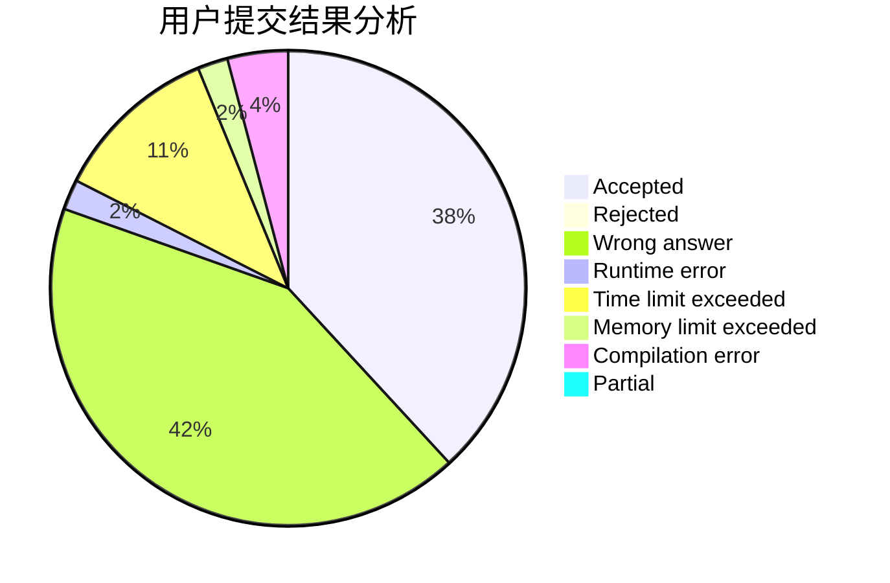
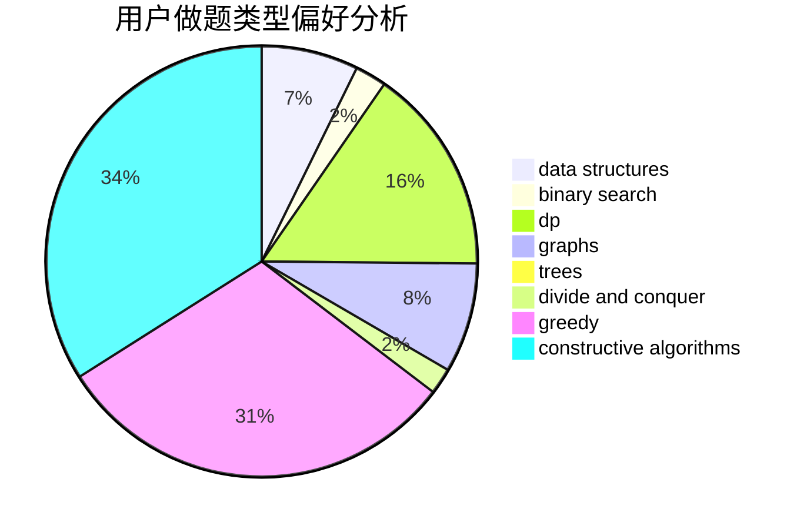

# birchtree

<!-- tabs:start -->

#### **用户提交结果分析**

#### **用户做题类型偏好分析**

#### **用户错题知识点分析**

<!-- tabs:end -->
# 推荐题目
[1113C](https://codeforces.com/contest/1113/problem/C)		dsu,graphs,sortings,trees		  
[1214E](https://codeforces.com/contest/1214/problem/E)		constructive algorithms,
                        graphs,
                        math,
                        sortings,
                        trees		  
[1082C](https://codeforces.com/contest/1082/problem/C)		greedy,
                        sortings		  
[717I](https://codeforces.com/contest/717/problem/I)		geometry		  
[533B](https://codeforces.com/contest/533/problem/B)		dfs and similar,
                        dp,
                        graphs,
                        strings,
                        trees		  
[1083C](https://codeforces.com/contest/1083/problem/C)		data structures,
                        trees		  
[1045I](https://codeforces.com/contest/1045/problem/I)		hashing,
                        strings		  
[862D](https://codeforces.com/contest/862/problem/D)		binary search,
                        divide and conquer,
                        interactive		  
[864A](https://codeforces.com/contest/864/problem/A)		implementation,
                        sortings		  
[377A](https://codeforces.com/contest/377/problem/A)		dfs and similar		  
