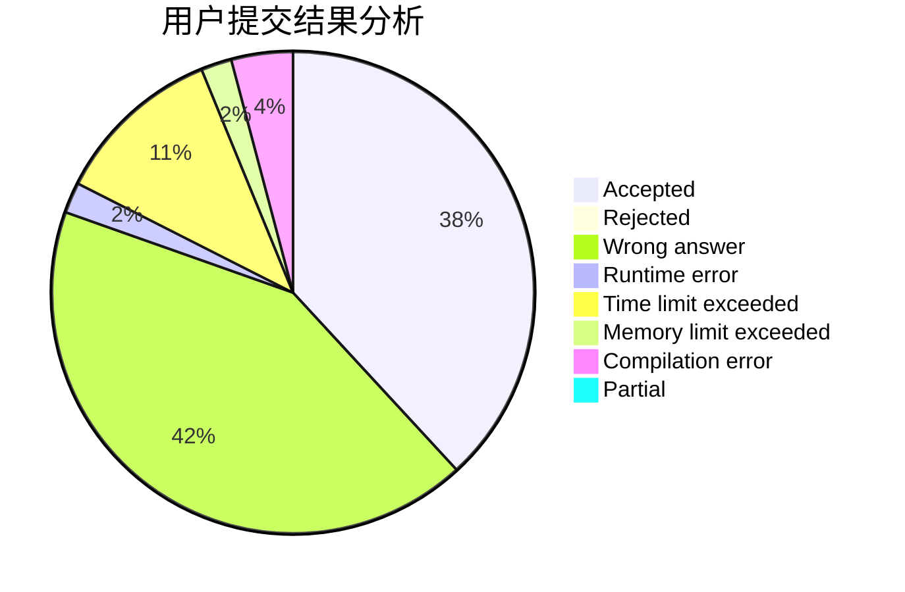
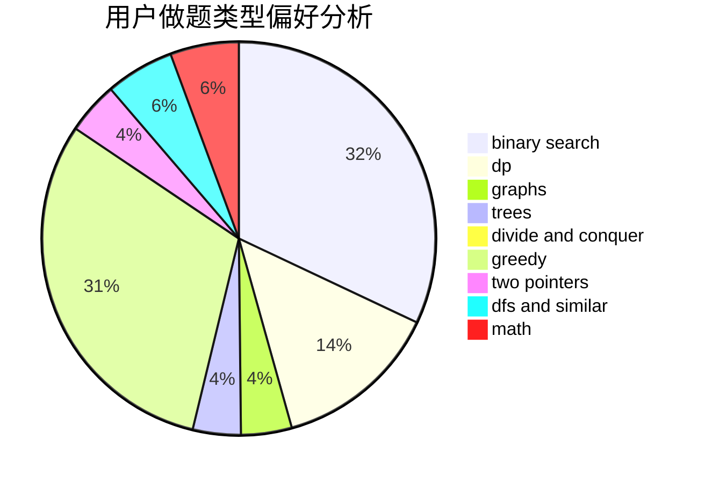

# birchtree

<!-- tabs:start -->

#### **用户提交结果分析**

#### **用户做题类型偏好分析**

<!-- tabs:end -->
# 推荐题目
[1114A](https://codeforces.com/contest/1114/problem/A)
[1220A](https://codeforces.com/contest/1220/problem/A)
[1082F](https://codeforces.com/contest/1082/problem/F)
[735C](https://codeforces.com/contest/735/problem/C)
[554A](https://codeforces.com/contest/554/problem/A)
[1083F](https://codeforces.com/contest/1083/problem/F)
[1046H](https://codeforces.com/contest/1046/problem/H)
[883A](https://codeforces.com/contest/883/problem/A)
[883I](https://codeforces.com/contest/883/problem/I)
[405B](https://codeforces.com/contest/405/problem/B)
