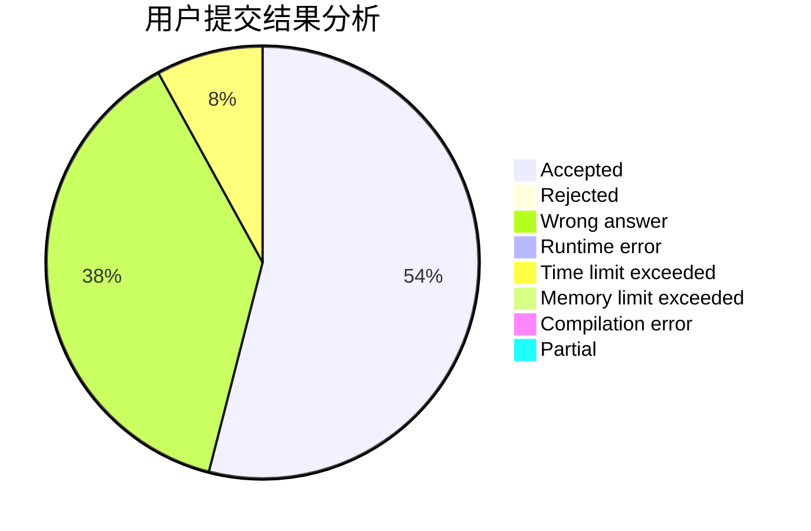
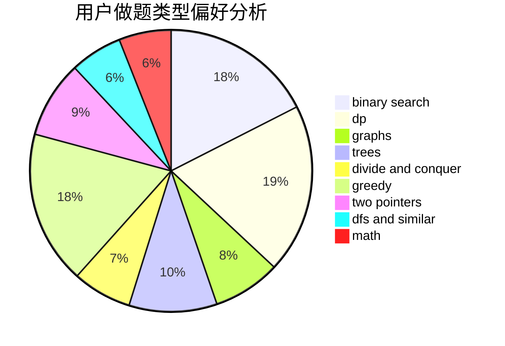

# bit-noob

<!-- tabs:start -->

#### **用户提交结果分析**

#### **用户做题类型偏好分析**

<!-- tabs:end -->
# 推荐题目
[893D](https://codeforces.com/contest/893/problem/D)
[388B](https://codeforces.com/contest/388/problem/B)
[300E](https://codeforces.com/contest/300/problem/E)
[997E](https://codeforces.com/contest/997/problem/E)
[1415C](https://codeforces.com/contest/1415/problem/C)
[796D](https://codeforces.com/contest/796/problem/D)
[297B](https://codeforces.com/contest/297/problem/B)
[863A](https://codeforces.com/contest/863/problem/A)
[939D](https://codeforces.com/contest/939/problem/D)
[1028B](https://codeforces.com/contest/1028/problem/B)
