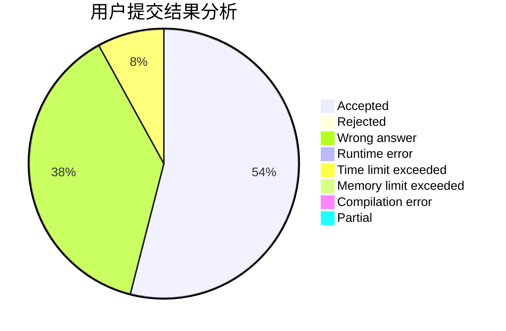
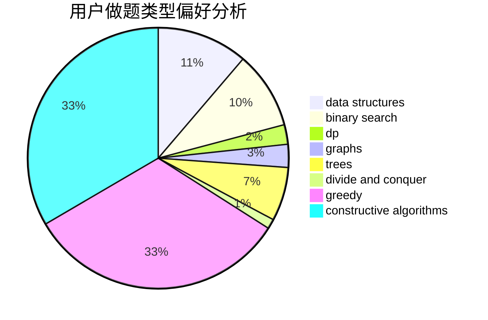
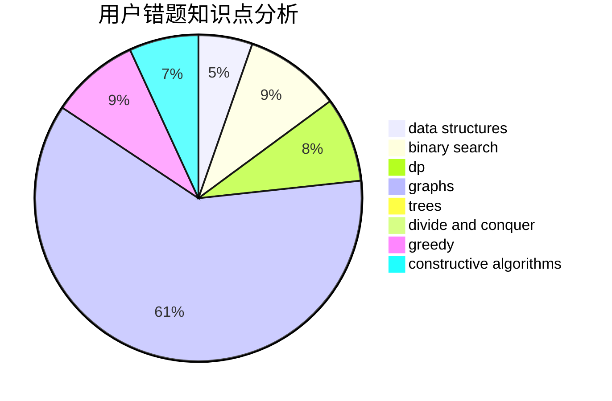

# bit-noob

<!-- tabs:start -->

#### **用户提交结果分析**

#### **用户做题类型偏好分析**

#### **用户错题知识点分析**

<!-- tabs:end -->
# 推荐题目
[872B](https://codeforces.com/contest/872/problem/B)		dsu,graphs,sortings,trees		  
[360A](https://codeforces.com/contest/360/problem/A)		greedy,
                        implementation		  
[286D](https://codeforces.com/contest/286/problem/D)		data structures,
                        sortings		  
[982B](https://codeforces.com/contest/982/problem/B)		data structures,
                        greedy,
                        implementation		  
[1404A](https://codeforces.com/contest/1404/problem/A)		implementation,
                        strings		  
[778C](https://codeforces.com/contest/778/problem/C)		brute force,
                        dfs and similar,
                        dsu,
                        hashing,
                        strings,
                        trees		  
[280E](https://codeforces.com/contest/280/problem/E)		data structures,
                        dp,
                        implementation,
                        math		  
[844A](https://codeforces.com/contest/844/problem/A)		greedy,
                        implementation,
                        strings		  
[919C](https://codeforces.com/contest/919/problem/C)		brute force,
                        implementation		  
[1027F](https://codeforces.com/contest/1027/problem/F)		binary search,
                        dfs and similar,
                        dsu,
                        graph matchings,
                        graphs		  
