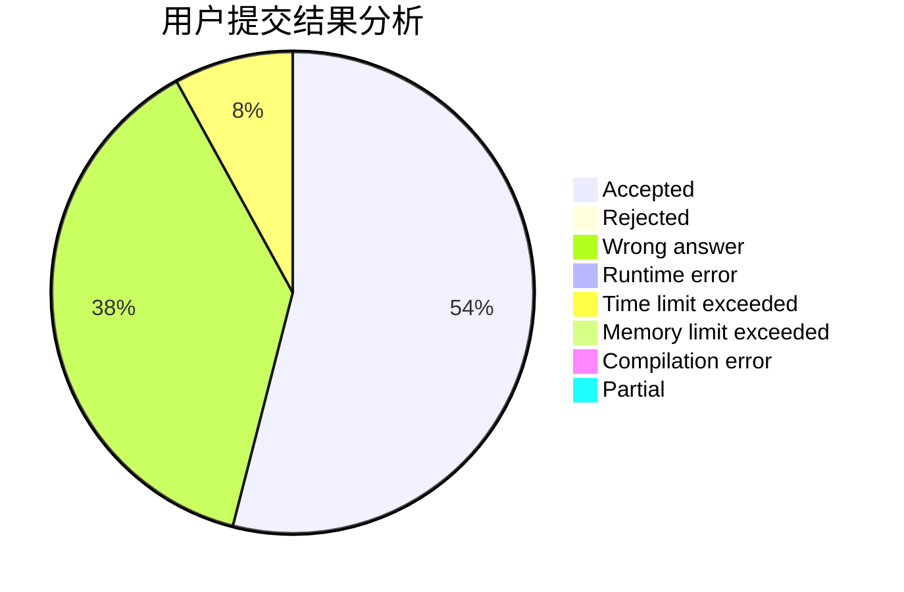
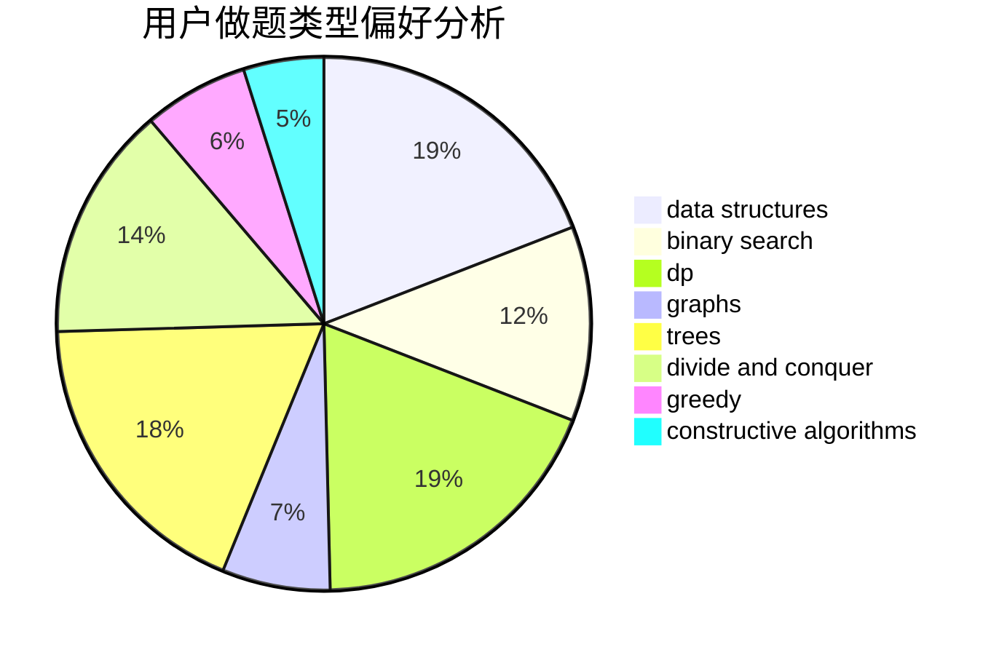

# bit-noob

<!-- tabs:start -->

#### **用户提交结果分析**

#### **用户做题类型偏好分析**

#### **用户错题知识点分析**

<!-- tabs:end -->
# 推荐题目
[893D](https://codeforces.com/contest/893/problem/D)		data structures,
                        dp,
                        greedy,
                        implementation		  
[388B](https://codeforces.com/contest/388/problem/B)		bitmasks,
                        constructive algorithms,
                        graphs,
                        implementation,
                        math		  
[300E](https://codeforces.com/contest/300/problem/E)		binary search,
                        math,
                        number theory		  
[997E](https://codeforces.com/contest/997/problem/E)		data structures		  
[1415C](https://codeforces.com/contest/1415/problem/C)		brute force,
                        dp,
                        implementation		  
[796D](https://codeforces.com/contest/796/problem/D)		constructive algorithms,
                        dfs and similar,
                        dp,
                        graphs,
                        shortest paths,
                        trees		  
[297B](https://codeforces.com/contest/297/problem/B)		constructive algorithms,
                        greedy		  
[863A](https://codeforces.com/contest/863/problem/A)		brute force,
                        implementation		  
[939D](https://codeforces.com/contest/939/problem/D)		dfs and similar,
                        dsu,
                        graphs,
                        greedy,
                        strings		  
[1028B](https://codeforces.com/contest/1028/problem/B)		constructive algorithms,
                        math		  
