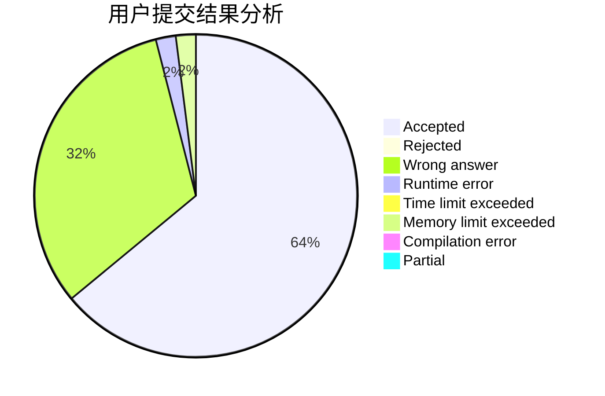
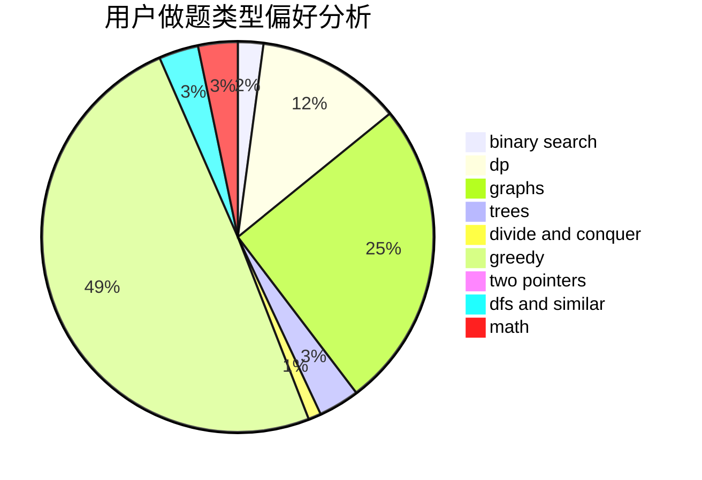

# Angavid

<!-- tabs:start -->

#### **用户提交结果分析**

#### **用户做题类型偏好分析**

<!-- tabs:end -->
# 推荐题目
[348B](https://codeforces.com/contest/348/problem/B)
[351E](https://codeforces.com/contest/351/problem/E)
[347A](https://codeforces.com/contest/347/problem/A)
[1156D](https://codeforces.com/contest/1156/problem/D)
[349B](https://codeforces.com/contest/349/problem/B)
[127A](https://codeforces.com/contest/127/problem/A)
[346B](https://codeforces.com/contest/346/problem/B)
[346E](https://codeforces.com/contest/346/problem/E)
[1280A](https://codeforces.com/contest/1280/problem/A)
[1386B](https://codeforces.com/contest/1386/problem/B)
