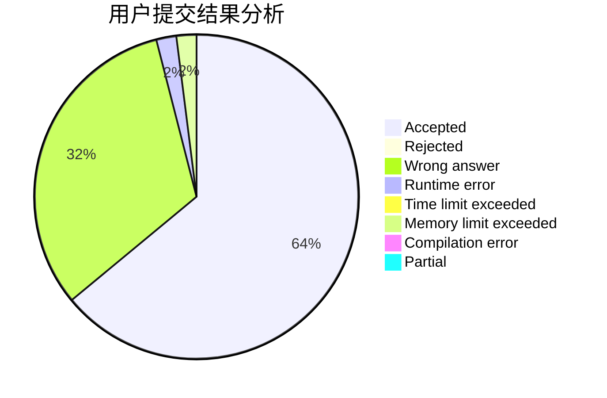
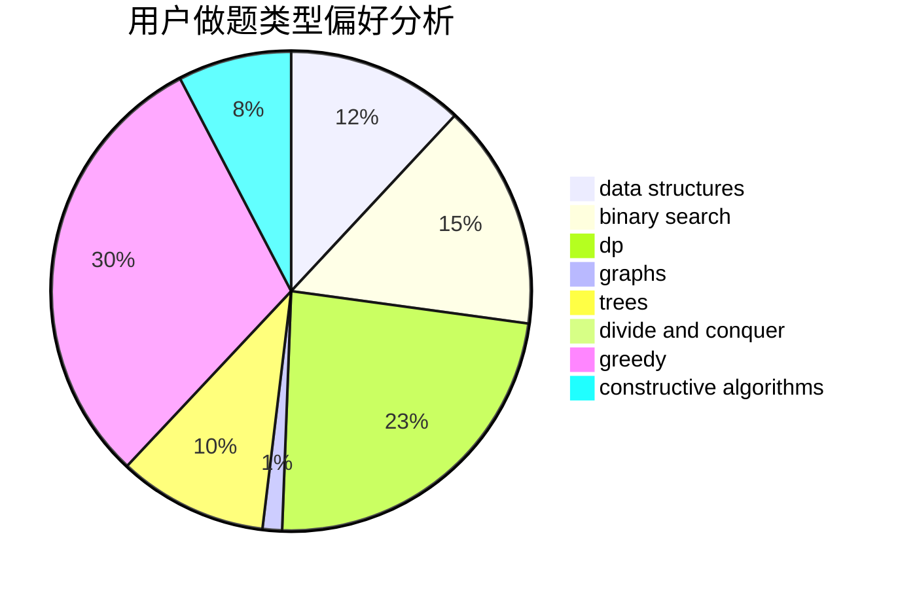
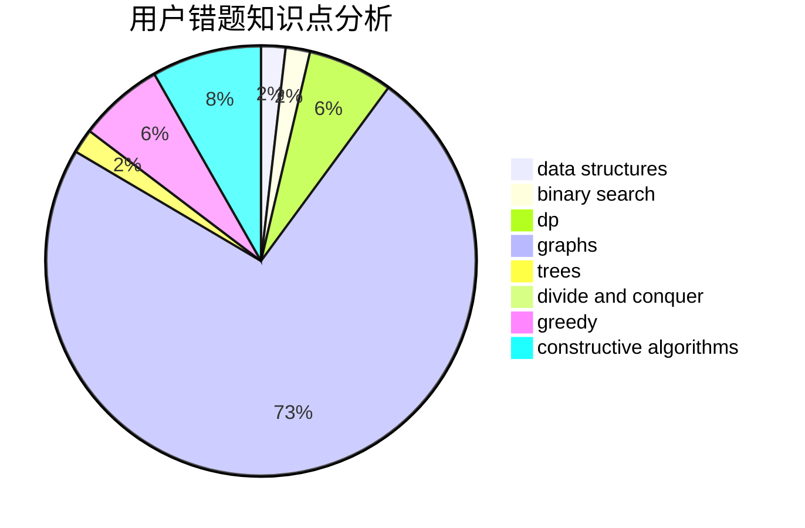

# Angavid

<!-- tabs:start -->

#### **用户提交结果分析**

#### **用户做题类型偏好分析**

#### **用户错题知识点分析**

<!-- tabs:end -->
# 推荐题目
[318A](https://codeforces.com/contest/318/problem/A)		math		  
[321A](https://codeforces.com/contest/321/problem/A)		binary search,
                        implementation,
                        math		  
[317D](https://codeforces.com/contest/317/problem/D)		dp,
                        games		  
[1154D](https://codeforces.com/contest/1154/problem/D)		greedy		  
[319A](https://codeforces.com/contest/319/problem/A)		combinatorics,
                        math		  
[1270G](https://codeforces.com/contest/1270/problem/G)		constructive algorithms,
                        dfs and similar,
                        graphs,
                        math		  
[317A](https://codeforces.com/contest/317/problem/A)		brute force		  
[317C](https://codeforces.com/contest/317/problem/C)		constructive algorithms,
                        dfs and similar,
                        graphs,
                        trees		  
[1270H](https://codeforces.com/contest/1270/problem/H)		data structures		  
[1377A1](https://codeforces.com/contest/1377A/problem/1)		dsu,graphs,sortings,trees		  
