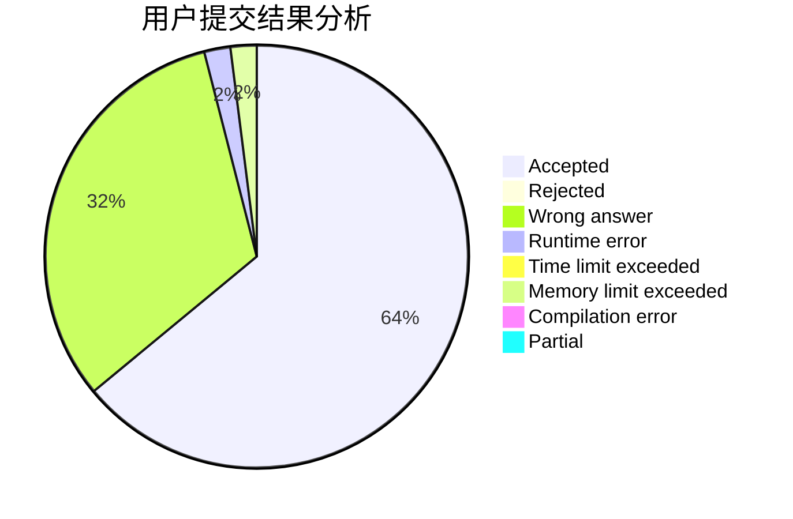
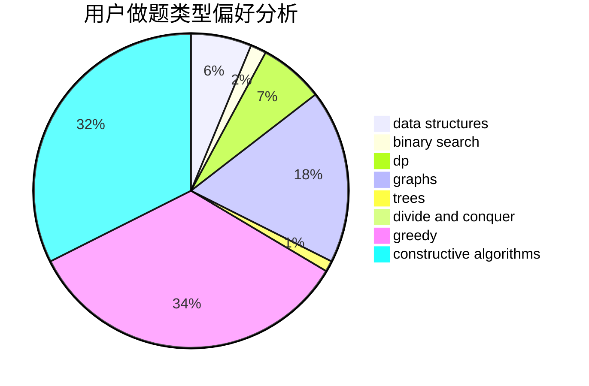
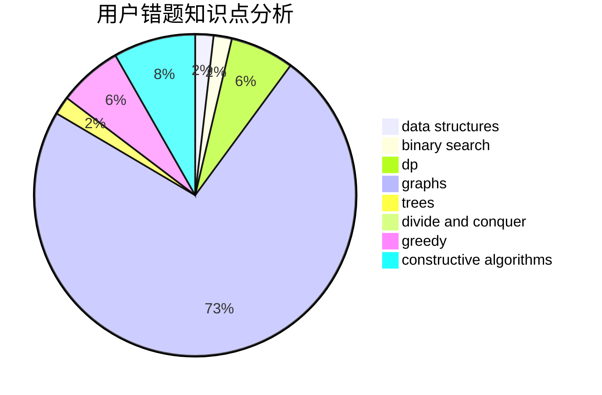

# Angavid

<!-- tabs:start -->

#### **用户提交结果分析**

#### **用户做题类型偏好分析**

#### **用户错题知识点分析**

<!-- tabs:end -->
# 推荐题目
[348B](https://codeforces.com/contest/348/problem/B)		dfs and similar,
                        number theory,
                        trees		  
[351E](https://codeforces.com/contest/351/problem/E)		greedy		  
[347A](https://codeforces.com/contest/347/problem/A)		constructive algorithms,
                        implementation,
                        sortings		  
[1156D](https://codeforces.com/contest/1156/problem/D)		dfs and similar,
                        divide and conquer,
                        dp,
                        dsu,
                        trees		  
[349B](https://codeforces.com/contest/349/problem/B)		data structures,
                        dp,
                        greedy,
                        implementation		  
[127A](https://codeforces.com/contest/127/problem/A)		geometry		  
[346B](https://codeforces.com/contest/346/problem/B)		dp,
                        strings		  
[346E](https://codeforces.com/contest/346/problem/E)		math,
                        number theory		  
[1280A](https://codeforces.com/contest/1280/problem/A)		implementation,
                        math		  
[1386B](https://codeforces.com/contest/1386/problem/B)		*special problem,
                        data structures,
                        geometry,
                        math,
                        sortings		  
