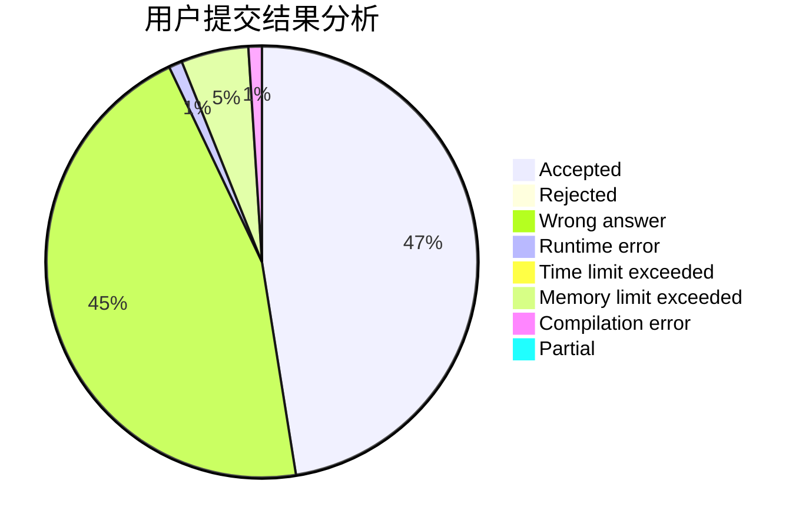
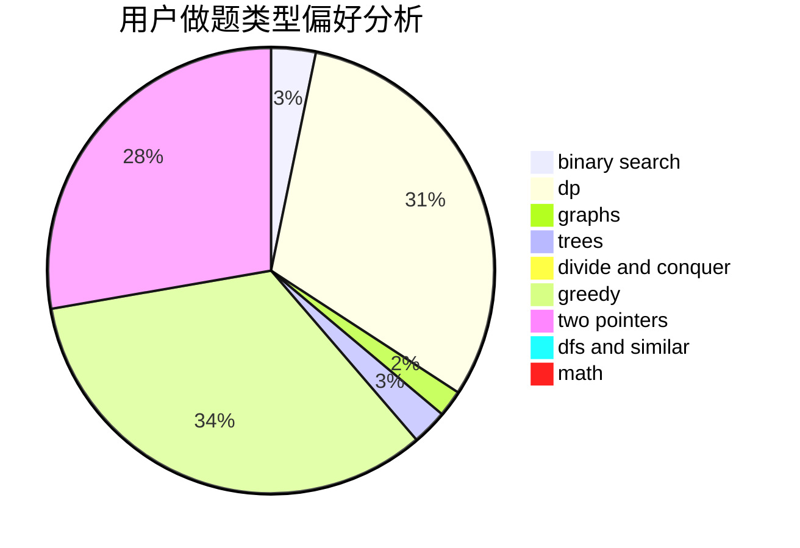

# bitoy

<!-- tabs:start -->

#### **用户提交结果分析**

#### **用户做题类型偏好分析**

<!-- tabs:end -->
# 推荐题目
[1290A](https://codeforces.com/contest/1290/problem/A)
[1154D](https://codeforces.com/contest/1154/problem/D)
[710D](https://codeforces.com/contest/710/problem/D)
[691B](https://codeforces.com/contest/691/problem/B)
[1095A](https://codeforces.com/contest/1095/problem/A)
[599D](https://codeforces.com/contest/599/problem/D)
[1394A](https://codeforces.com/contest/1394/problem/A)
[14402](https://codeforces.com/contest/1440/problem/2)
[309C](https://codeforces.com/contest/309/problem/C)
[1490C](https://codeforces.com/contest/1490/problem/C)
