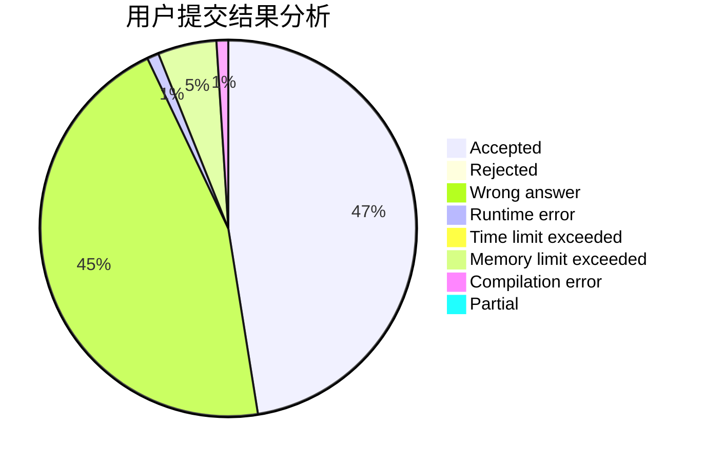
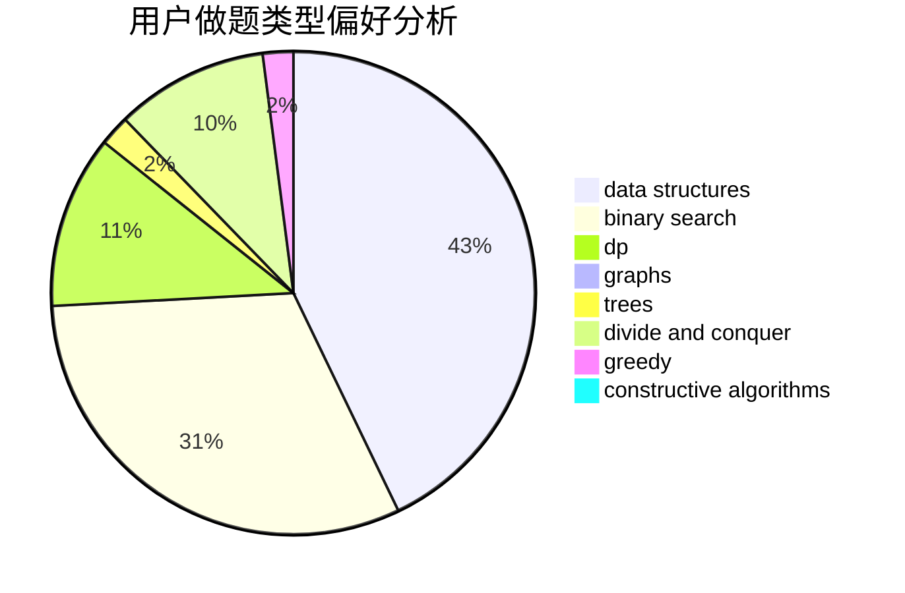

# bitoy

<!-- tabs:start -->

#### **用户提交结果分析**

#### **用户做题类型偏好分析**

#### **用户错题知识点分析**

<!-- tabs:end -->
# 推荐题目
[1283A](https://codeforces.com/contest/1283/problem/A)		math		  
[1152D](https://codeforces.com/contest/1152/problem/D)		dp,
                        greedy,
                        trees		  
[690D1](https://codeforces.com/contest/690D/problem/1)		nan		  
[669A](https://codeforces.com/contest/669/problem/A)		math		  
[1093E](https://codeforces.com/contest/1093/problem/E)		data structures		  
[578B](https://codeforces.com/contest/578/problem/B)		brute force,
                        greedy		  
[1384B1](https://codeforces.com/contest/1384B/problem/1)		brute force,
                        dp,
                        greedy		  
[1431B](https://codeforces.com/contest/1431/problem/B)		*special problem,
                        implementation,
                        two pointers		  
[293A](https://codeforces.com/contest/293/problem/A)		games,
                        greedy		  
[1482E](https://codeforces.com/contest/1482/problem/E)		data structures,
                        divide and conquer,
                        dp		  
