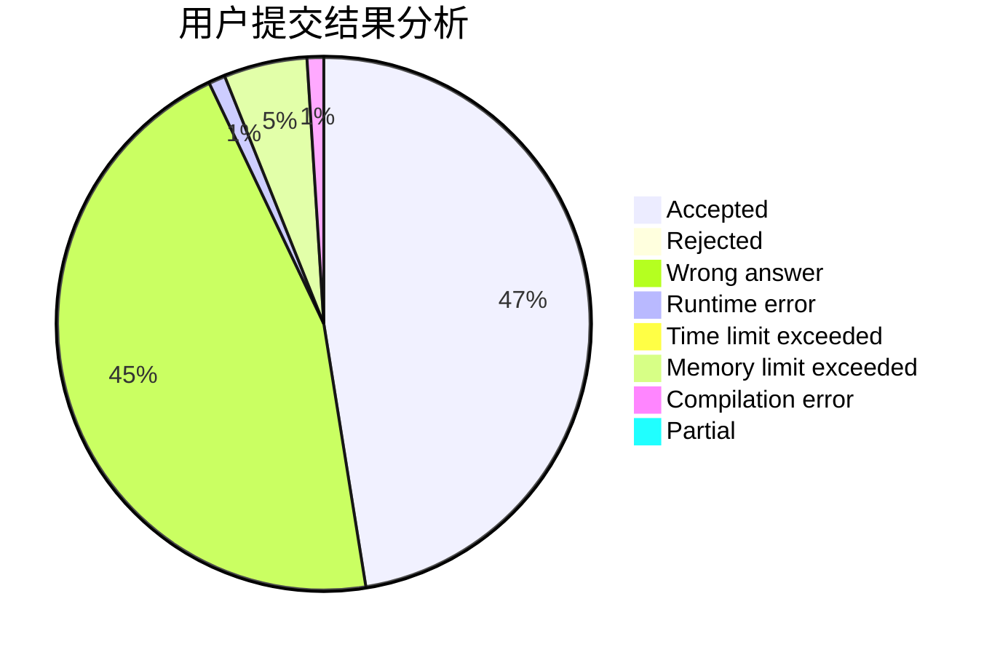
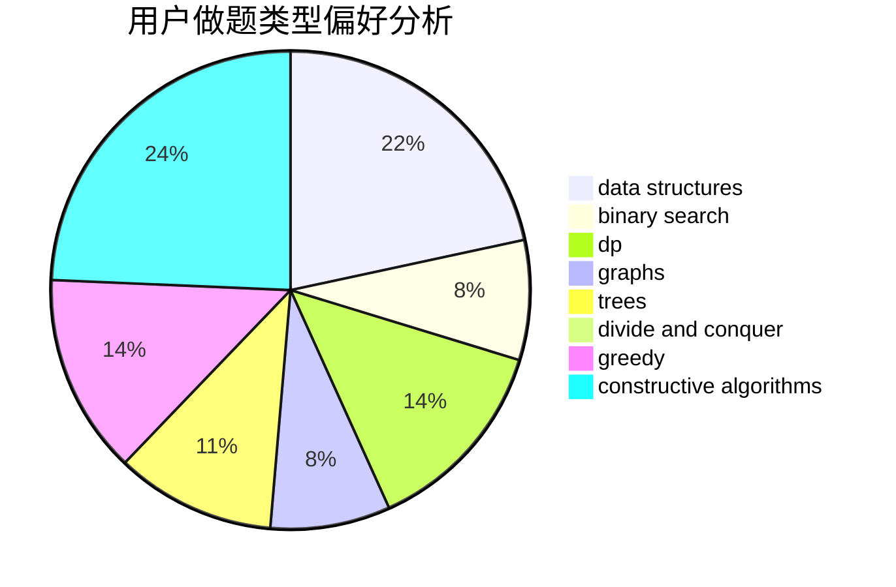

# bitoy

<!-- tabs:start -->

#### **用户提交结果分析**

#### **用户做题类型偏好分析**

#### **用户错题知识点分析**

<!-- tabs:end -->
# 推荐题目
[1290A](https://codeforces.com/contest/1290/problem/A)		brute force,
                        data structures,
                        implementation		  
[1154D](https://codeforces.com/contest/1154/problem/D)		greedy		  
[710D](https://codeforces.com/contest/710/problem/D)		math,
                        number theory		  
[691B](https://codeforces.com/contest/691/problem/B)		implementation,
                        strings		  
[1095A](https://codeforces.com/contest/1095/problem/A)		implementation		  
[599D](https://codeforces.com/contest/599/problem/D)		brute force,
                        math		  
[1394A](https://codeforces.com/contest/1394/problem/A)		dp,
                        greedy,
                        sortings,
                        two pointers		  
[14402](https://codeforces.com/contest/1440/problem/2)		dsu,graphs,sortings,trees		  
[309C](https://codeforces.com/contest/309/problem/C)		binary search,
                        bitmasks,
                        greedy		  
[1490C](https://codeforces.com/contest/1490/problem/C)		binary search,
                        brute force,
                        brute force,
                        math		  
