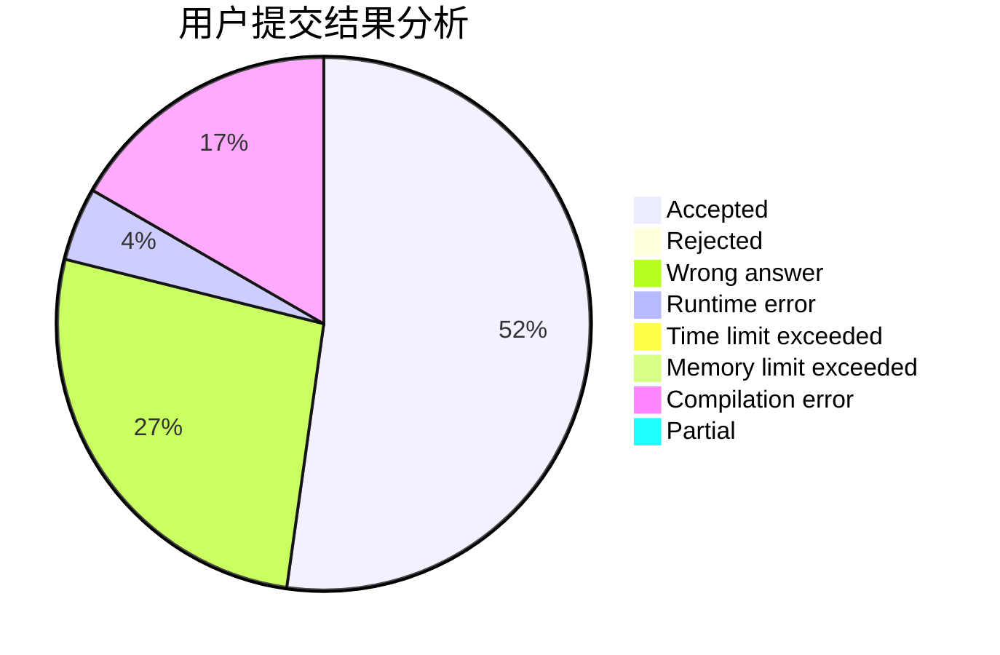
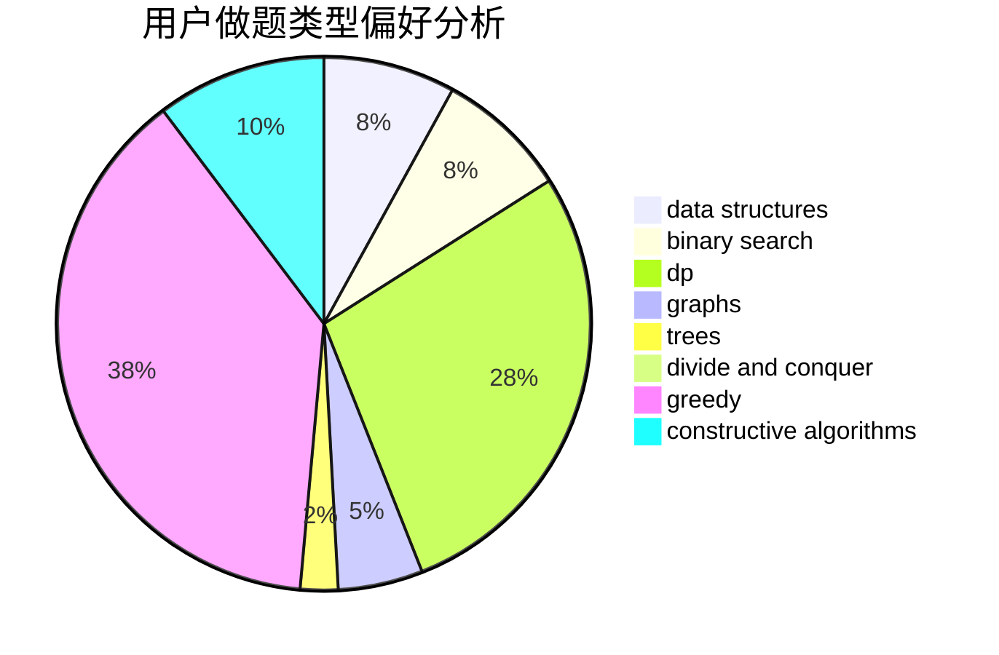
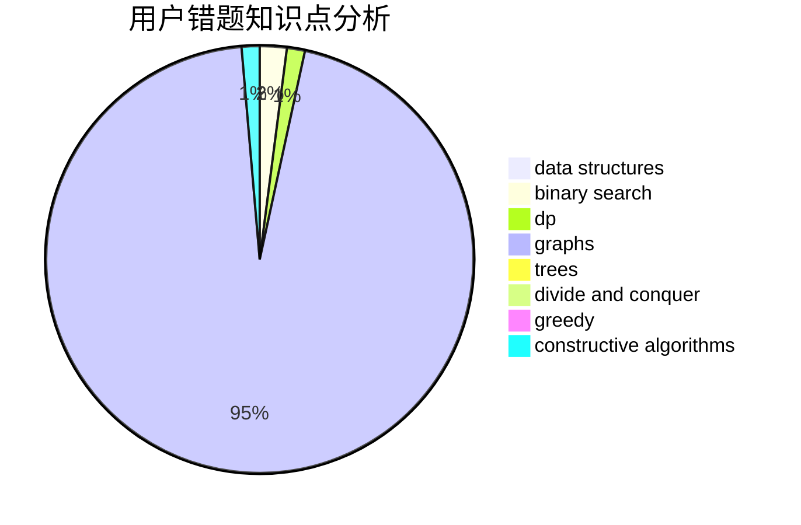

# black_trees

<!-- tabs:start -->

#### **用户提交结果分析**

#### **用户做题类型偏好分析**

#### **用户错题知识点分析**

<!-- tabs:end -->
# 推荐题目
[730J](https://codeforces.com/contest/730/problem/J)		dp		  
[15C](https://codeforces.com/contest/15/problem/C)		games		  
[460E](https://codeforces.com/contest/460/problem/E)		brute force,
                        geometry,
                        math,
                        sortings		  
[389B](https://codeforces.com/contest/389/problem/B)		greedy,
                        implementation		  
[108C](https://codeforces.com/contest/108/problem/C)		dsu,graphs,sortings,trees		  
[277A](https://codeforces.com/contest/277/problem/A)		dfs and similar,
                        dsu		  
[1457B](https://codeforces.com/contest/1457/problem/B)		dsu,graphs,sortings,trees		  
[569B](https://codeforces.com/contest/569/problem/B)		greedy,
                        math		  
[1438C](https://codeforces.com/contest/1438/problem/C)		2-sat,
                        chinese remainder theorem,
                        constructive algorithms,
                        fft,
                        flows		  
[1490C](https://codeforces.com/contest/1490/problem/C)		binary search,
                        brute force,
                        brute force,
                        math		  
