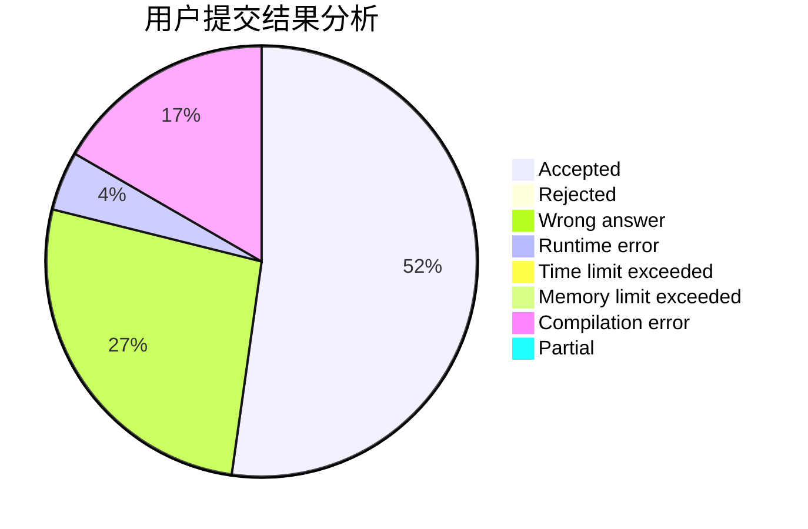
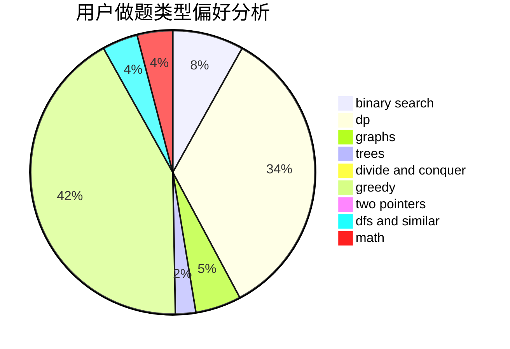

# black_trees

<!-- tabs:start -->

#### **用户提交结果分析**

#### **用户做题类型偏好分析**

<!-- tabs:end -->
# 推荐题目
[730J](https://codeforces.com/contest/730/problem/J)
[15C](https://codeforces.com/contest/15/problem/C)
[460E](https://codeforces.com/contest/460/problem/E)
[389B](https://codeforces.com/contest/389/problem/B)
[108C](https://codeforces.com/contest/108/problem/C)
[277A](https://codeforces.com/contest/277/problem/A)
[1457B](https://codeforces.com/contest/1457/problem/B)
[569B](https://codeforces.com/contest/569/problem/B)
[1438C](https://codeforces.com/contest/1438/problem/C)
[1490C](https://codeforces.com/contest/1490/problem/C)
