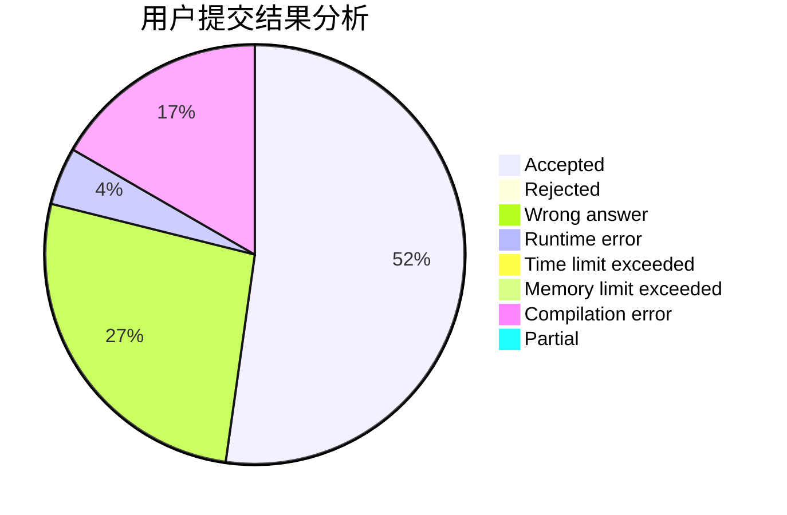
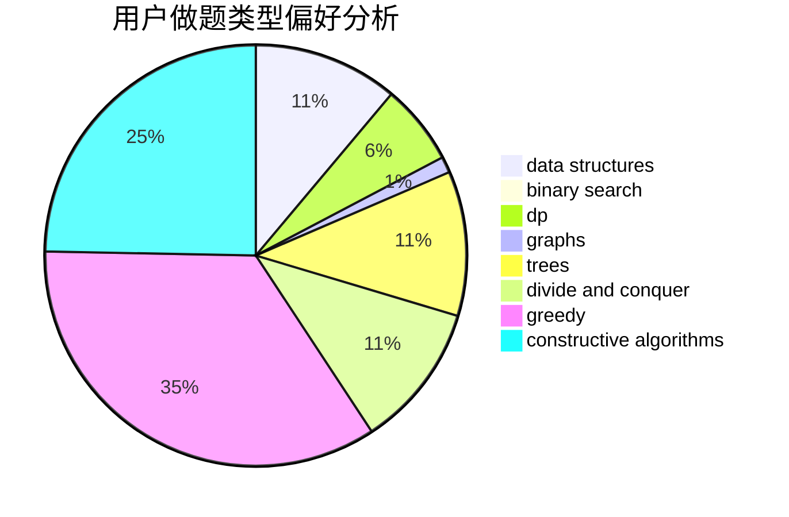
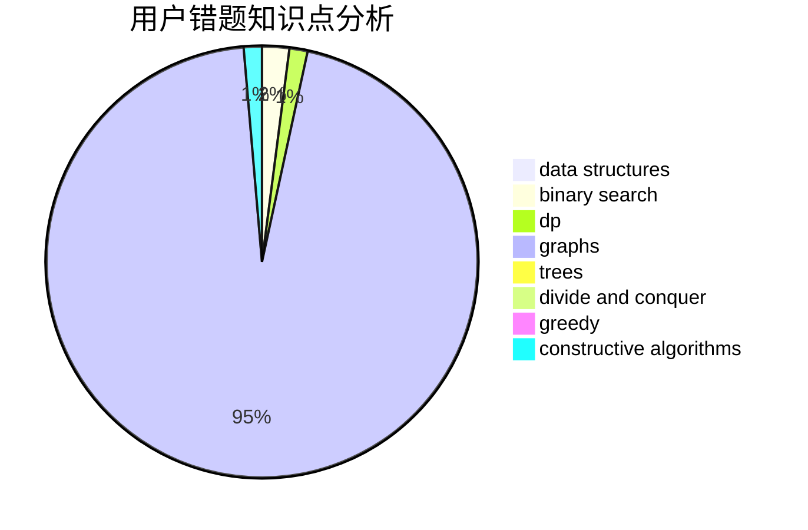

# black_trees

<!-- tabs:start -->

#### **用户提交结果分析**

#### **用户做题类型偏好分析**

#### **用户错题知识点分析**

<!-- tabs:end -->
# 推荐题目
[710F](https://codeforces.com/contest/710/problem/F)		brute force,
                        data structures,
                        hashing,
                        interactive,
                        string suffix structures,
                        strings		  
[1509A](https://codeforces.com/contest/1509/problem/A)		constructive algorithms		  
[439D](https://codeforces.com/contest/439/problem/D)		binary search,
                        sortings,
                        ternary search,
                        two pointers		  
[362C](https://codeforces.com/contest/362/problem/C)		data structures,
                        dp,
                        implementation,
                        math		  
[1089K](https://codeforces.com/contest/1089/problem/K)		data structures		  
[25A](https://codeforces.com/contest/25/problem/A)		brute force		  
[1447E](https://codeforces.com/contest/1447/problem/E)		dsu,graphs,sortings,trees		  
[544E](https://codeforces.com/contest/544/problem/E)		dsu,graphs,sortings,trees		  
[142B](https://codeforces.com/contest/142/problem/B)		constructive algorithms,
                        greedy,
                        implementation		  
[1482E](https://codeforces.com/contest/1482/problem/E)		data structures,
                        divide and conquer,
                        dp		  
