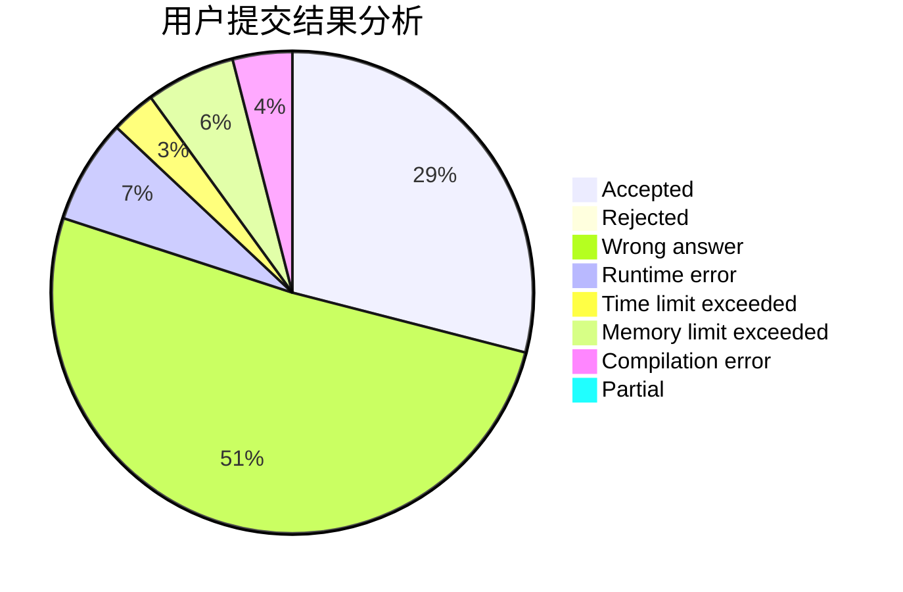
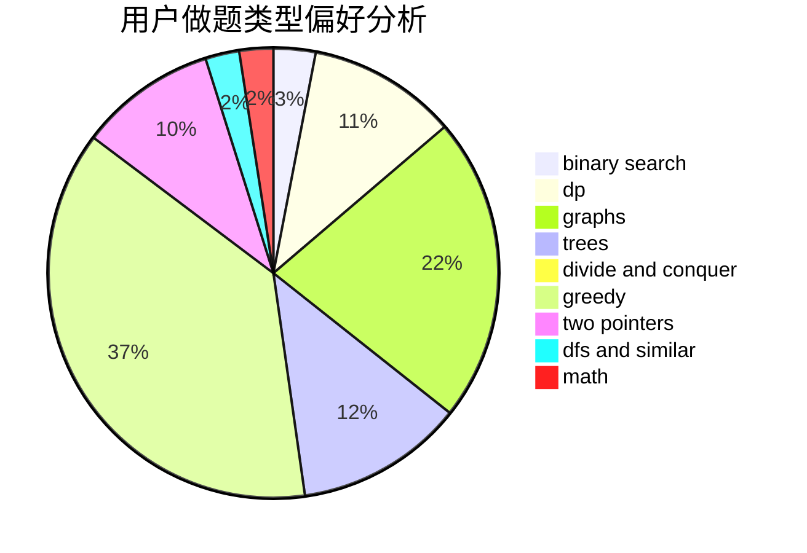

# black_white_tony

<!-- tabs:start -->

#### **用户提交结果分析**

#### **用户做题类型偏好分析**

<!-- tabs:end -->
# 推荐题目
[1154E](https://codeforces.com/contest/1154/problem/E)
[1057B](https://codeforces.com/contest/1057/problem/B)
[932A](https://codeforces.com/contest/932/problem/A)
[11301](https://codeforces.com/contest/1130/problem/1)
[216A](https://codeforces.com/contest/216/problem/A)
[710B](https://codeforces.com/contest/710/problem/B)
[271E](https://codeforces.com/contest/271/problem/E)
[952C](https://codeforces.com/contest/952/problem/C)
[1385F](https://codeforces.com/contest/1385/problem/F)
[499C](https://codeforces.com/contest/499/problem/C)
