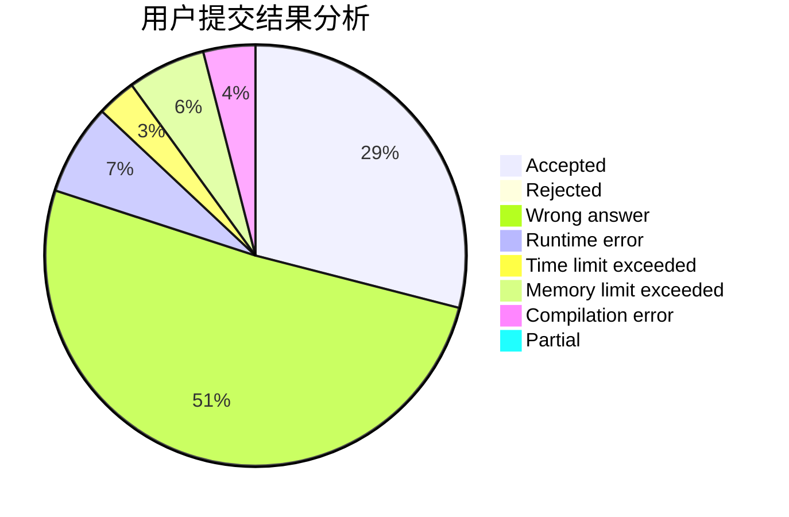
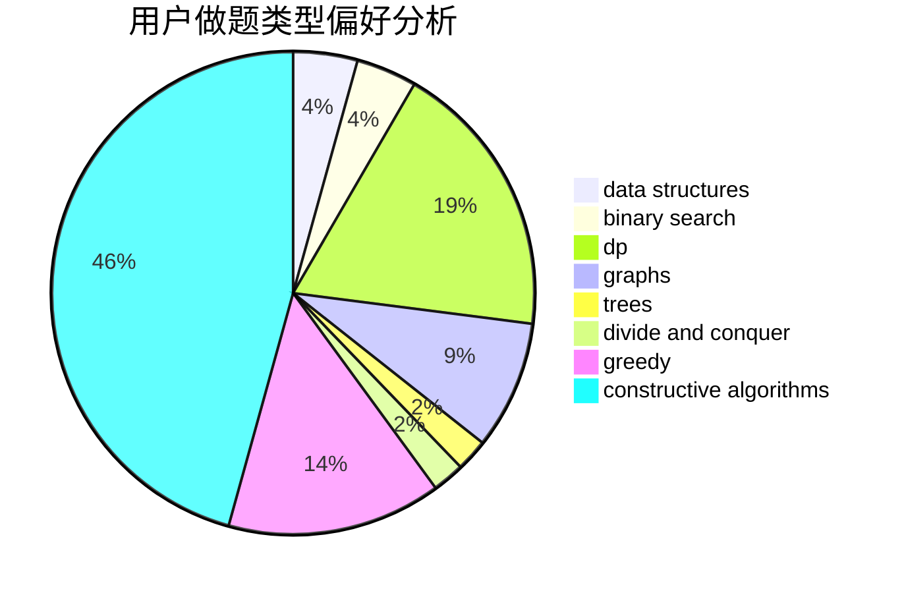
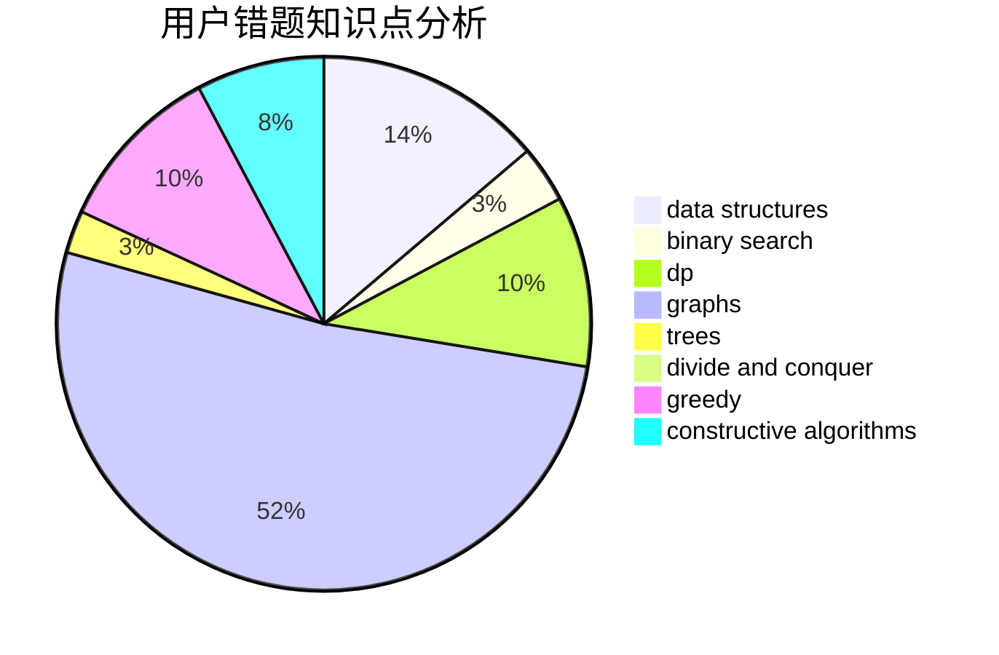

# black_white_tony

<!-- tabs:start -->

#### **用户提交结果分析**

#### **用户做题类型偏好分析**

#### **用户错题知识点分析**

<!-- tabs:end -->
# 推荐题目
[1154E](https://codeforces.com/contest/1154/problem/E)		data structures,
                        implementation,
                        sortings		  
[1057B](https://codeforces.com/contest/1057/problem/B)		*special problem,
                        brute force		  
[932A](https://codeforces.com/contest/932/problem/A)		constructive algorithms		  
[11301](https://codeforces.com/contest/1130/problem/1)		dsu,graphs,sortings,trees		  
[216A](https://codeforces.com/contest/216/problem/A)		implementation,
                        math		  
[710B](https://codeforces.com/contest/710/problem/B)		brute force,
                        sortings		  
[271E](https://codeforces.com/contest/271/problem/E)		constructive algorithms,
                        math,
                        number theory		  
[952C](https://codeforces.com/contest/952/problem/C)		implementation		  
[1385F](https://codeforces.com/contest/1385/problem/F)		data structures,
                        greedy,
                        implementation,
                        trees		  
[499C](https://codeforces.com/contest/499/problem/C)		dsu,graphs,sortings,trees		  
