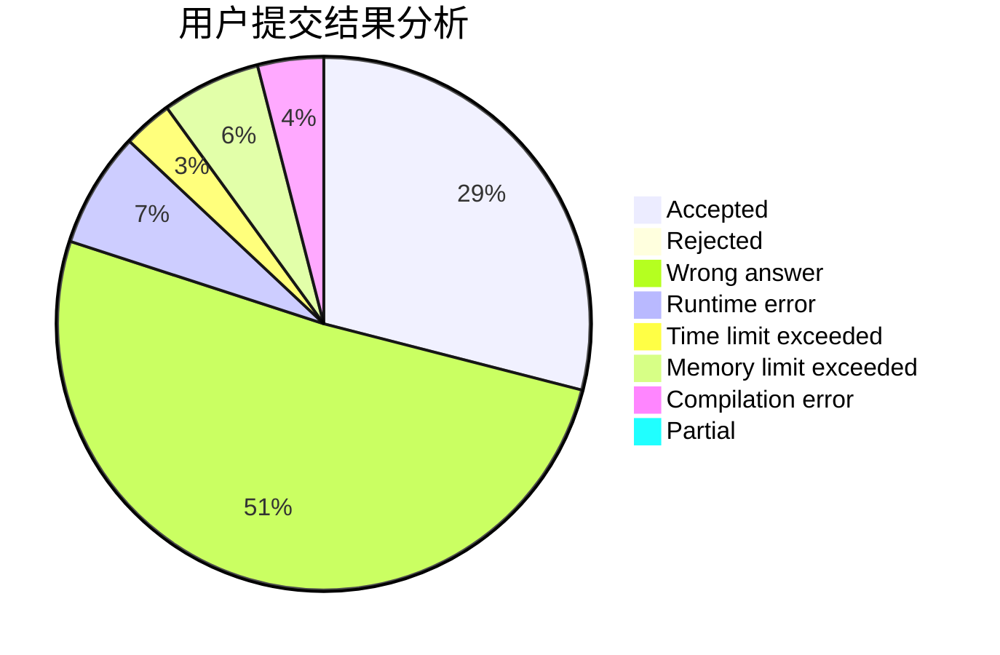
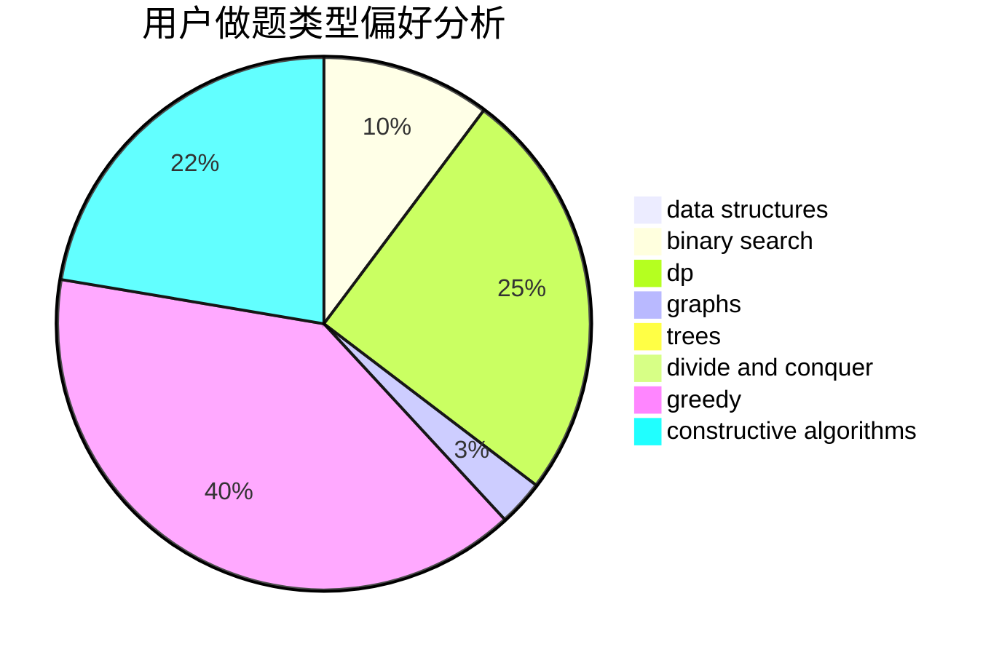
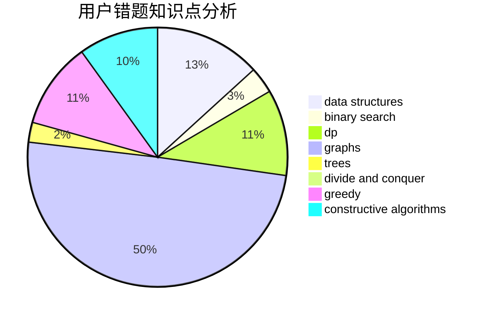

# black_white_tony

<!-- tabs:start -->

#### **用户提交结果分析**

#### **用户做题类型偏好分析**

#### **用户错题知识点分析**

<!-- tabs:end -->
# 推荐题目
[1152E](https://codeforces.com/contest/1152/problem/E)		constructive algorithms,
                        dfs and similar,
                        graphs		  
[1056F](https://codeforces.com/contest/1056/problem/F)		binary search,
                        dp,
                        math		  
[913C](https://codeforces.com/contest/913/problem/C)		bitmasks,
                        dp,
                        greedy		  
[1120D](https://codeforces.com/contest/1120/problem/D)		dfs and similar,
                        dp,
                        dsu,
                        graphs,
                        greedy,
                        trees		  
[191C](https://codeforces.com/contest/191/problem/C)		data structures,
                        dfs and similar,
                        trees		  
[690A1](https://codeforces.com/contest/690A/problem/1)		nan		  
[254A](https://codeforces.com/contest/254/problem/A)		constructive algorithms,
                        sortings		  
[931C](https://codeforces.com/contest/931/problem/C)		implementation,
                        math		  
[1376B2](https://codeforces.com/contest/1376B/problem/2)		dsu,graphs,sortings,trees		  
[479A](https://codeforces.com/contest/479/problem/A)		brute force,
                        math		  
