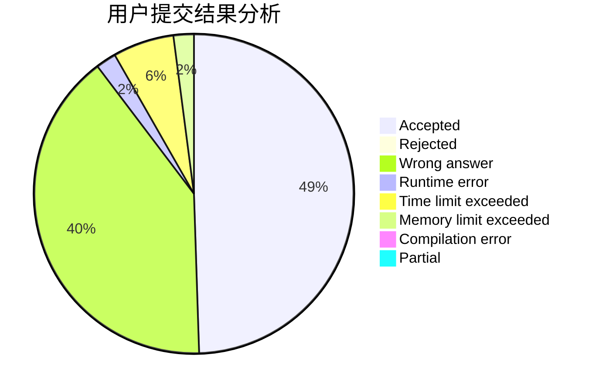
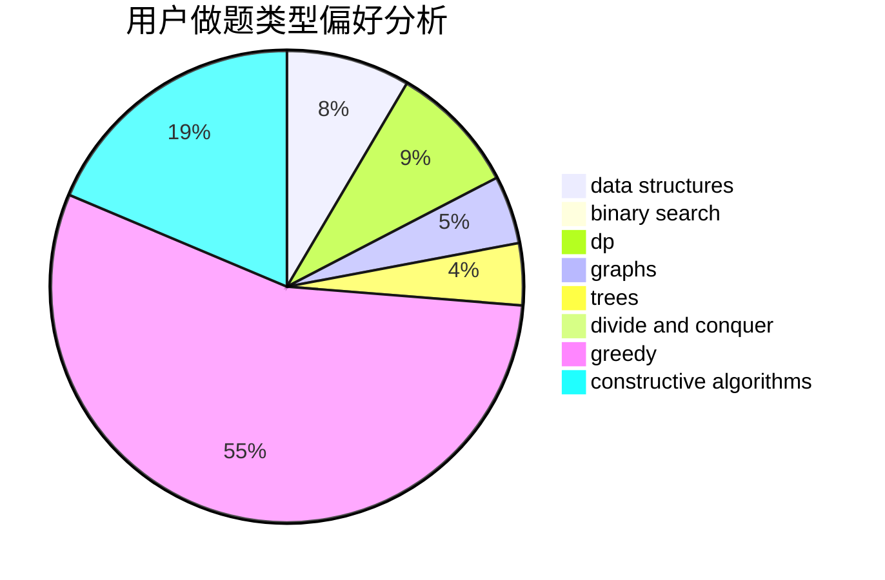
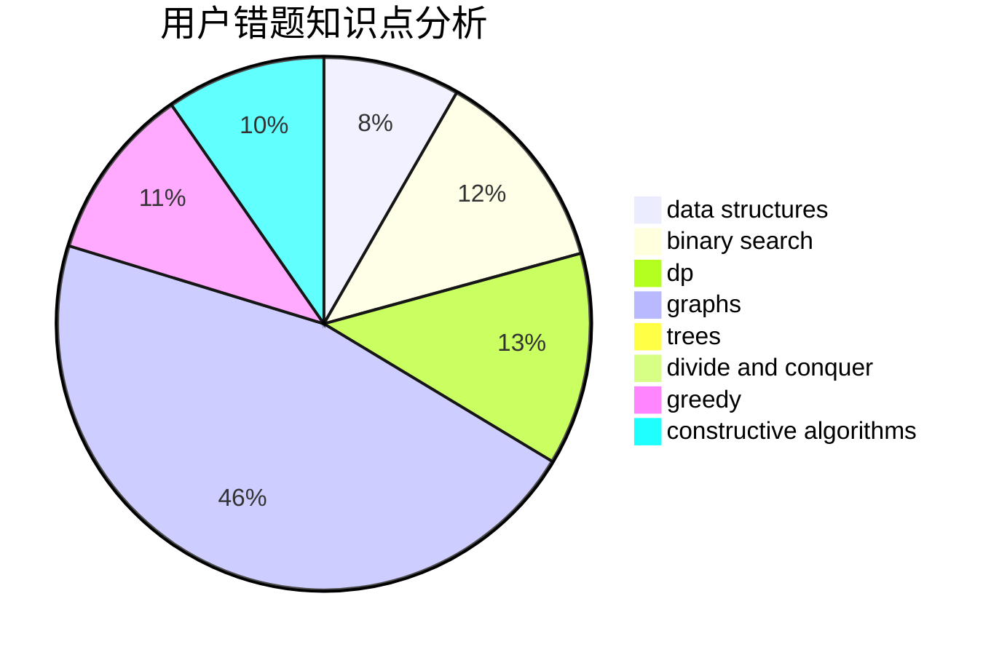

# blackbird137

<!-- tabs:start -->

#### **用户提交结果分析**

#### **用户做题类型偏好分析**

#### **用户错题知识点分析**

<!-- tabs:end -->
# 推荐题目
[931F](https://codeforces.com/contest/931/problem/F)		dsu,graphs,sortings,trees		  
[1066E](https://codeforces.com/contest/1066/problem/E)		data structures,
                        implementation,
                        math		  
[215B](https://codeforces.com/contest/215/problem/B)		greedy,
                        math		  
[446D](https://codeforces.com/contest/446/problem/D)		math,
                        matrices,
                        probabilities		  
[1036B](https://codeforces.com/contest/1036/problem/B)		math		  
[476A](https://codeforces.com/contest/476/problem/A)		implementation,
                        math		  
[1279E](https://codeforces.com/contest/1279/problem/E)		combinatorics,
                        dp		  
[908G](https://codeforces.com/contest/908/problem/G)		dp,
                        math		  
[602A](https://codeforces.com/contest/602/problem/A)		brute force,
                        implementation		  
[86D](https://codeforces.com/contest/86/problem/D)		data structures,
                        implementation,
                        math,
                        two pointers		  
