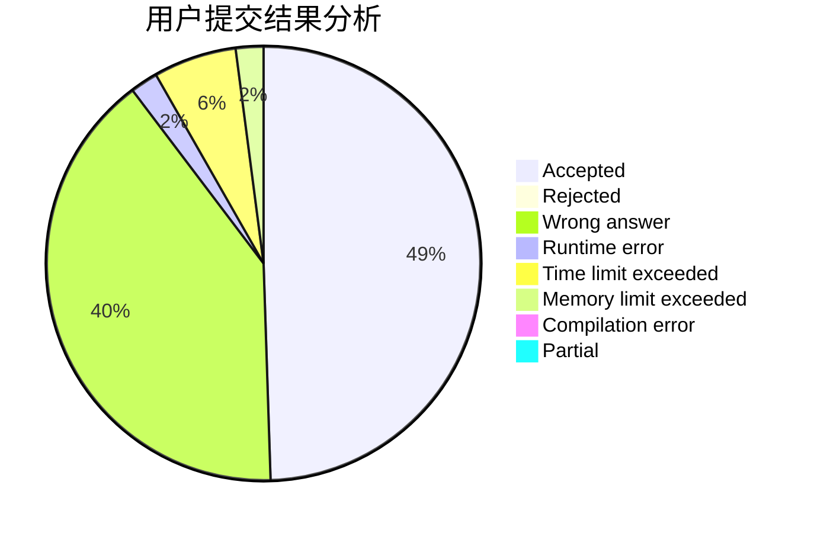
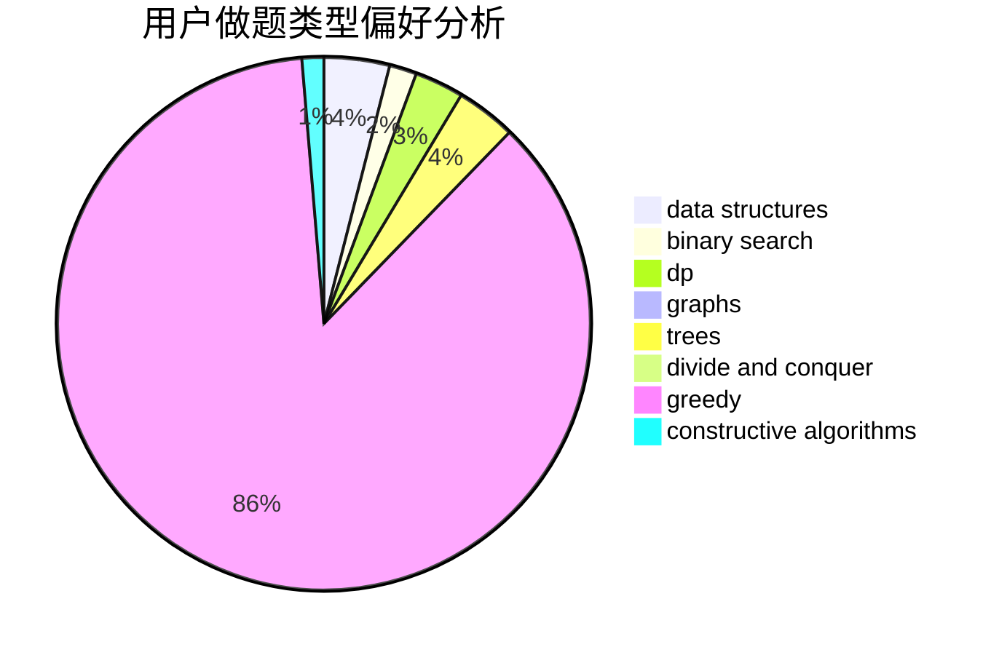
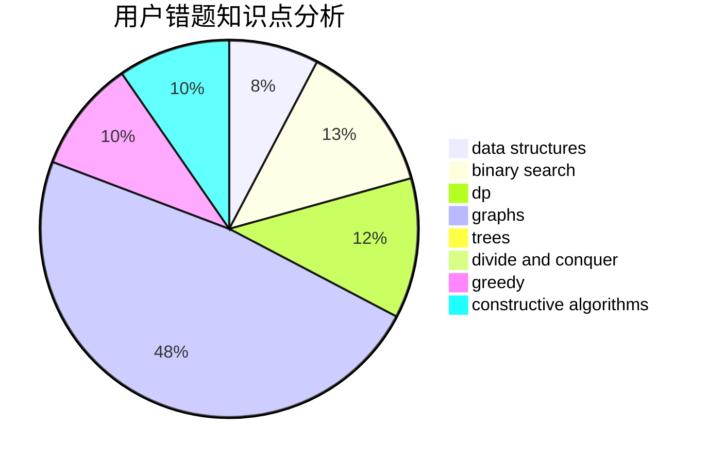

# blackbird137

<!-- tabs:start -->

#### **用户提交结果分析**

#### **用户做题类型偏好分析**

#### **用户错题知识点分析**

<!-- tabs:end -->
# 推荐题目
[952E](https://codeforces.com/contest/952/problem/E)		nan		  
[1067B](https://codeforces.com/contest/1067/problem/B)		dfs and similar,
                        graphs,
                        shortest paths		  
[234A](https://codeforces.com/contest/234/problem/A)		implementation		  
[466E](https://codeforces.com/contest/466/problem/E)		dfs and similar,
                        dsu,
                        graphs,
                        trees		  
[1036E](https://codeforces.com/contest/1036/problem/E)		fft,
                        geometry,
                        number theory		  
[494E](https://codeforces.com/contest/494/problem/E)		data structures,
                        games		  
[1285F](https://codeforces.com/contest/1285/problem/F)		binary search,
                        combinatorics,
                        number theory		  
[923B](https://codeforces.com/contest/923/problem/B)		binary search,
                        data structures		  
[621B](https://codeforces.com/contest/621/problem/B)		combinatorics,
                        implementation		  
[890A](https://codeforces.com/contest/890/problem/A)		dsu,graphs,sortings,trees		  
