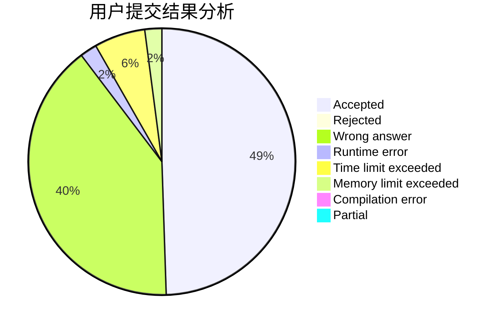
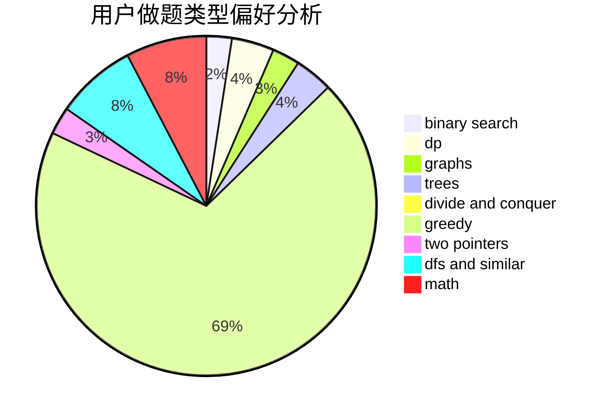

# blackbird137

<!-- tabs:start -->

#### **用户提交结果分析**

#### **用户做题类型偏好分析**

<!-- tabs:end -->
# 推荐题目
[952E](https://codeforces.com/contest/952/problem/E)
[1067B](https://codeforces.com/contest/1067/problem/B)
[234A](https://codeforces.com/contest/234/problem/A)
[466E](https://codeforces.com/contest/466/problem/E)
[1036E](https://codeforces.com/contest/1036/problem/E)
[494E](https://codeforces.com/contest/494/problem/E)
[1285F](https://codeforces.com/contest/1285/problem/F)
[923B](https://codeforces.com/contest/923/problem/B)
[621B](https://codeforces.com/contest/621/problem/B)
[890A](https://codeforces.com/contest/890/problem/A)
