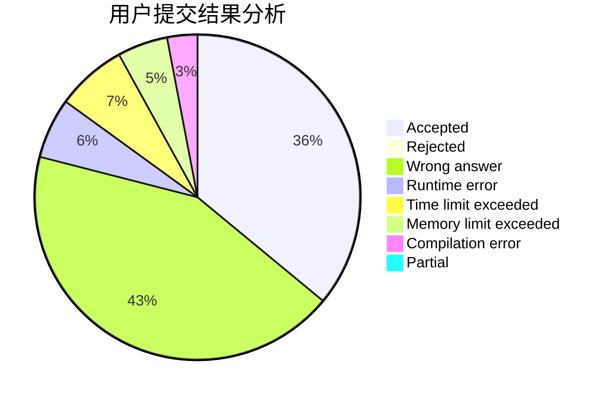
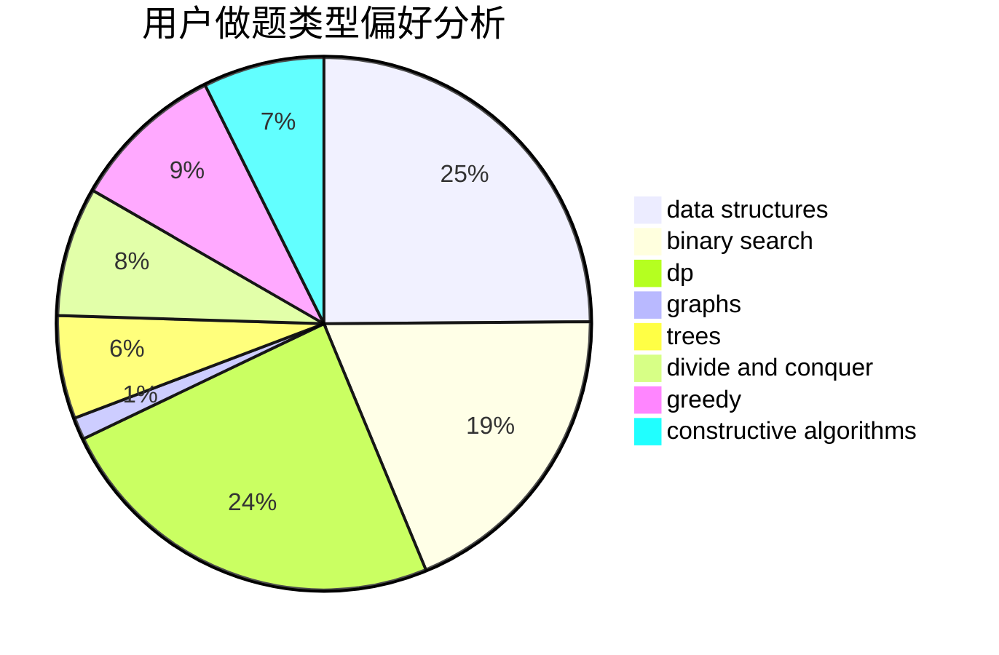
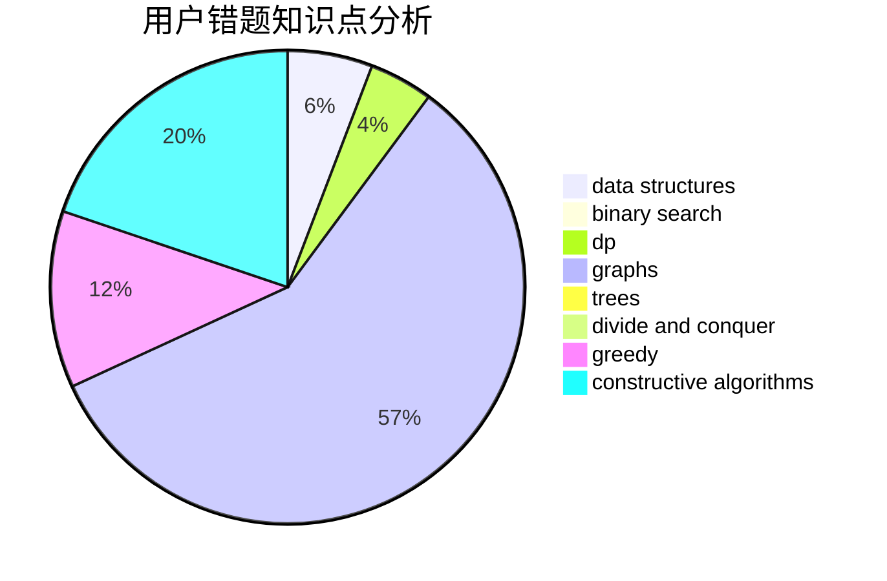

# blankvoid

<!-- tabs:start -->

#### **用户提交结果分析**

#### **用户做题类型偏好分析**

#### **用户错题知识点分析**

<!-- tabs:end -->
# 推荐题目
[229D](https://codeforces.com/contest/229/problem/D)		dp,
                        greedy,
                        two pointers		  
[643D](https://codeforces.com/contest/643/problem/D)		nan		  
[1510I](https://codeforces.com/contest/1510/problem/I)		greedy,
                        interactive,
                        math,
                        probabilities		  
[1081A](https://codeforces.com/contest/1081/problem/A)		constructive algorithms,
                        math		  
[888C](https://codeforces.com/contest/888/problem/C)		binary search,
                        implementation,
                        two pointers		  
[329E](https://codeforces.com/contest/329/problem/E)		math		  
[237C](https://codeforces.com/contest/237/problem/C)		binary search,
                        number theory,
                        two pointers		  
[567F](https://codeforces.com/contest/567/problem/F)		dp		  
[707E](https://codeforces.com/contest/707/problem/E)		data structures		  
[1028B](https://codeforces.com/contest/1028/problem/B)		constructive algorithms,
                        math		  
