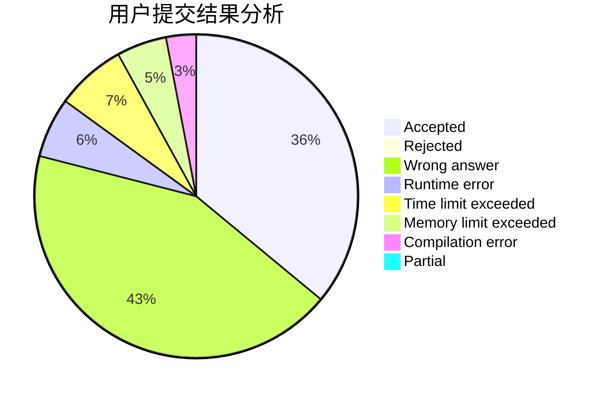
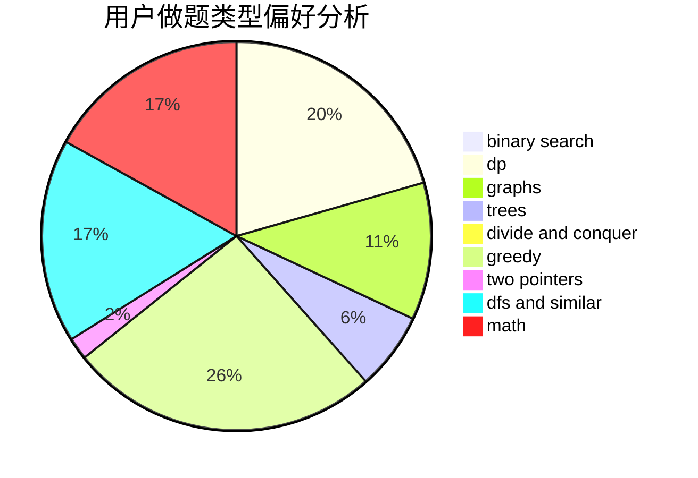

# blankvoid

<!-- tabs:start -->

#### **用户提交结果分析**

#### **用户做题类型偏好分析**

<!-- tabs:end -->
# 推荐题目
[249E](https://codeforces.com/contest/249/problem/E)
[670B](https://codeforces.com/contest/670/problem/B)
[166A](https://codeforces.com/contest/166/problem/A)
[1081D](https://codeforces.com/contest/1081/problem/D)
[908A](https://codeforces.com/contest/908/problem/A)
[357B](https://codeforces.com/contest/357/problem/B)
[25C](https://codeforces.com/contest/25/problem/C)
[587E](https://codeforces.com/contest/587/problem/E)
[725G](https://codeforces.com/contest/725/problem/G)
[1028E](https://codeforces.com/contest/1028/problem/E)
