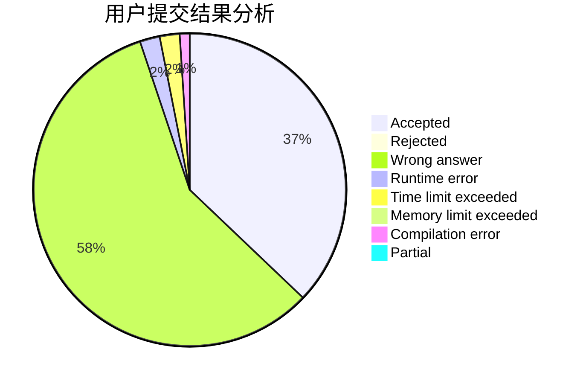
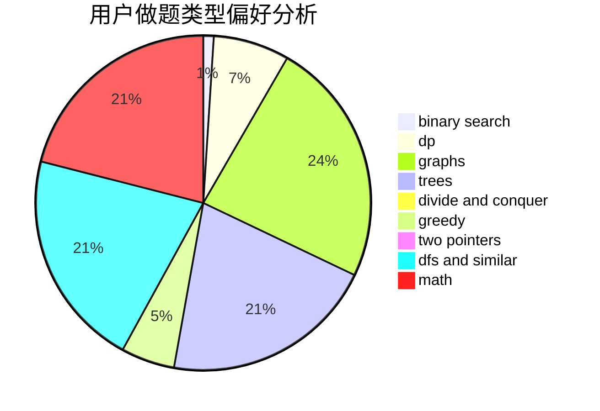

# blueblue_

<!-- tabs:start -->

#### **用户提交结果分析**

#### **用户做题类型偏好分析**

<!-- tabs:end -->
# 推荐题目
[1090D](https://codeforces.com/contest/1090/problem/D)
[1290F](https://codeforces.com/contest/1290/problem/F)
[181A](https://codeforces.com/contest/181/problem/A)
[687A](https://codeforces.com/contest/687/problem/A)
[1087A](https://codeforces.com/contest/1087/problem/A)
[1342C](https://codeforces.com/contest/1342/problem/C)
[959E](https://codeforces.com/contest/959/problem/E)
[908B](https://codeforces.com/contest/908/problem/B)
[584D](https://codeforces.com/contest/584/problem/D)
[715B](https://codeforces.com/contest/715/problem/B)
