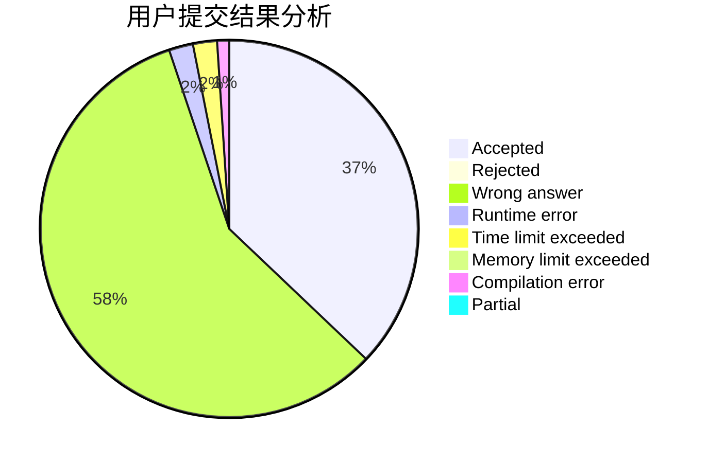
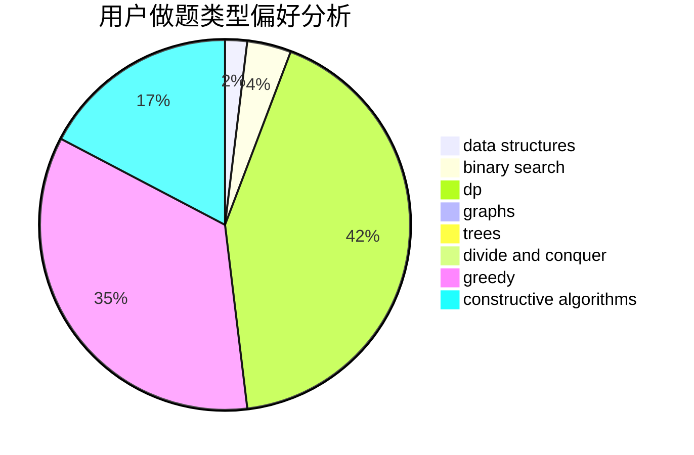
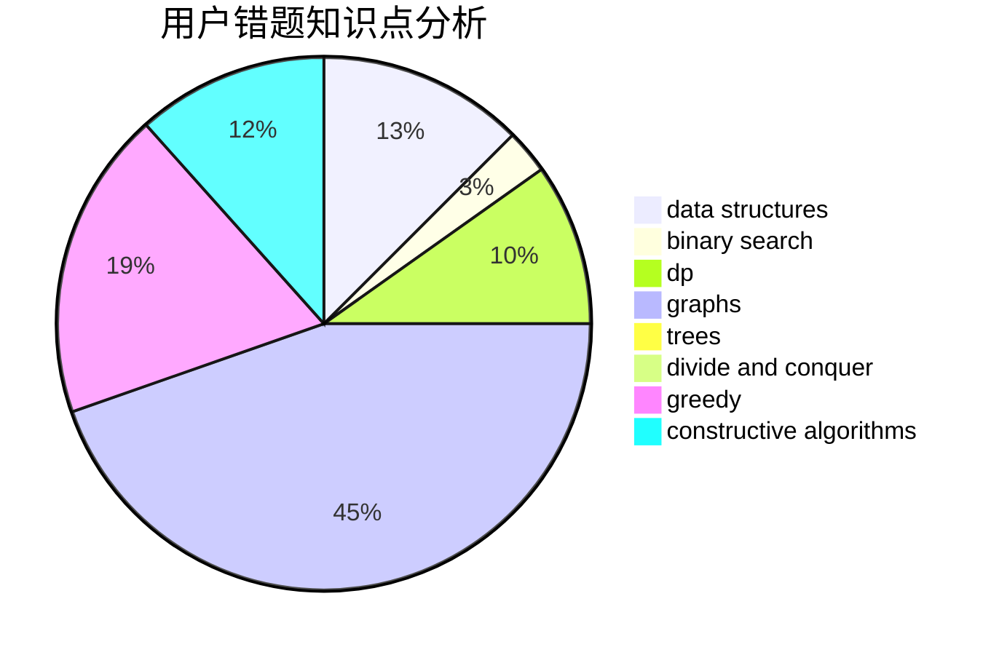

# blueblue_

<!-- tabs:start -->

#### **用户提交结果分析**

#### **用户做题类型偏好分析**

#### **用户错题知识点分析**

<!-- tabs:end -->
# 推荐题目
[1090D](https://codeforces.com/contest/1090/problem/D)		constructive algorithms		  
[1290F](https://codeforces.com/contest/1290/problem/F)		dp		  
[181A](https://codeforces.com/contest/181/problem/A)		brute force,
                        geometry,
                        implementation		  
[687A](https://codeforces.com/contest/687/problem/A)		dfs and similar,
                        graphs		  
[1087A](https://codeforces.com/contest/1087/problem/A)		dsu,graphs,sortings,trees		  
[1342C](https://codeforces.com/contest/1342/problem/C)		math,
                        number theory		  
[959E](https://codeforces.com/contest/959/problem/E)		bitmasks,
                        dp,
                        graphs,
                        implementation,
                        math		  
[908B](https://codeforces.com/contest/908/problem/B)		brute force,
                        implementation		  
[584D](https://codeforces.com/contest/584/problem/D)		brute force,
                        math,
                        number theory		  
[715B](https://codeforces.com/contest/715/problem/B)		binary search,
                        constructive algorithms,
                        graphs,
                        shortest paths		  
