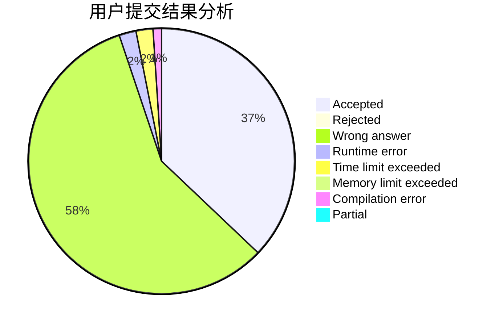
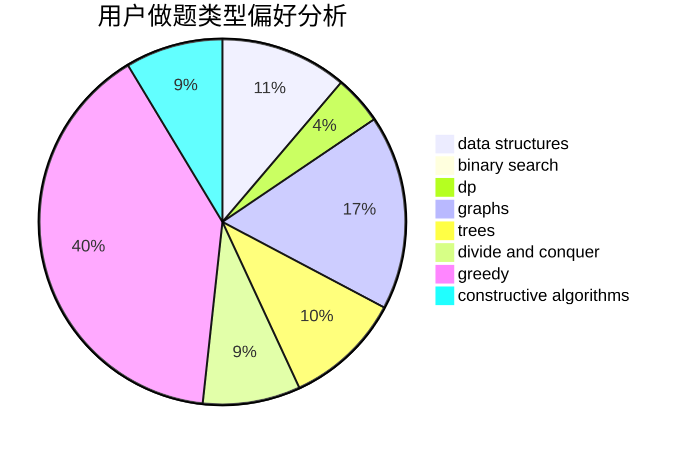
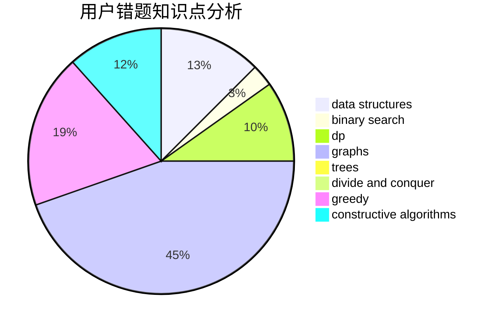

# blueblue_

<!-- tabs:start -->

#### **用户提交结果分析**

#### **用户做题类型偏好分析**

#### **用户错题知识点分析**

<!-- tabs:end -->
# 推荐题目
[108C](https://codeforces.com/contest/108/problem/C)		dsu,graphs,sortings,trees		  
[1283F](https://codeforces.com/contest/1283/problem/F)		constructive algorithms,
                        greedy,
                        trees		  
[159D](https://codeforces.com/contest/159/problem/D)		*special problem,
                        brute force,
                        dp,
                        strings		  
[666A](https://codeforces.com/contest/666/problem/A)		dp,
                        implementation,
                        strings		  
[1086C](https://codeforces.com/contest/1086/problem/C)		dsu,graphs,sortings,trees		  
[1335C](https://codeforces.com/contest/1335/problem/C)		binary search,
                        greedy,
                        implementation,
                        sortings		  
[937C](https://codeforces.com/contest/937/problem/C)		dsu,graphs,sortings,trees		  
[888D](https://codeforces.com/contest/888/problem/D)		combinatorics,
                        dp,
                        math		  
[560E](https://codeforces.com/contest/560/problem/E)		dsu,graphs,sortings,trees		  
[698D](https://codeforces.com/contest/698/problem/D)		brute force,
                        geometry,
                        math		  
