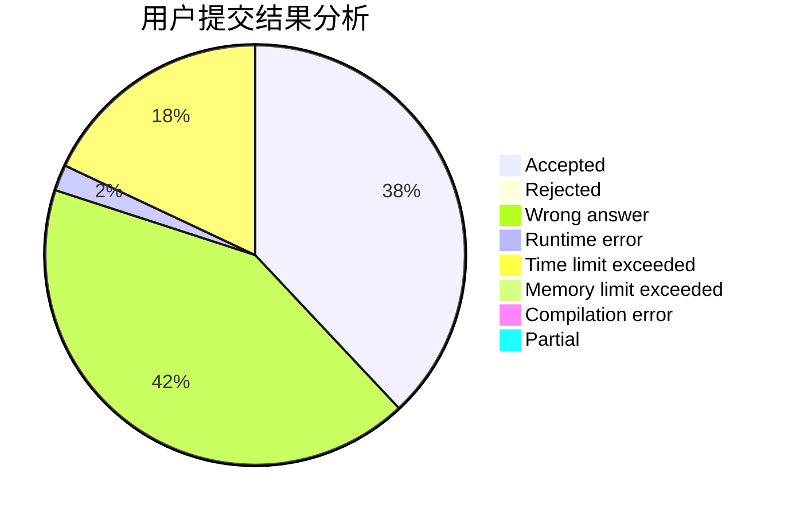
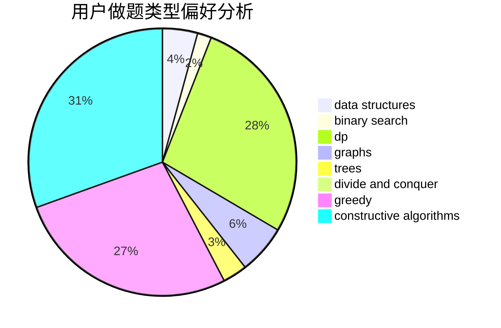

# bnnpuu

<!-- tabs:start -->

#### **用户提交结果分析**

#### **用户做题类型偏好分析**

#### **用户错题知识点分析**

<!-- tabs:end -->
# 推荐题目
[348B](https://codeforces.com/contest/348/problem/B)		dfs and similar,
                        number theory,
                        trees		  
[683B](https://codeforces.com/contest/683/problem/B)		*special problem		  
[51F](https://codeforces.com/contest/51/problem/F)		dfs and similar,
                        dp,
                        graphs,
                        trees		  
[1011D](https://codeforces.com/contest/1011/problem/D)		dsu,graphs,sortings,trees		  
[841C](https://codeforces.com/contest/841/problem/C)		dsu,graphs,sortings,trees		  
[843B](https://codeforces.com/contest/843/problem/B)		brute force,
                        interactive,
                        probabilities		  
[967D](https://codeforces.com/contest/967/problem/D)		dsu,graphs,sortings,trees		  
[263C](https://codeforces.com/contest/263/problem/C)		brute force,
                        dfs and similar,
                        implementation		  
[662E](https://codeforces.com/contest/662/problem/E)		brute force,
                        dp,
                        greedy		  
[1347B](https://codeforces.com/contest/1347/problem/B)		dsu,graphs,sortings,trees		  
