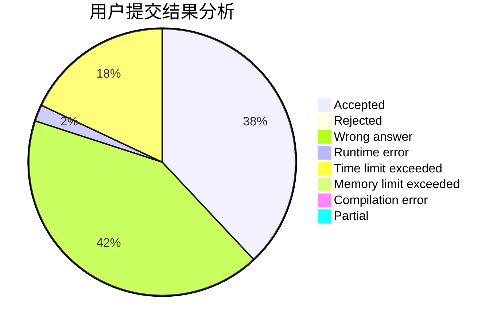
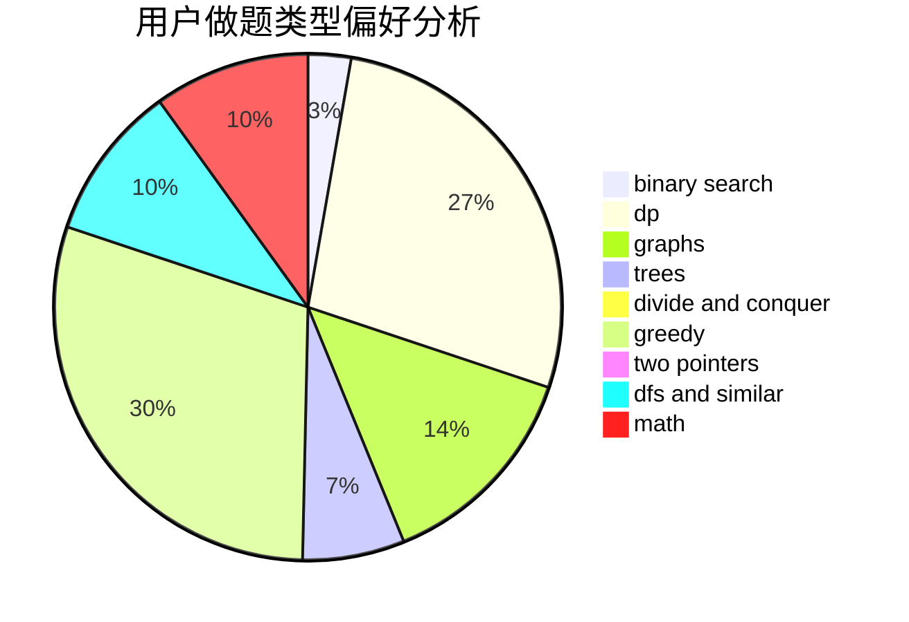

# bnnpuu

<!-- tabs:start -->

#### **用户提交结果分析**

#### **用户做题类型偏好分析**

<!-- tabs:end -->
# 推荐题目
[348B](https://codeforces.com/contest/348/problem/B)
[683B](https://codeforces.com/contest/683/problem/B)
[51F](https://codeforces.com/contest/51/problem/F)
[1011D](https://codeforces.com/contest/1011/problem/D)
[841C](https://codeforces.com/contest/841/problem/C)
[843B](https://codeforces.com/contest/843/problem/B)
[967D](https://codeforces.com/contest/967/problem/D)
[263C](https://codeforces.com/contest/263/problem/C)
[662E](https://codeforces.com/contest/662/problem/E)
[1347B](https://codeforces.com/contest/1347/problem/B)
