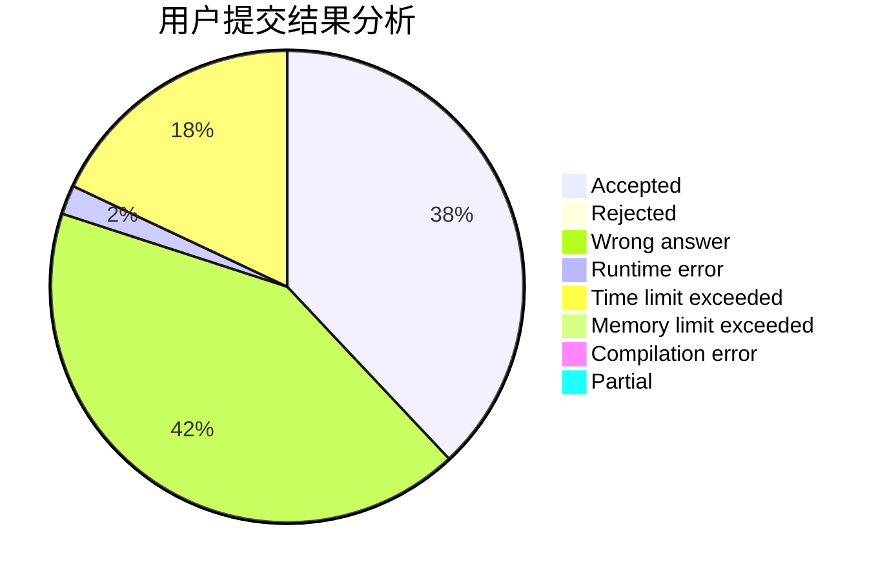
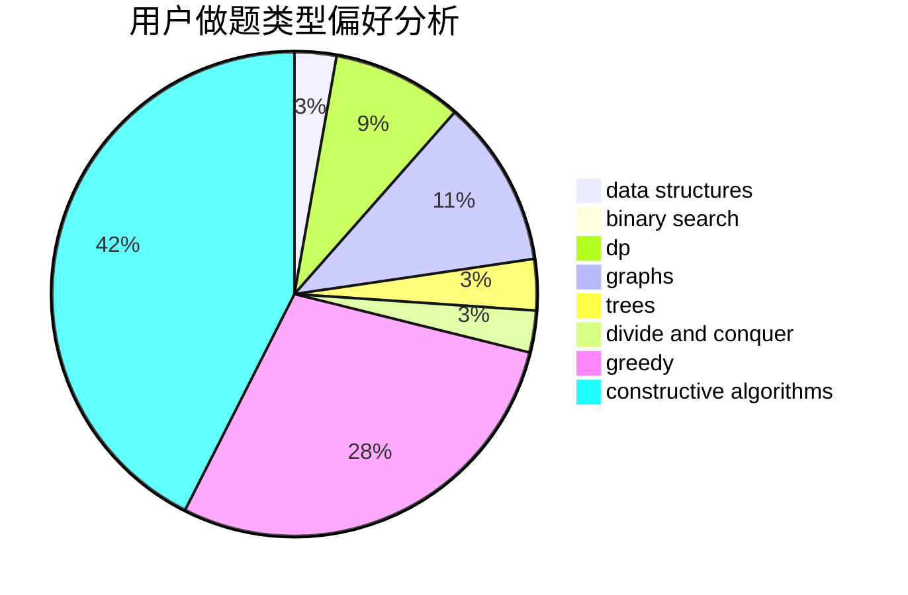
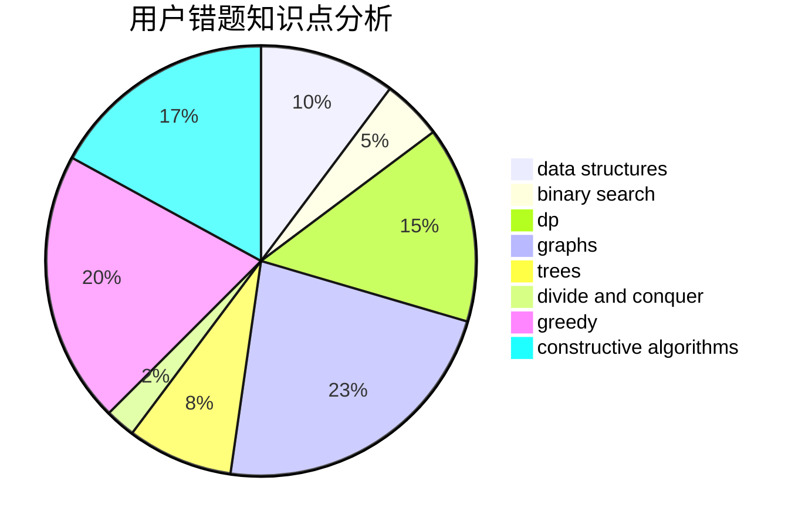

# bnnpuu

<!-- tabs:start -->

#### **用户提交结果分析**

#### **用户做题类型偏好分析**

#### **用户错题知识点分析**

<!-- tabs:end -->
# 推荐题目
[318A](https://codeforces.com/contest/318/problem/A)		math		  
[664A](https://codeforces.com/contest/664/problem/A)		math,
                        number theory		  
[49E](https://codeforces.com/contest/49/problem/E)		dp		  
[1011A](https://codeforces.com/contest/1011/problem/A)		greedy,
                        implementation,
                        sortings		  
[821D](https://codeforces.com/contest/821/problem/D)		dfs and similar,
                        graphs,
                        shortest paths		  
[825B](https://codeforces.com/contest/825/problem/B)		brute force,
                        implementation		  
[950B](https://codeforces.com/contest/950/problem/B)		greedy,
                        implementation		  
[241E](https://codeforces.com/contest/241/problem/E)		graphs,
                        shortest paths		  
[632B](https://codeforces.com/contest/632/problem/B)		brute force,
                        constructive algorithms		  
[1340C](https://codeforces.com/contest/1340/problem/C)		dfs and similar,
                        dp,
                        graphs,
                        shortest paths		  
