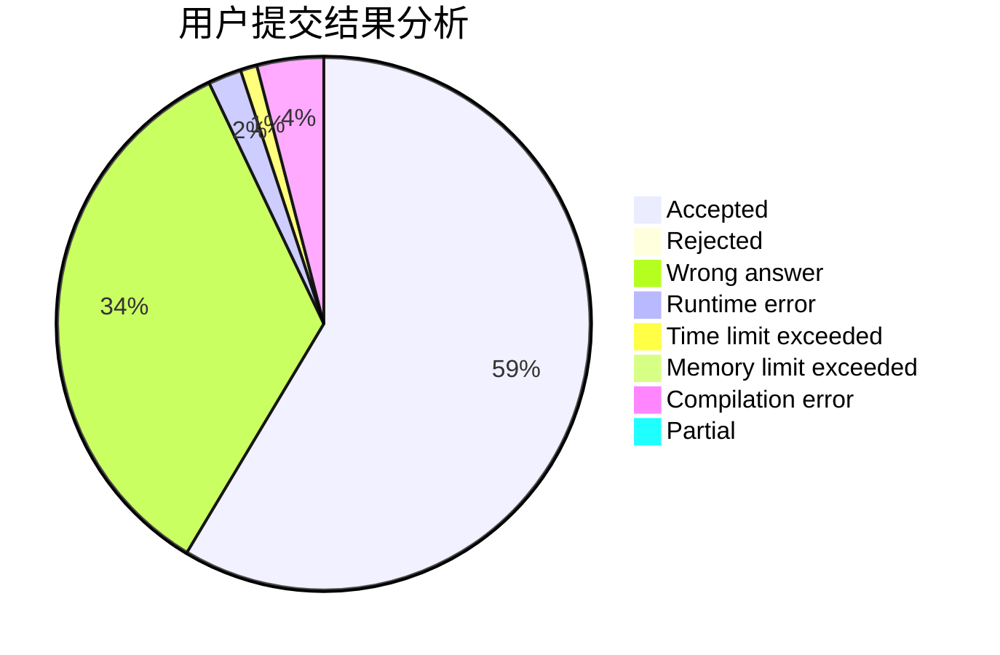
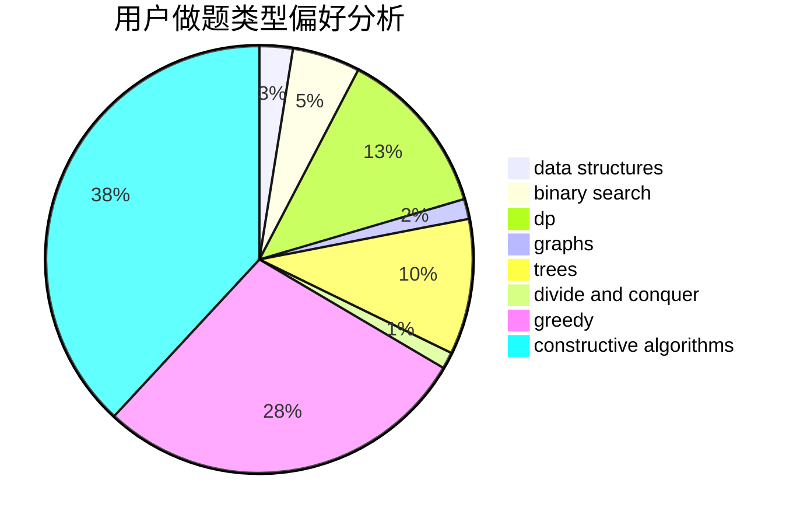
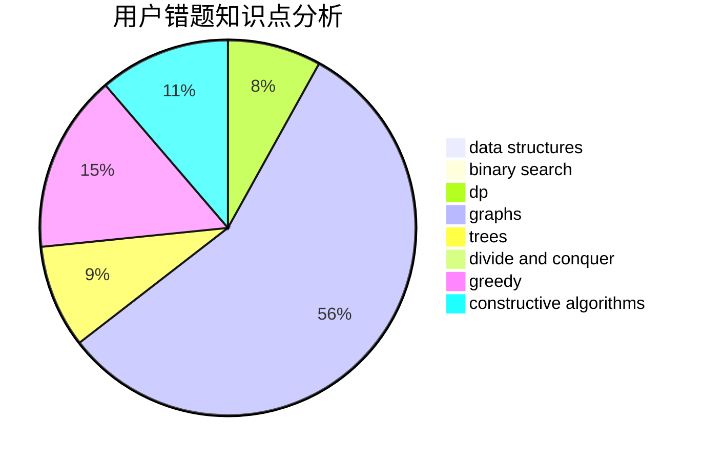

# bnubeginner

<!-- tabs:start -->

#### **用户提交结果分析**

#### **用户做题类型偏好分析**

#### **用户错题知识点分析**

<!-- tabs:end -->
# 推荐题目
[1469F](https://codeforces.com/contest/1469/problem/F)		binary search,
                        data structures,
                        greedy		  
[416D](https://codeforces.com/contest/416/problem/D)		greedy,
                        implementation,
                        math		  
[895D](https://codeforces.com/contest/895/problem/D)		combinatorics,
                        math,
                        strings		  
[1159A](https://codeforces.com/contest/1159/problem/A)		implementation,
                        math		  
[917C](https://codeforces.com/contest/917/problem/C)		combinatorics,
                        dp,
                        matrices		  
[1401D](https://codeforces.com/contest/1401/problem/D)		dfs and similar,
                        dp,
                        greedy,
                        implementation,
                        math,
                        number theory,
                        sortings,
                        trees		  
[1011A](https://codeforces.com/contest/1011/problem/A)		greedy,
                        implementation,
                        sortings		  
[774C](https://codeforces.com/contest/774/problem/C)		*special problem,
                        constructive algorithms,
                        greedy,
                        implementation		  
[1190E](https://codeforces.com/contest/1190/problem/E)		binary search,
                        greedy		  
[685C](https://codeforces.com/contest/685/problem/C)		binary search,
                        math		  
