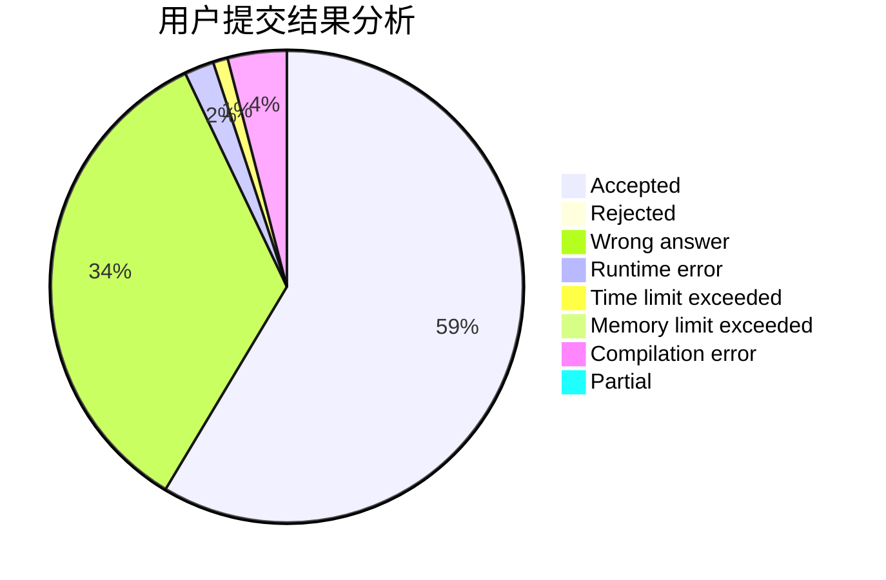
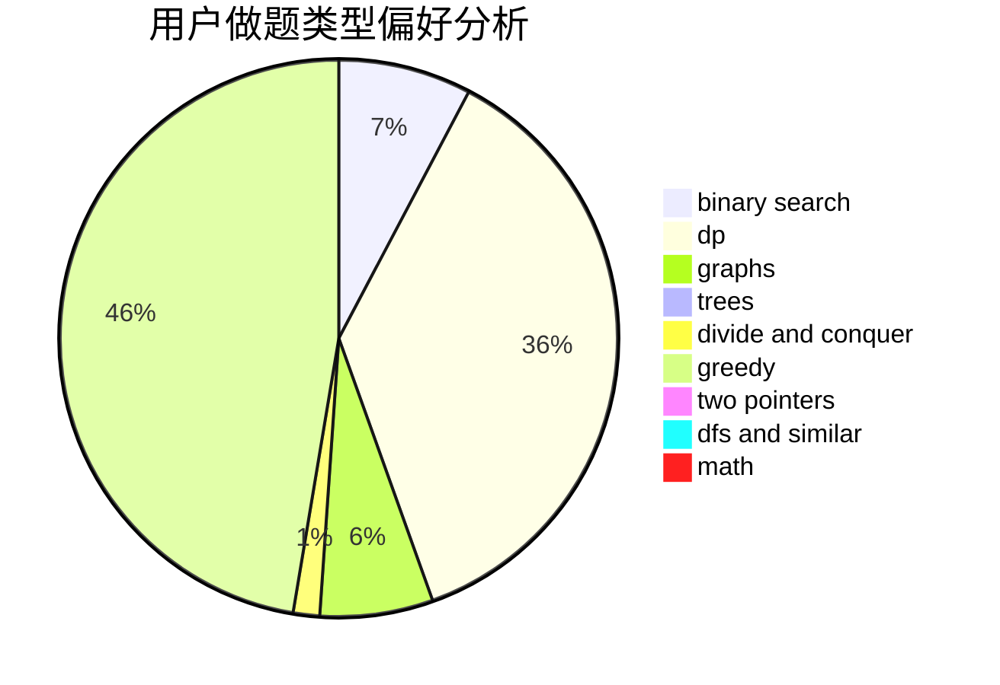

# bnubeginner

<!-- tabs:start -->

#### **用户提交结果分析**

#### **用户做题类型偏好分析**

<!-- tabs:end -->
# 推荐题目
[1478A](https://codeforces.com/contest/1478/problem/A)
[441D](https://codeforces.com/contest/441/problem/D)
[913B](https://codeforces.com/contest/913/problem/B)
[1161E](https://codeforces.com/contest/1161/problem/E)
[938A](https://codeforces.com/contest/938/problem/A)
[1411G](https://codeforces.com/contest/1411/problem/G)
[1011D](https://codeforces.com/contest/1011/problem/D)
[793D](https://codeforces.com/contest/793/problem/D)
[1196C](https://codeforces.com/contest/1196/problem/C)
[707E](https://codeforces.com/contest/707/problem/E)
