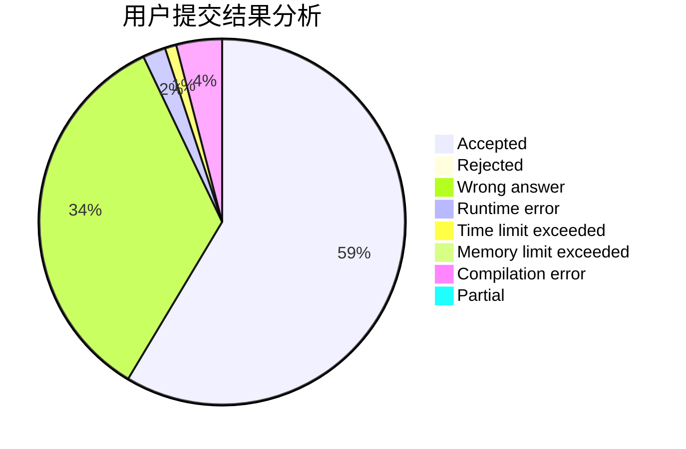
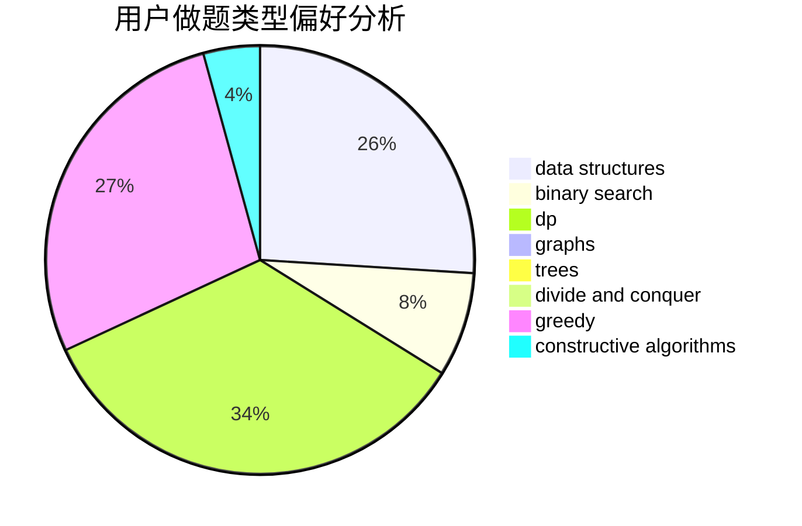
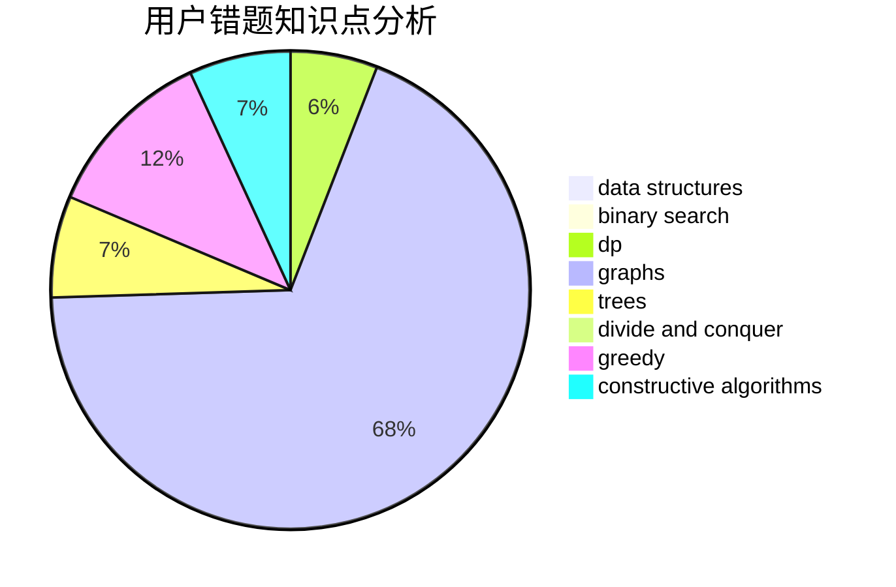

# bnubeginner

<!-- tabs:start -->

#### **用户提交结果分析**

#### **用户做题类型偏好分析**

#### **用户错题知识点分析**

<!-- tabs:end -->
# 推荐题目
[1478A](https://codeforces.com/contest/1478/problem/A)		brute force,
                        greedy		  
[441D](https://codeforces.com/contest/441/problem/D)		constructive algorithms,
                        dsu,
                        graphs,
                        implementation,
                        math,
                        string suffix structures		  
[913B](https://codeforces.com/contest/913/problem/B)		implementation,
                        trees		  
[1161E](https://codeforces.com/contest/1161/problem/E)		dsu,graphs,sortings,trees		  
[938A](https://codeforces.com/contest/938/problem/A)		implementation		  
[1411G](https://codeforces.com/contest/1411/problem/G)		bitmasks,
                        games,
                        math,
                        matrices		  
[1011D](https://codeforces.com/contest/1011/problem/D)		dsu,graphs,sortings,trees		  
[793D](https://codeforces.com/contest/793/problem/D)		dp,
                        graphs,
                        shortest paths		  
[1196C](https://codeforces.com/contest/1196/problem/C)		implementation		  
[707E](https://codeforces.com/contest/707/problem/E)		data structures		  
