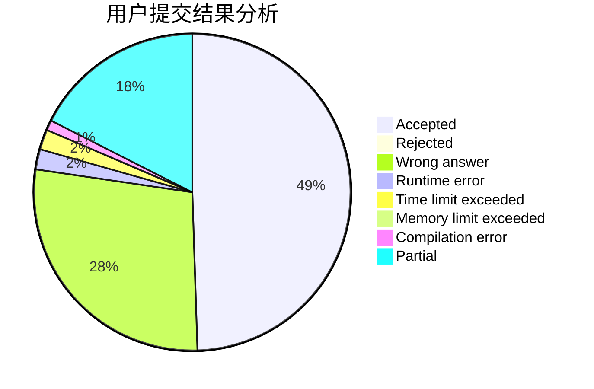
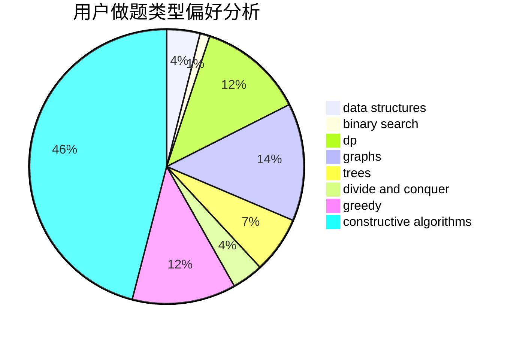

# bobby285271

<!-- tabs:start -->

#### **用户提交结果分析**

#### **用户做题类型偏好分析**

#### **用户错题知识点分析**

<!-- tabs:end -->
# 推荐题目
[1153C](https://codeforces.com/contest/1153/problem/C)		greedy,
                        strings		  
[429C](https://codeforces.com/contest/429/problem/C)		bitmasks,
                        constructive algorithms,
                        dp,
                        greedy,
                        trees		  
[1C](https://codeforces.com/contest/1/problem/C)		geometry,
                        math		  
[670C](https://codeforces.com/contest/670/problem/C)		implementation,
                        sortings		  
[354C](https://codeforces.com/contest/354/problem/C)		brute force,
                        dp,
                        number theory		  
[978C](https://codeforces.com/contest/978/problem/C)		binary search,
                        implementation,
                        two pointers		  
[216C](https://codeforces.com/contest/216/problem/C)		greedy		  
[709C](https://codeforces.com/contest/709/problem/C)		dsu,graphs,sortings,trees		  
[8D](https://codeforces.com/contest/8/problem/D)		binary search,
                        geometry		  
[1415F](https://codeforces.com/contest/1415/problem/F)		dp		  
