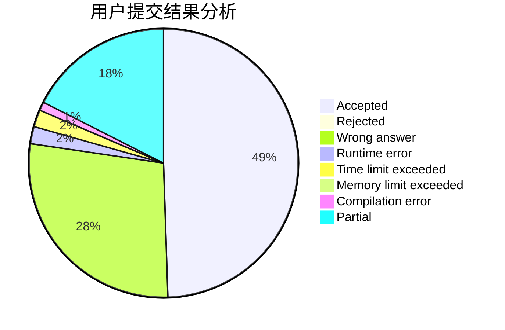
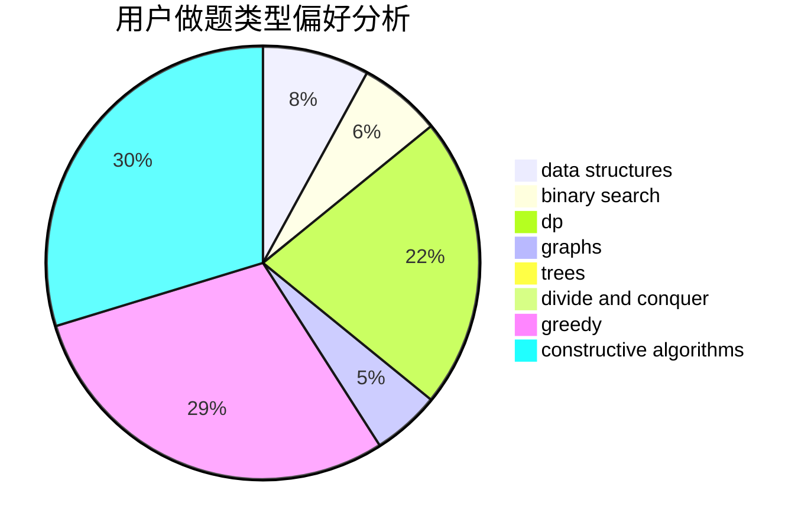
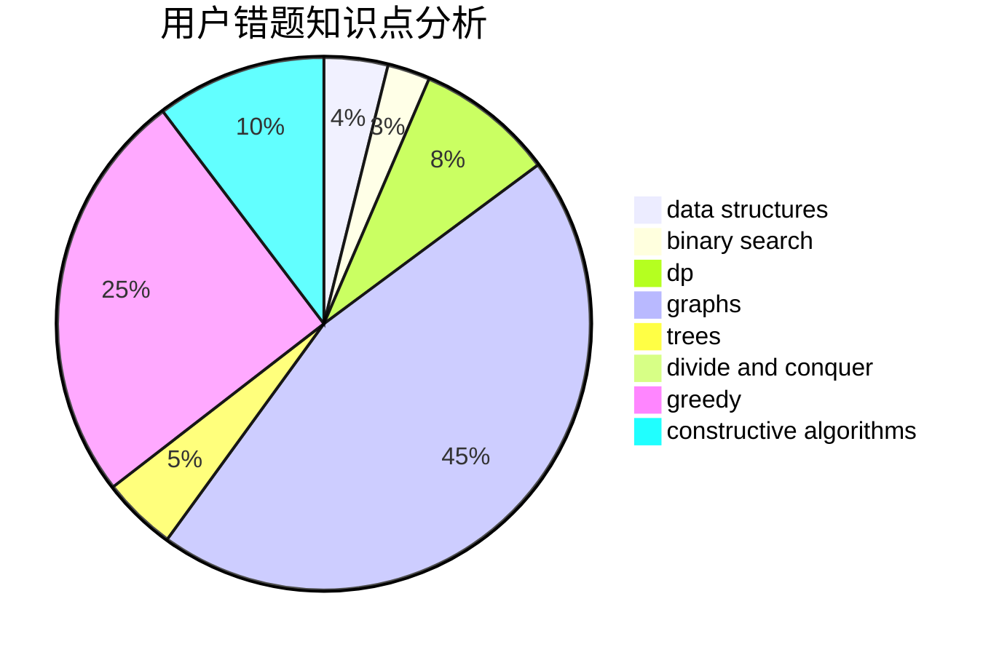

# bobby285271

<!-- tabs:start -->

#### **用户提交结果分析**

#### **用户做题类型偏好分析**

#### **用户错题知识点分析**

<!-- tabs:end -->
# 推荐题目
[1151C](https://codeforces.com/contest/1151/problem/C)		constructive algorithms,
                        math		  
[3B](https://codeforces.com/contest/3/problem/B)		greedy,
                        sortings		  
[174C](https://codeforces.com/contest/174/problem/C)		data structures,
                        greedy		  
[643E](https://codeforces.com/contest/643/problem/E)		dp,
                        math,
                        probabilities,
                        trees		  
[325B](https://codeforces.com/contest/325/problem/B)		binary search,
                        math		  
[956F](https://codeforces.com/contest/956/problem/F)		dsu,graphs,sortings,trees		  
[193B](https://codeforces.com/contest/193/problem/B)		brute force		  
[688A](https://codeforces.com/contest/688/problem/A)		implementation		  
[87C](https://codeforces.com/contest/87/problem/C)		dp,
                        games,
                        math		  
[1404D](https://codeforces.com/contest/1404/problem/D)		constructive algorithms,
                        dfs and similar,
                        interactive,
                        math,
                        number theory		  
