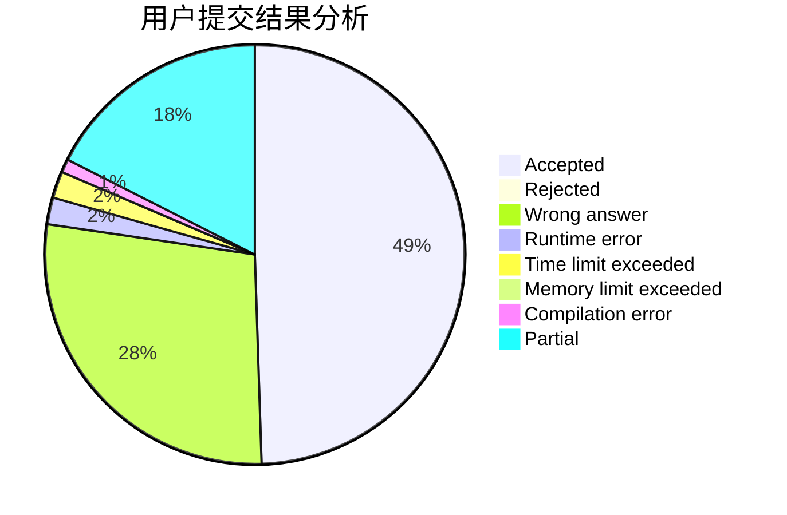
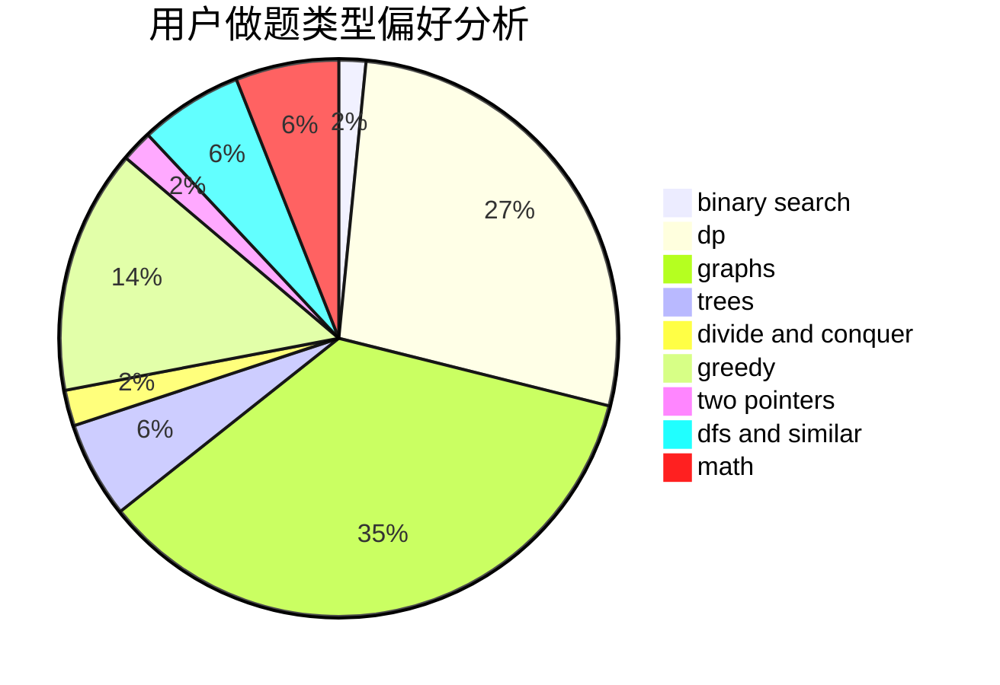

# bobby285271

<!-- tabs:start -->

#### **用户提交结果分析**

#### **用户做题类型偏好分析**

<!-- tabs:end -->
# 推荐题目
[1153C](https://codeforces.com/contest/1153/problem/C)
[429C](https://codeforces.com/contest/429/problem/C)
[1C](https://codeforces.com/contest/1/problem/C)
[670C](https://codeforces.com/contest/670/problem/C)
[354C](https://codeforces.com/contest/354/problem/C)
[978C](https://codeforces.com/contest/978/problem/C)
[216C](https://codeforces.com/contest/216/problem/C)
[709C](https://codeforces.com/contest/709/problem/C)
[8D](https://codeforces.com/contest/8/problem/D)
[1415F](https://codeforces.com/contest/1415/problem/F)
