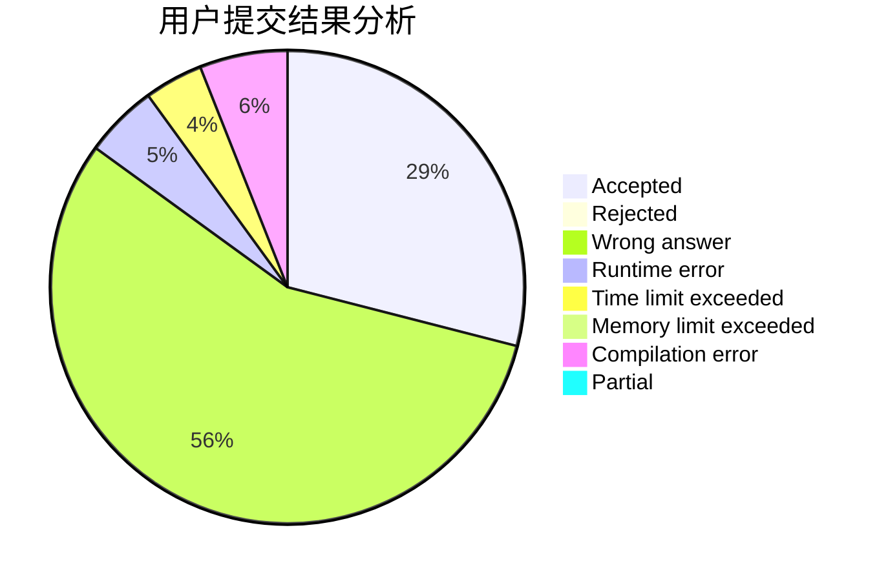
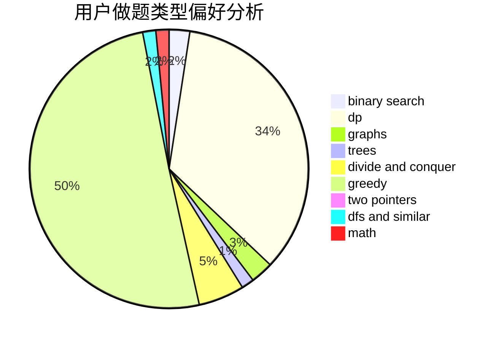

# bobh

<!-- tabs:start -->

#### **用户提交结果分析**

#### **用户做题类型偏好分析**

<!-- tabs:end -->
# 推荐题目
[1484F](https://codeforces.com/contest/1484/problem/F)
[708B](https://codeforces.com/contest/708/problem/B)
[578B](https://codeforces.com/contest/578/problem/B)
[382E](https://codeforces.com/contest/382/problem/E)
[977A](https://codeforces.com/contest/977/problem/A)
[1091H](https://codeforces.com/contest/1091/problem/H)
[442B](https://codeforces.com/contest/442/problem/B)
[611C](https://codeforces.com/contest/611/problem/C)
[810D](https://codeforces.com/contest/810/problem/D)
[1176E](https://codeforces.com/contest/1176/problem/E)
