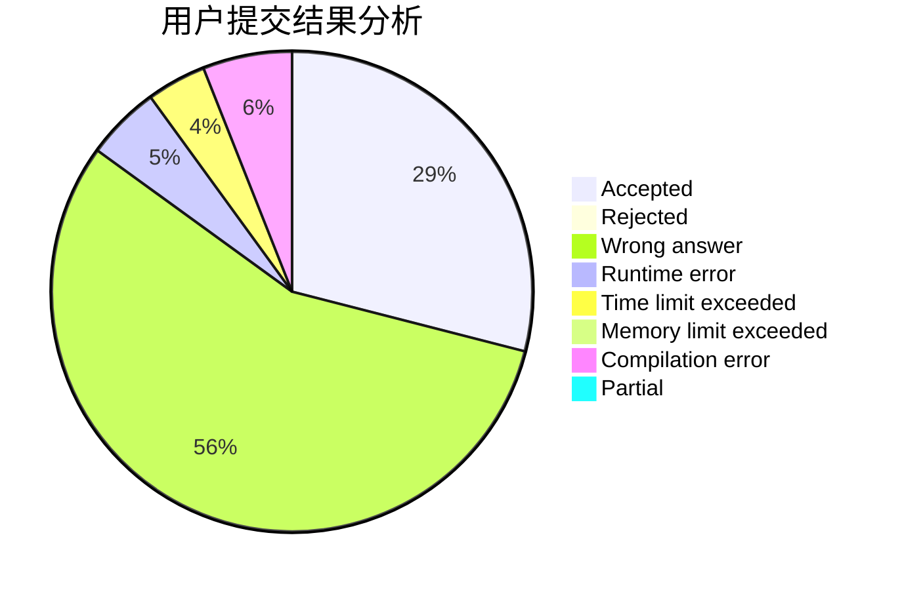
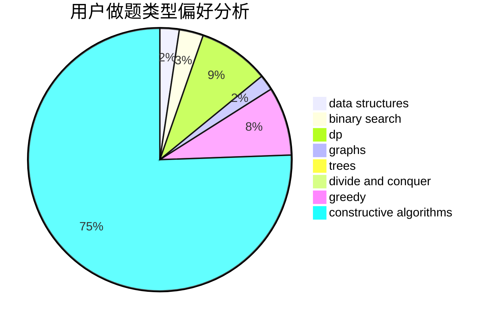
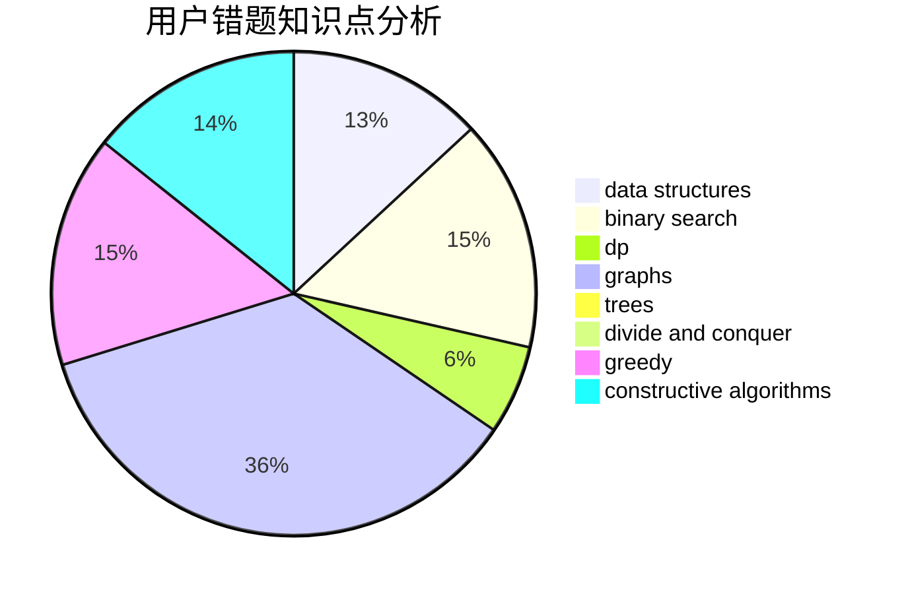

# bobh

<!-- tabs:start -->

#### **用户提交结果分析**

#### **用户做题类型偏好分析**

#### **用户错题知识点分析**

<!-- tabs:end -->
# 推荐题目
[1476B](https://codeforces.com/contest/1476/problem/B)		binary search,
                        brute force,
                        greedy,
                        math		  
[686B](https://codeforces.com/contest/686/problem/B)		constructive algorithms,
                        implementation,
                        sortings		  
[552E](https://codeforces.com/contest/552/problem/E)		brute force,
                        dp,
                        expression parsing,
                        greedy,
                        implementation,
                        strings		  
[356D](https://codeforces.com/contest/356/problem/D)		bitmasks,
                        constructive algorithms,
                        dp,
                        greedy		  
[955A](https://codeforces.com/contest/955/problem/A)		greedy,
                        math		  
[1091E](https://codeforces.com/contest/1091/problem/E)		binary search,
                        data structures,
                        graphs,
                        greedy,
                        implementation,
                        math,
                        sortings		  
[417C](https://codeforces.com/contest/417/problem/C)		constructive algorithms,
                        graphs,
                        implementation		  
[592A](https://codeforces.com/contest/592/problem/A)		implementation		  
[796C](https://codeforces.com/contest/796/problem/C)		constructive algorithms,
                        data structures,
                        dp,
                        trees		  
[1174C](https://codeforces.com/contest/1174/problem/C)		constructive algorithms,
                        number theory		  
