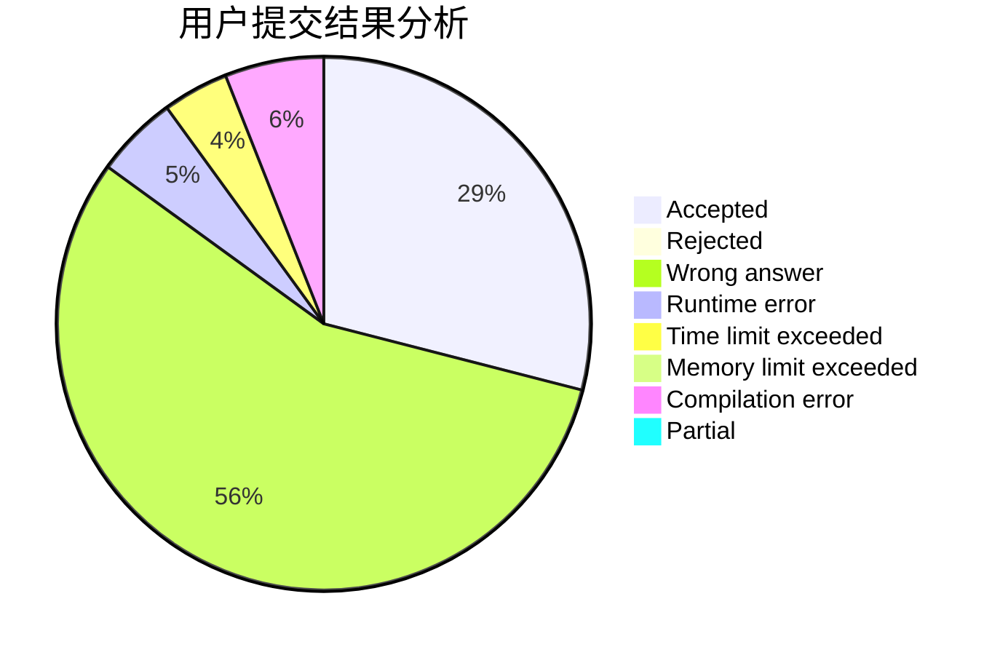
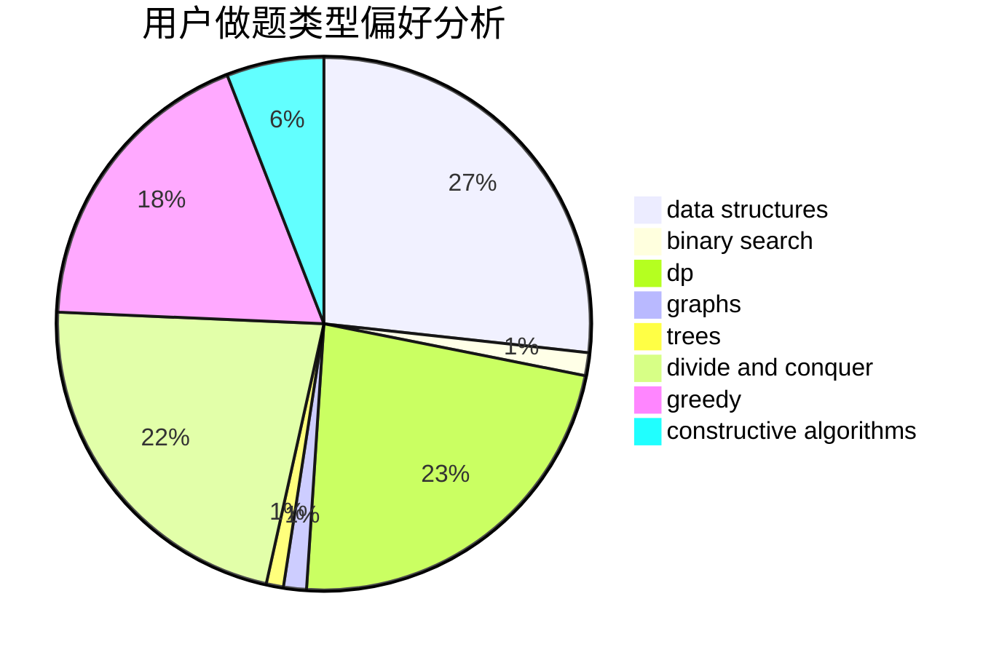
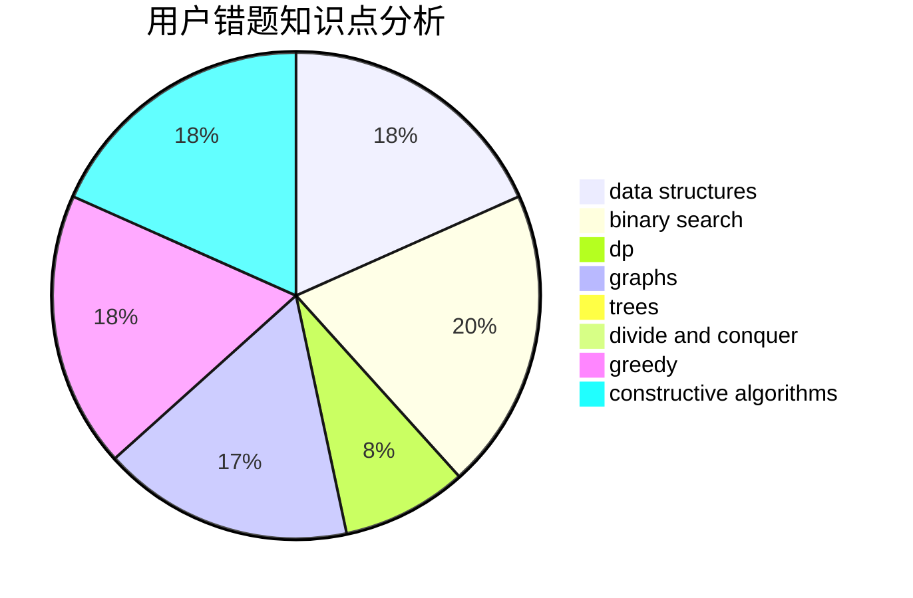

# bobh

<!-- tabs:start -->

#### **用户提交结果分析**

#### **用户做题类型偏好分析**

#### **用户错题知识点分析**

<!-- tabs:end -->
# 推荐题目
[1484F](https://codeforces.com/contest/1484/problem/F)		dsu,graphs,sortings,trees		  
[708B](https://codeforces.com/contest/708/problem/B)		constructive algorithms,
                        greedy,
                        implementation,
                        math		  
[578B](https://codeforces.com/contest/578/problem/B)		brute force,
                        greedy		  
[382E](https://codeforces.com/contest/382/problem/E)		combinatorics,
                        dp		  
[977A](https://codeforces.com/contest/977/problem/A)		implementation		  
[1091H](https://codeforces.com/contest/1091/problem/H)		games		  
[442B](https://codeforces.com/contest/442/problem/B)		greedy,
                        math,
                        probabilities		  
[611C](https://codeforces.com/contest/611/problem/C)		dp,
                        implementation		  
[810D](https://codeforces.com/contest/810/problem/D)		dsu,graphs,sortings,trees		  
[1176E](https://codeforces.com/contest/1176/problem/E)		dfs and similar,
                        dsu,
                        graphs,
                        shortest paths,
                        trees		  
