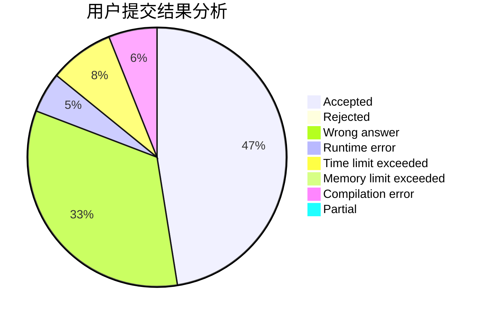
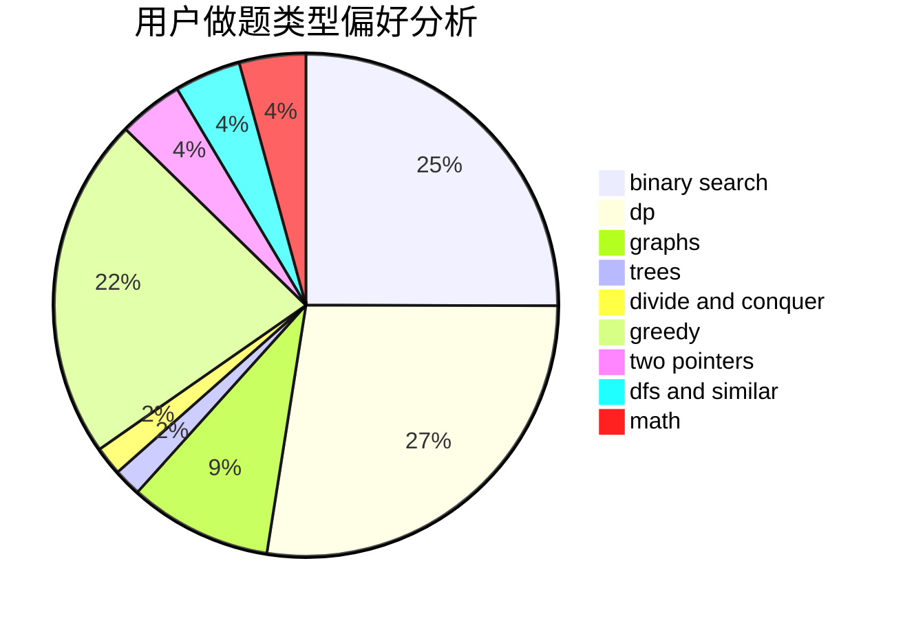

# Angel_Demon

<!-- tabs:start -->

#### **用户提交结果分析**

#### **用户做题类型偏好分析**

<!-- tabs:end -->
# 推荐题目
[1326C](https://codeforces.com/contest/1326/problem/C)
[1435B](https://codeforces.com/contest/1435/problem/B)
[1159F](https://codeforces.com/contest/1159/problem/F)
[353A](https://codeforces.com/contest/353/problem/A)
[359C](https://codeforces.com/contest/359/problem/C)
[1288A](https://codeforces.com/contest/1288/problem/A)
[360E](https://codeforces.com/contest/360/problem/E)
[359B](https://codeforces.com/contest/359/problem/B)
[1335F](https://codeforces.com/contest/1335/problem/F)
[1159C](https://codeforces.com/contest/1159/problem/C)
