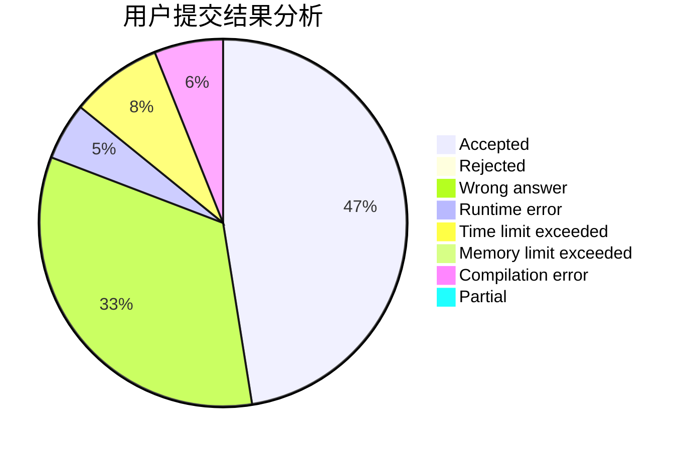
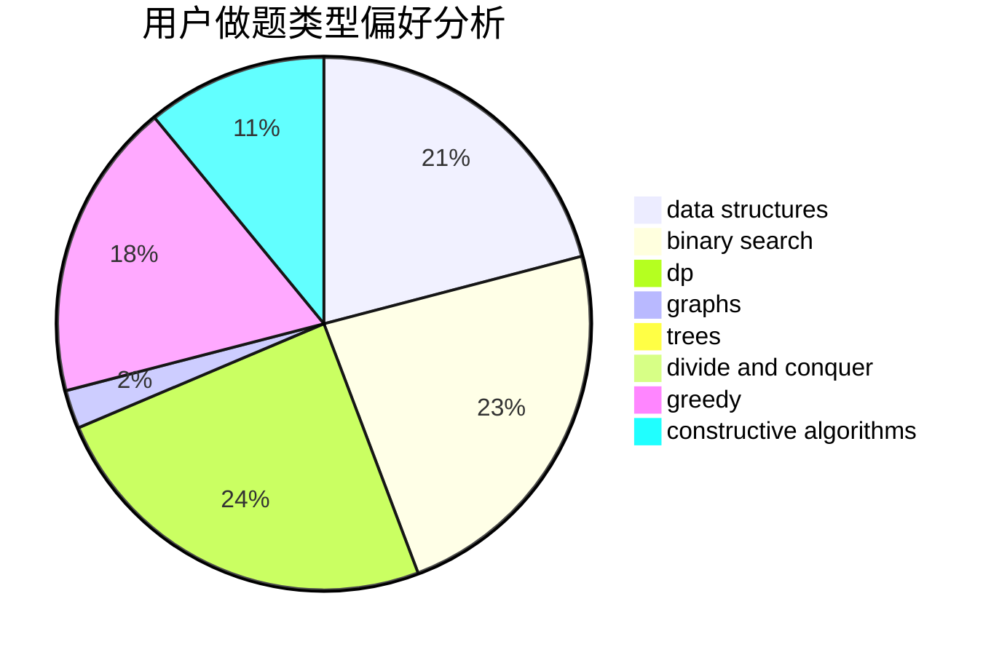
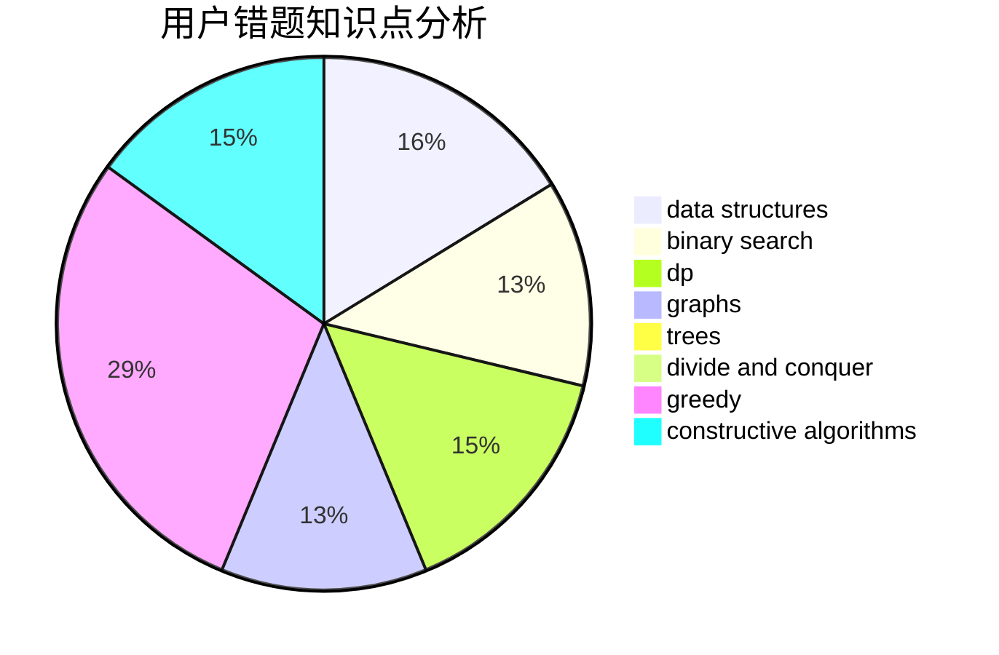

# Angel_Demon

<!-- tabs:start -->

#### **用户提交结果分析**

#### **用户做题类型偏好分析**

#### **用户错题知识点分析**

<!-- tabs:end -->
# 推荐题目
[1326C](https://codeforces.com/contest/1326/problem/C)		combinatorics,
                        greedy,
                        math		  
[1435B](https://codeforces.com/contest/1435/problem/B)		dsu,graphs,sortings,trees		  
[1159F](https://codeforces.com/contest/1159/problem/F)		dsu,graphs,sortings,trees		  
[353A](https://codeforces.com/contest/353/problem/A)		implementation,
                        math		  
[359C](https://codeforces.com/contest/359/problem/C)		math,
                        number theory		  
[1288A](https://codeforces.com/contest/1288/problem/A)		binary search,
                        brute force,
                        math,
                        ternary search		  
[360E](https://codeforces.com/contest/360/problem/E)		graphs,
                        greedy,
                        shortest paths		  
[359B](https://codeforces.com/contest/359/problem/B)		constructive algorithms,
                        dp,
                        math		  
[1335F](https://codeforces.com/contest/1335/problem/F)		data structures,
                        dfs and similar,
                        dsu,
                        graphs,
                        greedy,
                        matrices		  
[1159C](https://codeforces.com/contest/1159/problem/C)		dsu,graphs,sortings,trees		  
