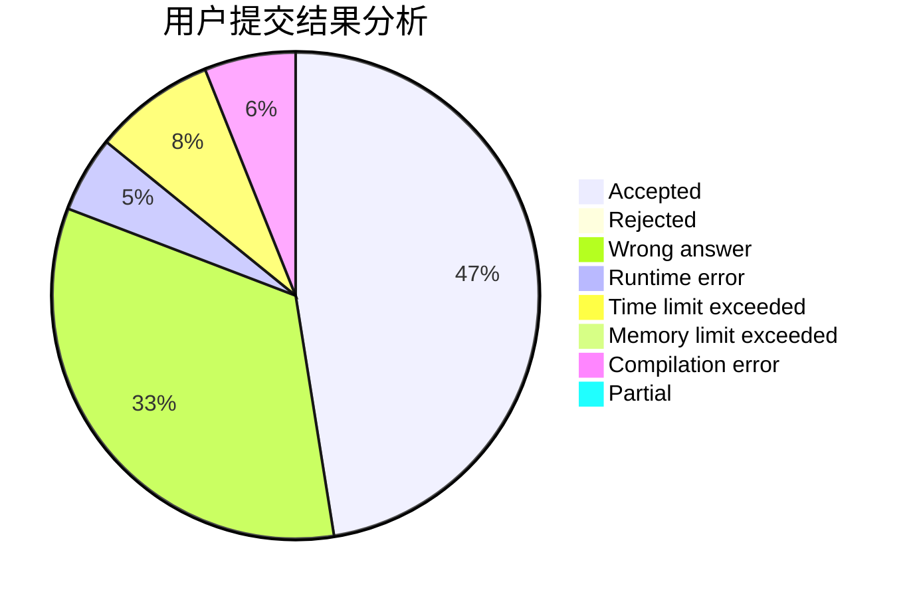
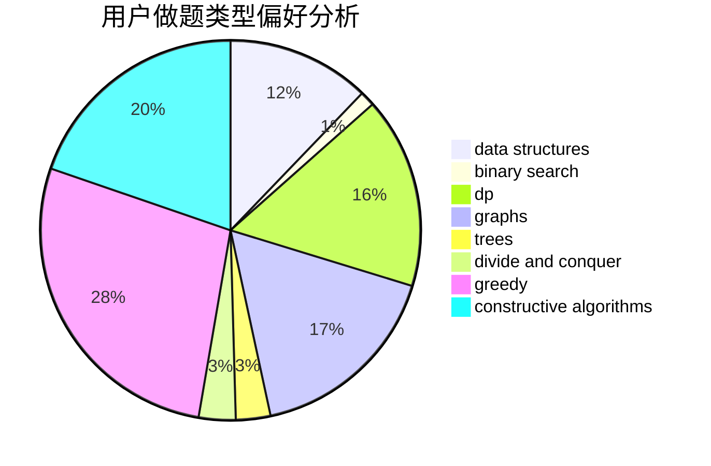
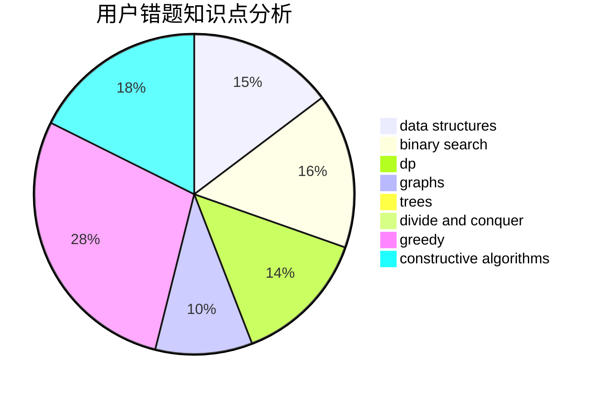

# Angel_Demon

<!-- tabs:start -->

#### **用户提交结果分析**

#### **用户做题类型偏好分析**

#### **用户错题知识点分析**

<!-- tabs:end -->
# 推荐题目
[131A](https://codeforces.com/contest/131/problem/A)		implementation,
                        strings		  
[1426E](https://codeforces.com/contest/1426/problem/E)		brute force,
                        constructive algorithms,
                        flows,
                        greedy,
                        math		  
[1157D](https://codeforces.com/contest/1157/problem/D)		constructive algorithms,
                        greedy,
                        math		  
[321D](https://codeforces.com/contest/321/problem/D)		dp,
                        greedy,
                        math		  
[331C3](https://codeforces.com/contest/331C/problem/3)		dp		  
[1281E](https://codeforces.com/contest/1281/problem/E)		dsu,graphs,sortings,trees		  
[335A](https://codeforces.com/contest/335/problem/A)		binary search,
                        constructive algorithms,
                        greedy		  
[331C1](https://codeforces.com/contest/331C/problem/1)		dp		  
[1329E](https://codeforces.com/contest/1329/problem/E)		binary search,
                        greedy		  
[1157C1](https://codeforces.com/contest/1157C/problem/1)		greedy		  
