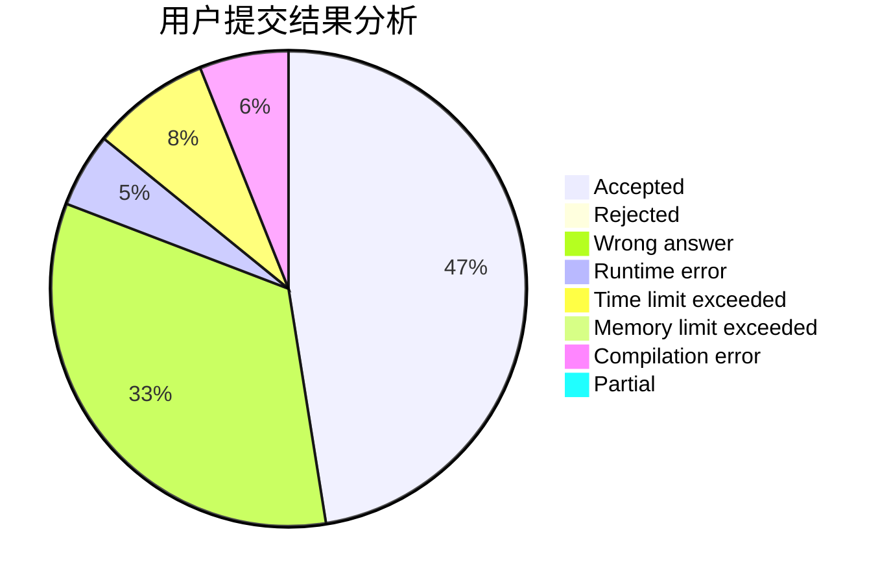
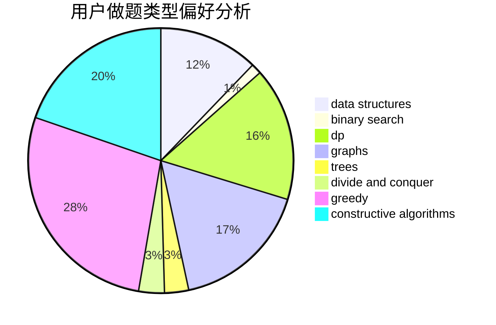
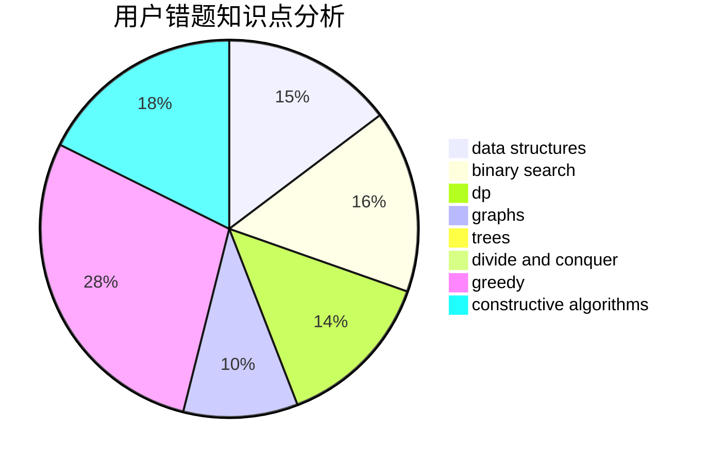

# Angel_Demon
<!-- tabs:start -->
#### **用户提交结果分析**

#### **用户做题类型偏好分析**

#### **用户错题知识点分析**

<!-- tabs:end -->
# 推荐题目
[Evil](http://codeforces.com/problemset/problem/329/E)		math		  
[N Problems During K Days](http://codeforces.com/problemset/problem/1157/D)		constructive algorithms,
                        greedy,
                        math		  
[Epic Convolution](http://codeforces.com/problemset/problem/1054/H)		chinese remainder theorem,
                        fft,
                        math,
                        number theory		  
[Prepare superposition of basis states with the same parity](http://codeforces.com/problemset/problem/1357/C2)		nan		  
[Deja Vu](http://codeforces.com/problemset/problem/331/E2)		constructive algorithms,
                        dp		  
[Banana](http://codeforces.com/problemset/problem/335/A)		binary search,
                        constructive algorithms,
                        greedy		  
[Split](http://codeforces.com/problemset/problem/1416/E)		binary search,
                        data structures,
                        dp,
                        greedy		  
[Ciel the Commander](http://codeforces.com/problemset/problem/321/C)		constructive algorithms,
                        dfs and similar,
                        divide and conquer,
                        greedy,
                        trees		  
[The Great Julya Calendar](http://codeforces.com/problemset/problem/331/C3)		dp		  
[U2](https://codeforces.com/contest/1143/problem/F)		geometry		  
<!-- tabs:start -->
#### **data structures**
[Evil](http://codeforces.com/problemset/problem/1416/E)		binary search,
                        data structures,
                        dp,
                        greedy		  
[N Problems During K Days](http://codeforces.com/problemset/problem/1220/F)		binary search,
                        data structures		  
[Epic Convolution](http://codeforces.com/problemset/problem/331/D3)		data structures,
                        implementation,
                        trees		  
[Prepare superposition of basis states with the same parity](http://codeforces.com/problemset/problem/1344/E)		data structures,
                        trees		  
[Deja Vu](http://codeforces.com/problemset/problem/323/C)		data structures		  
[Banana](http://codeforces.com/problemset/problem/1163/F)		data structures,
                        graphs,
                        shortest paths		  
[Split](http://codeforces.com/problemset/problem/1279/C)		data structures,
                        implementation		  
[Ciel the Commander](http://codeforces.com/problemset/problem/321/E)		data structures,
                        divide and conquer,
                        dp		  
[The Great Julya Calendar](http://codeforces.com/problemset/problem/1492/C)		binary search,
                        data structures,
                        dp,
                        greedy,
                        two pointers		  
[U2](http://codeforces.com/problemset/problem/1490/G)		binary search,
                        data structures,
                        math		  
#### **binary search**
[Evil](http://codeforces.com/problemset/problem/335/A)		binary search,
                        constructive algorithms,
                        greedy		  
[N Problems During K Days](http://codeforces.com/problemset/problem/1416/E)		binary search,
                        data structures,
                        dp,
                        greedy		  
[Epic Convolution](http://codeforces.com/problemset/problem/1220/F)		binary search,
                        data structures		  
[Prepare superposition of basis states with the same parity](http://codeforces.com/problemset/problem/325/B)		binary search,
                        math		  
[Deja Vu](https://codeforces.com/contest/1020/problem/D)		binary search,
                        interactive		  
[Banana](http://codeforces.com/problemset/problem/333/E)		binary search,
                        bitmasks,
                        brute force,
                        geometry,
                        sortings		  
[Split](http://codeforces.com/problemset/problem/1329/E)		binary search,
                        greedy		  
[Ciel the Commander](http://codeforces.com/problemset/problem/1492/C)		binary search,
                        data structures,
                        dp,
                        greedy,
                        two pointers		  
[The Great Julya Calendar](http://codeforces.com/problemset/problem/1463/D)		binary search,
                        constructive algorithms,
                        greedy,
                        two pointers		  
[U2](http://codeforces.com/problemset/problem/1490/G)		binary search,
                        data structures,
                        math		  
#### **dp**
[Evil](http://codeforces.com/problemset/problem/331/E2)		constructive algorithms,
                        dp		  
[N Problems During K Days](http://codeforces.com/problemset/problem/1416/E)		binary search,
                        data structures,
                        dp,
                        greedy		  
[Epic Convolution](http://codeforces.com/problemset/problem/331/C3)		dp		  
[Prepare superposition of basis states with the same parity](http://codeforces.com/problemset/problem/321/D)		dp,
                        greedy,
                        math		  
[Deja Vu](https://codeforces.com/contest/1384/problem/E)		bitmasks,
                        dp,
                        graphs,
                        trees		  
[Banana](http://codeforces.com/problemset/problem/331/C1)		dp		  
[Split](http://codeforces.com/problemset/problem/321/B)		dp,
                        flows,
                        greedy		  
[Ciel the Commander](http://codeforces.com/problemset/problem/327/A)		brute force,
                        dp,
                        implementation		  
[The Great Julya Calendar](https://codeforces.com/contest/1068/problem/D)		dp		  
[U2](https://codeforces.com/contest/1013/problem/E)		dp		  
#### **graph**
[Evil](http://codeforces.com/problemset/problem/1333/D)		brute force,
                        constructive algorithms,
                        games,
                        graphs,
                        greedy,
                        implementation,
                        sortings		  
[N Problems During K Days](https://codeforces.com/contest/1384/problem/E)		bitmasks,
                        dp,
                        graphs,
                        trees		  
[Epic Convolution](http://codeforces.com/problemset/problem/325/C)		dfs and similar,
                        graphs,
                        shortest paths		  
[Prepare superposition of basis states with the same parity](http://codeforces.com/problemset/problem/327/D)		constructive algorithms,
                        dfs and similar,
                        graphs		  
[Deja Vu](https://codeforces.com/contest/1281/problem/E)		dfs and similar,
                        graphs,
                        greedy,
                        trees		  
[Banana](http://codeforces.com/problemset/problem/331/E1)		constructive algorithms,
                        graphs,
                        implementation		  
[Split](http://codeforces.com/problemset/problem/1163/F)		data structures,
                        graphs,
                        shortest paths		  
[Ciel the Commander](http://codeforces.com/problemset/problem/325/E)		combinatorics,
                        dfs and similar,
                        dsu,
                        graphs,
                        greedy		  
[The Great Julya Calendar](http://codeforces.com/problemset/problem/323/B)		constructive algorithms,
                        graphs		  
[U2](http://codeforces.com/problemset/problem/1133/F1)		graphs		  
#### **trees**
[Evil](http://codeforces.com/problemset/problem/321/C)		constructive algorithms,
                        dfs and similar,
                        divide and conquer,
                        greedy,
                        trees		  
[N Problems During K Days](https://codeforces.com/contest/1384/problem/E)		bitmasks,
                        dp,
                        graphs,
                        trees		  
[Epic Convolution](https://codeforces.com/contest/1281/problem/E)		dfs and similar,
                        graphs,
                        greedy,
                        trees		  
[Prepare superposition of basis states with the same parity](http://codeforces.com/problemset/problem/331/D3)		data structures,
                        implementation,
                        trees		  
[Deja Vu](http://codeforces.com/problemset/problem/1344/E)		data structures,
                        trees		  
[Banana](http://codeforces.com/problemset/problem/1085/D)		constructive algorithms,
                        implementation,
                        trees		  
[Split](http://codeforces.com/problemset/problem/1479/D)		binary search,
                        bitmasks,
                        brute force,
                        data structures,
                        probabilities,
                        trees		  
[Ciel the Commander](http://codeforces.com/problemset/problem/1511/C)		brute force,
                        data structures,
                        implementation,
                        trees		  
[The Great Julya Calendar](http://codeforces.com/problemset/problem/1499/F)		combinatorics,
                        dfs and similar,
                        dp,
                        trees		  
[U2](http://codeforces.com/problemset/problem/1491/E)		brute force,
                        dfs and similar,
                        divide and conquer,
                        number theory,
                        trees		  
#### **divide and conquer**
[Evil](http://codeforces.com/problemset/problem/321/C)		constructive algorithms,
                        dfs and similar,
                        divide and conquer,
                        greedy,
                        trees		  
[N Problems During K Days](http://codeforces.com/problemset/problem/321/E)		data structures,
                        divide and conquer,
                        dp		  
[Epic Convolution](http://codeforces.com/problemset/problem/1461/D)		binary search,
                        brute force,
                        data structures,
                        divide and conquer,
                        implementation,
                        sortings		  
[Prepare superposition of basis states with the same parity](http://codeforces.com/problemset/problem/1466/G)		combinatorics,
                        divide and conquer,
                        hashing,
                        math,
                        string suffix structures,
                        strings		  
[Deja Vu](http://codeforces.com/problemset/problem/1490/D)		dfs and similar,
                        divide and conquer,
                        implementation		  
[Banana](https://codeforces.com/contest/1483/problem/C)		data structures,
                        divide and conquer,
                        dp		  
[Split](http://codeforces.com/problemset/problem/1491/E)		brute force,
                        dfs and similar,
                        divide and conquer,
                        number theory,
                        trees		  
[Ciel the Commander](http://codeforces.com/problemset/problem/1303/G)		data structures,
                        divide and conquer,
                        geometry,
                        trees		  
[The Great Julya Calendar](http://codeforces.com/problemset/problem/1494/D)		constructive algorithms,
                        data structures,
                        dfs and similar,
                        divide and conquer,
                        dsu,
                        greedy,
                        sortings,
                        trees		  
[U2](http://codeforces.com/problemset/problem/1482/E)		data structures,
                        divide and conquer,
                        dp		  
#### **greedy**
[Evil](http://codeforces.com/problemset/problem/1157/D)		constructive algorithms,
                        greedy,
                        math		  
[N Problems During K Days](http://codeforces.com/problemset/problem/335/A)		binary search,
                        constructive algorithms,
                        greedy		  
[Epic Convolution](http://codeforces.com/problemset/problem/1416/E)		binary search,
                        data structures,
                        dp,
                        greedy		  
[Prepare superposition of basis states with the same parity](http://codeforces.com/problemset/problem/321/C)		constructive algorithms,
                        dfs and similar,
                        divide and conquer,
                        greedy,
                        trees		  
[Deja Vu](http://codeforces.com/problemset/problem/321/D)		dp,
                        greedy,
                        math		  
[Banana](http://codeforces.com/problemset/problem/1157/C1)		greedy		  
[Split](http://codeforces.com/problemset/problem/1333/D)		brute force,
                        constructive algorithms,
                        games,
                        graphs,
                        greedy,
                        implementation,
                        sortings		  
[Ciel the Commander](http://codeforces.com/problemset/problem/333/B)		greedy		  
[The Great Julya Calendar](http://codeforces.com/problemset/problem/321/B)		dp,
                        flows,
                        greedy		  
[U2](https://codeforces.com/contest/1281/problem/E)		dfs and similar,
                        graphs,
                        greedy,
                        trees		  
#### **constructive algorithms**
[Evil](http://codeforces.com/problemset/problem/1157/D)		constructive algorithms,
                        greedy,
                        math		  
[N Problems During K Days](http://codeforces.com/problemset/problem/331/E2)		constructive algorithms,
                        dp		  
[Epic Convolution](http://codeforces.com/problemset/problem/335/A)		binary search,
                        constructive algorithms,
                        greedy		  
[Prepare superposition of basis states with the same parity](http://codeforces.com/problemset/problem/321/C)		constructive algorithms,
                        dfs and similar,
                        divide and conquer,
                        greedy,
                        trees		  
[Deja Vu](http://codeforces.com/problemset/problem/1333/D)		brute force,
                        constructive algorithms,
                        games,
                        graphs,
                        greedy,
                        implementation,
                        sortings		  
[Banana](http://codeforces.com/problemset/problem/327/D)		constructive algorithms,
                        dfs and similar,
                        graphs		  
[Split](http://codeforces.com/problemset/problem/282/C)		constructive algorithms,
                        implementation,
                        math		  
[Ciel the Commander](http://codeforces.com/problemset/problem/331/E1)		constructive algorithms,
                        graphs,
                        implementation		  
[The Great Julya Calendar](http://codeforces.com/problemset/problem/1415/D)		bitmasks,
                        brute force,
                        constructive algorithms		  
[U2](http://codeforces.com/problemset/problem/323/B)		constructive algorithms,
                        graphs		  
#### **sortings**
[Evil](http://codeforces.com/problemset/problem/334/B)		sortings		  
[N Problems During K Days](http://codeforces.com/problemset/problem/1333/D)		brute force,
                        constructive algorithms,
                        games,
                        graphs,
                        greedy,
                        implementation,
                        sortings		  
[Epic Convolution](http://codeforces.com/problemset/problem/333/E)		binary search,
                        bitmasks,
                        brute force,
                        geometry,
                        sortings		  
[Prepare superposition of basis states with the same parity](https://codeforces.com/contest/1496/problem/C)		geometry,
                        greedy,
                        math,
                        sortings		  
[Deja Vu](http://codeforces.com/problemset/problem/1495/A)		geometry,
                        greedy,
                        math,
                        sortings		  
[Banana](http://codeforces.com/problemset/problem/1497/A)		brute force,
                        data structures,
                        greedy,
                        sortings		  
[Split](http://codeforces.com/problemset/problem/1427/A)		math,
                        sortings		  
[Ciel the Commander](http://codeforces.com/problemset/problem/1461/D)		binary search,
                        brute force,
                        data structures,
                        divide and conquer,
                        implementation,
                        sortings		  
[The Great Julya Calendar](http://codeforces.com/problemset/problem/1437/C)		dp,
                        flows,
                        graph matchings,
                        greedy,
                        math,
                        sortings		  
[U2](http://codeforces.com/problemset/problem/1473/A)		greedy,
                        implementation,
                        math,
                        sortings		  
<!-- tabs:end -->
