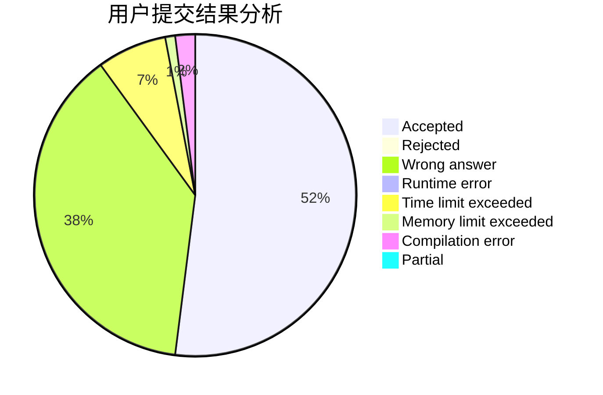
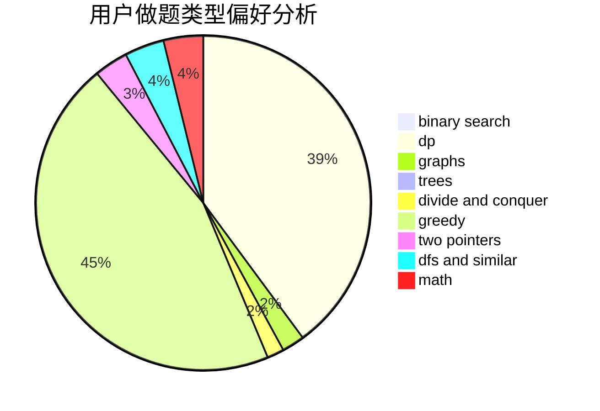

# bobo

<!-- tabs:start -->

#### **用户提交结果分析**

#### **用户做题类型偏好分析**

<!-- tabs:end -->
# 推荐题目
[1290F](https://codeforces.com/contest/1290/problem/F)
[861A](https://codeforces.com/contest/861/problem/A)
[1000G](https://codeforces.com/contest/1000/problem/G)
[295C](https://codeforces.com/contest/295/problem/C)
[796A](https://codeforces.com/contest/796/problem/A)
[1161B](https://codeforces.com/contest/1161/problem/B)
[1256D](https://codeforces.com/contest/1256/problem/D)
[1140D](https://codeforces.com/contest/1140/problem/D)
[807B](https://codeforces.com/contest/807/problem/B)
[1375I](https://codeforces.com/contest/1375/problem/I)
