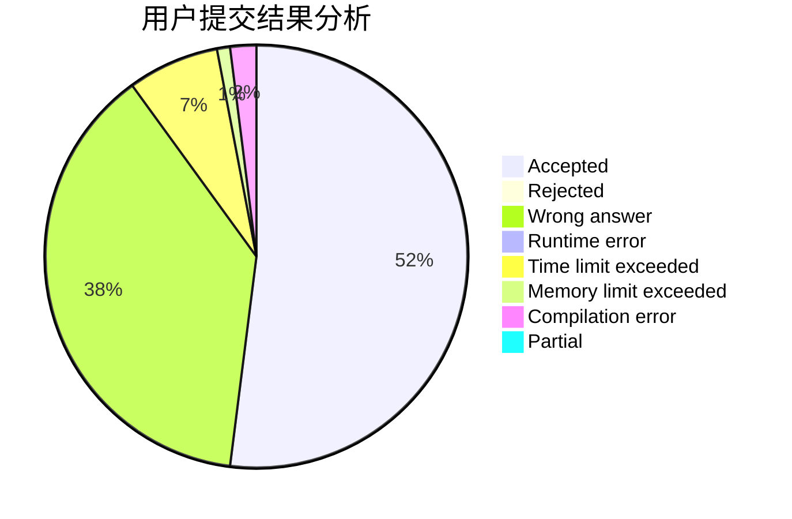
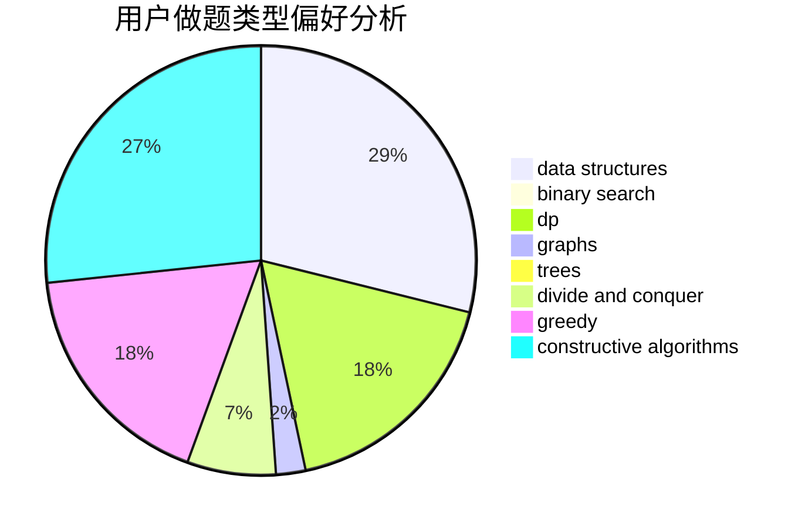
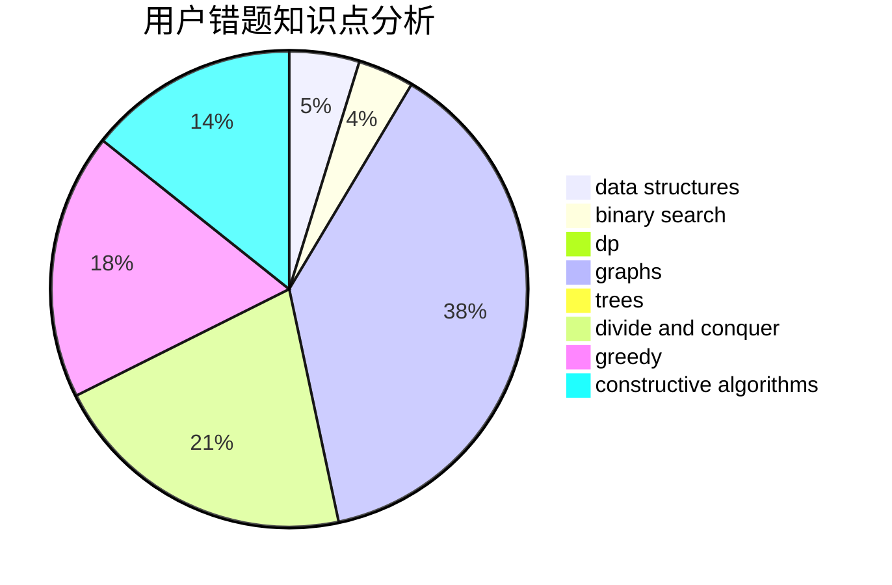

# bobo

<!-- tabs:start -->

#### **用户提交结果分析**

#### **用户做题类型偏好分析**

#### **用户错题知识点分析**

<!-- tabs:end -->
# 推荐题目
[1290F](https://codeforces.com/contest/1290/problem/F)		dp		  
[861A](https://codeforces.com/contest/861/problem/A)		dsu,graphs,sortings,trees		  
[1000G](https://codeforces.com/contest/1000/problem/G)		data structures,
                        dp,
                        trees		  
[295C](https://codeforces.com/contest/295/problem/C)		combinatorics,
                        dp,
                        graphs,
                        shortest paths		  
[796A](https://codeforces.com/contest/796/problem/A)		brute force,
                        implementation		  
[1161B](https://codeforces.com/contest/1161/problem/B)		dsu,graphs,sortings,trees		  
[1256D](https://codeforces.com/contest/1256/problem/D)		greedy		  
[1140D](https://codeforces.com/contest/1140/problem/D)		dp,
                        greedy,
                        math		  
[807B](https://codeforces.com/contest/807/problem/B)		brute force,
                        implementation		  
[1375I](https://codeforces.com/contest/1375/problem/I)		geometry,
                        math,
                        matrices,
                        number theory		  
