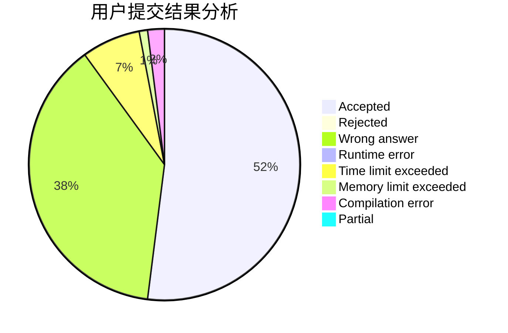
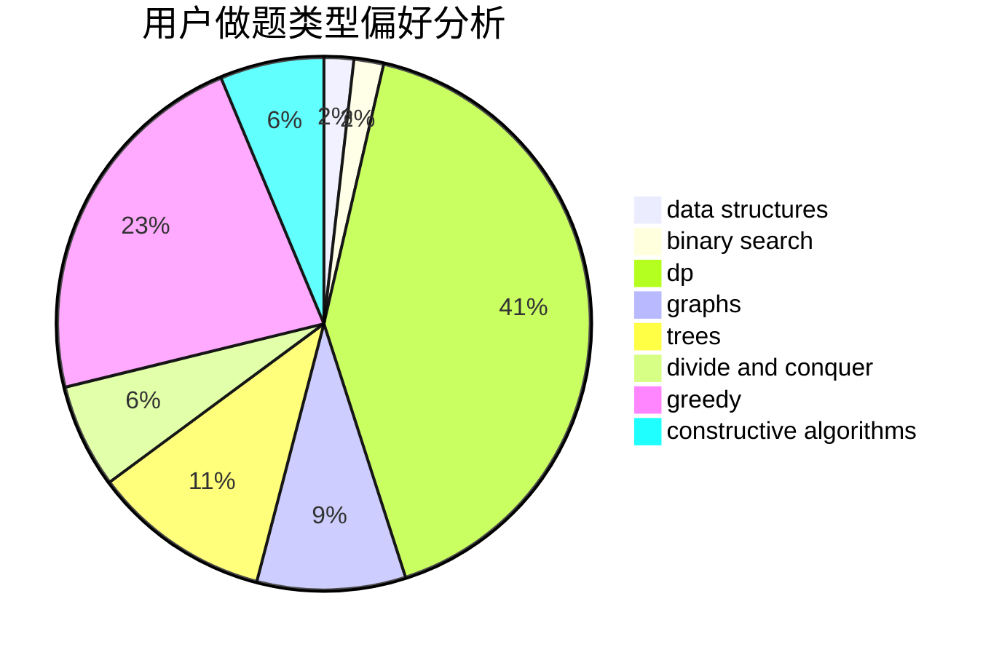
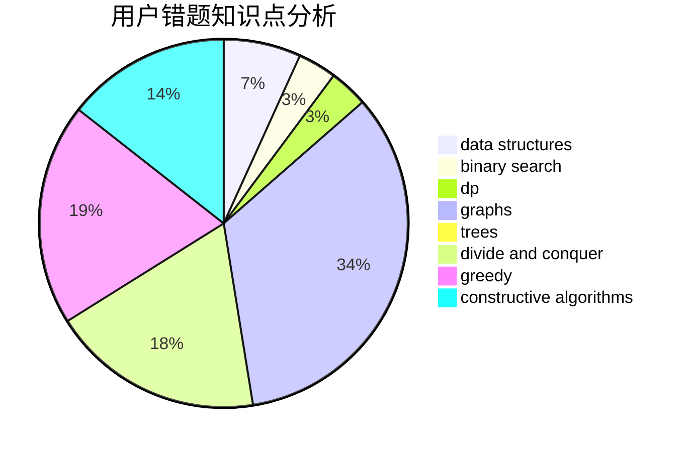

# bobo

<!-- tabs:start -->

#### **用户提交结果分析**

#### **用户做题类型偏好分析**

#### **用户错题知识点分析**

<!-- tabs:end -->
# 推荐题目
[1283F](https://codeforces.com/contest/1283/problem/F)		constructive algorithms,
                        greedy,
                        trees		  
[842B](https://codeforces.com/contest/842/problem/B)		geometry		  
[1000G](https://codeforces.com/contest/1000/problem/G)		data structures,
                        dp,
                        trees		  
[27D](https://codeforces.com/contest/27/problem/D)		2-sat,
                        dfs and similar,
                        dsu,
                        graphs		  
[777D](https://codeforces.com/contest/777/problem/D)		binary search,
                        greedy,
                        implementation,
                        strings		  
[1158C](https://codeforces.com/contest/1158/problem/C)		constructive algorithms,
                        data structures,
                        dfs and similar,
                        graphs,
                        greedy,
                        math,
                        sortings		  
[1251C](https://codeforces.com/contest/1251/problem/C)		greedy,
                        two pointers		  
[1138F](https://codeforces.com/contest/1138/problem/F)		dsu,graphs,sortings,trees		  
[791D](https://codeforces.com/contest/791/problem/D)		dsu,graphs,sortings,trees		  
[1369A](https://codeforces.com/contest/1369/problem/A)		geometry,
                        math		  
