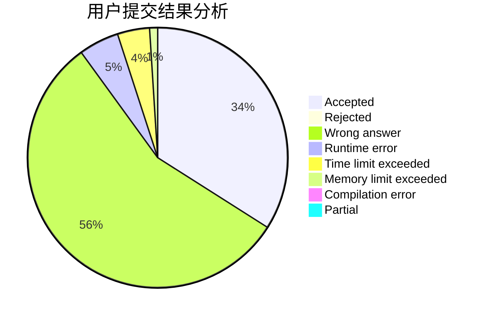
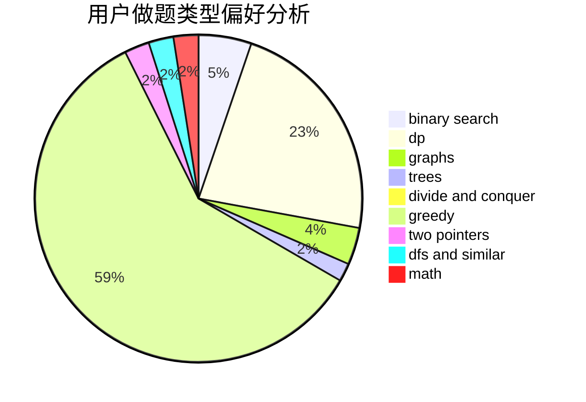

# boleyn.su

<!-- tabs:start -->

#### **用户提交结果分析**

#### **用户做题类型偏好分析**

<!-- tabs:end -->
# 推荐题目
[1108A](https://codeforces.com/contest/1108/problem/A)
[45G](https://codeforces.com/contest/45/problem/G)
[58E](https://codeforces.com/contest/58/problem/E)
[634B](https://codeforces.com/contest/634/problem/B)
[14D](https://codeforces.com/contest/14/problem/D)
[360E](https://codeforces.com/contest/360/problem/E)
[676D](https://codeforces.com/contest/676/problem/D)
[1251C](https://codeforces.com/contest/1251/problem/C)
[861C](https://codeforces.com/contest/861/problem/C)
[949B](https://codeforces.com/contest/949/problem/B)
