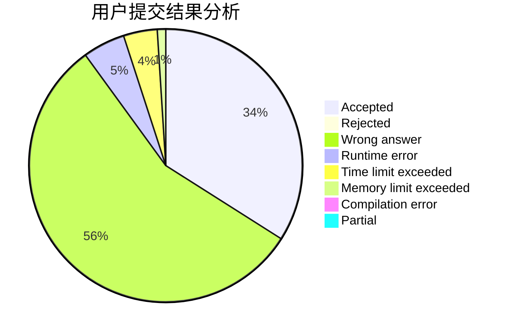
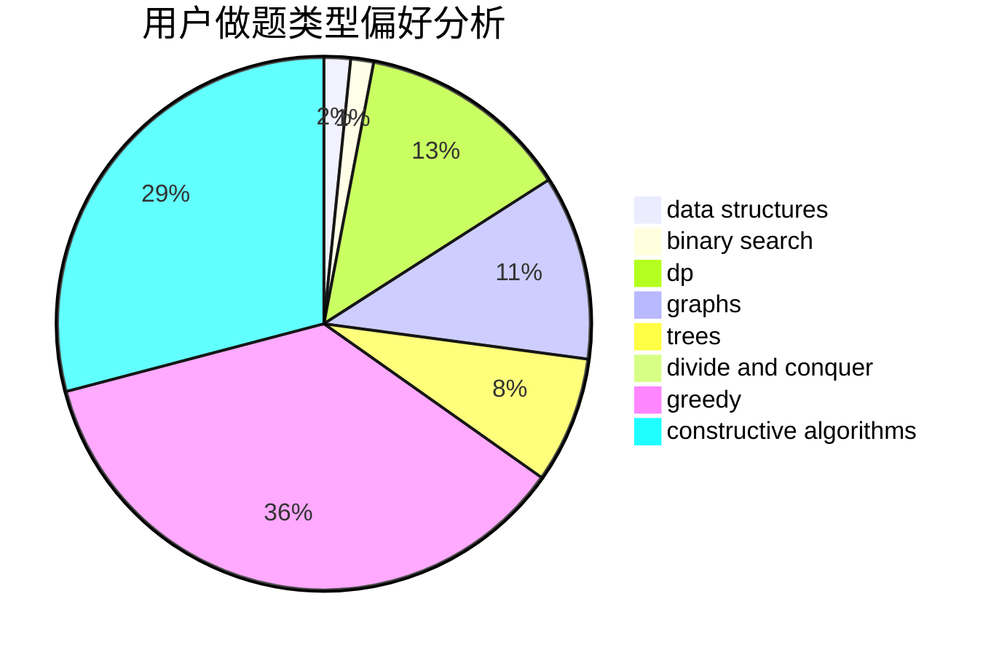
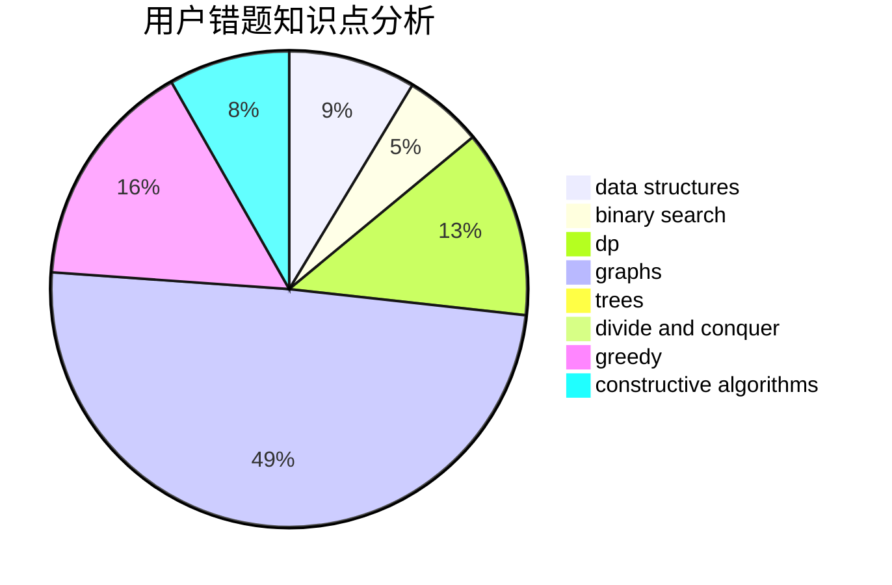

# boleyn.su

<!-- tabs:start -->

#### **用户提交结果分析**

#### **用户做题类型偏好分析**

#### **用户错题知识点分析**

<!-- tabs:end -->
# 推荐题目
[1107F](https://codeforces.com/contest/1107/problem/F)		dp,
                        flows,
                        graph matchings,
                        graphs,
                        sortings		  
[438B](https://codeforces.com/contest/438/problem/B)		dsu,graphs,sortings,trees		  
[56B](https://codeforces.com/contest/56/problem/B)		implementation		  
[616E](https://codeforces.com/contest/616/problem/E)		implementation,
                        math,
                        number theory		  
[1491G](https://codeforces.com/contest/1491/problem/G)		constructive algorithms,
                        graphs,
                        math		  
[335A](https://codeforces.com/contest/335/problem/A)		binary search,
                        constructive algorithms,
                        greedy		  
[652E](https://codeforces.com/contest/652/problem/E)		dfs and similar,
                        dsu,
                        graphs,
                        trees		  
[1247D](https://codeforces.com/contest/1247/problem/D)		dsu,graphs,sortings,trees		  
[842D](https://codeforces.com/contest/842/problem/D)		binary search,
                        data structures		  
[925E](https://codeforces.com/contest/925/problem/E)		data structures,
                        trees		  
