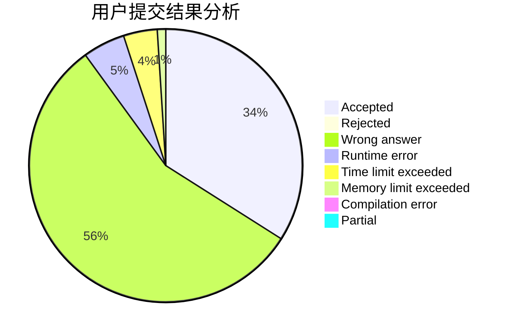
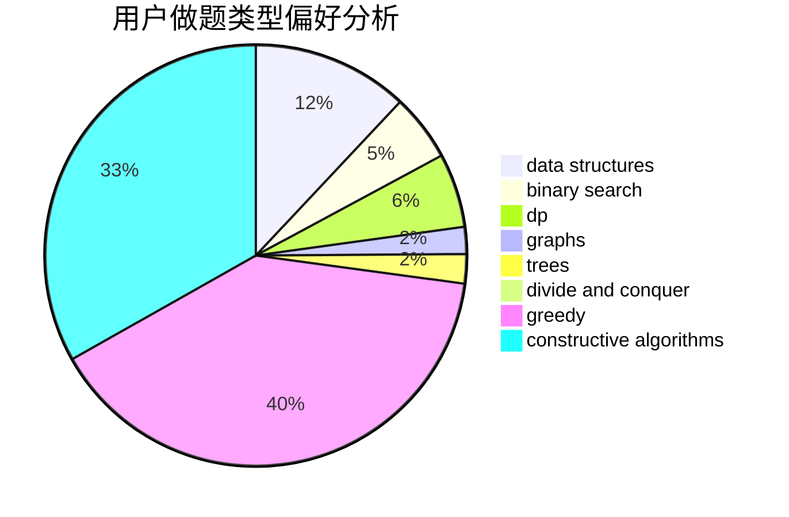
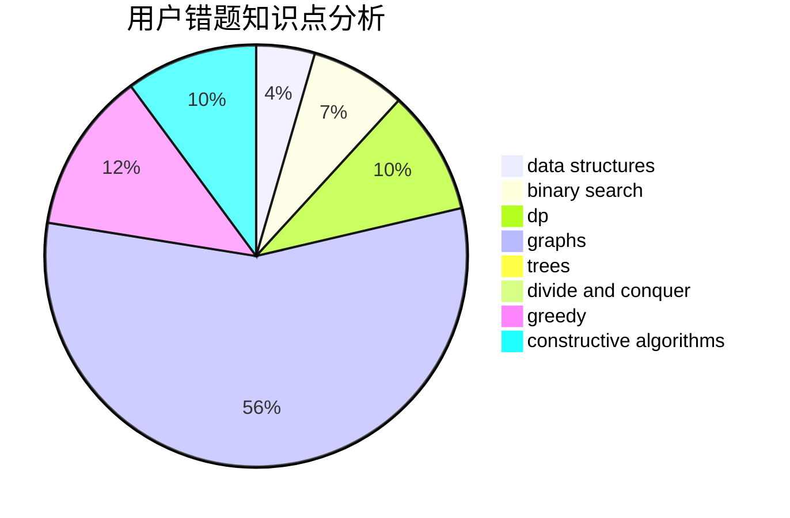

# boleyn.su

<!-- tabs:start -->

#### **用户提交结果分析**

#### **用户做题类型偏好分析**

#### **用户错题知识点分析**

<!-- tabs:end -->
# 推荐题目
[1108A](https://codeforces.com/contest/1108/problem/A)		implementation		  
[45G](https://codeforces.com/contest/45/problem/G)		number theory		  
[58E](https://codeforces.com/contest/58/problem/E)		dp		  
[634B](https://codeforces.com/contest/634/problem/B)		dsu,graphs,sortings,trees		  
[14D](https://codeforces.com/contest/14/problem/D)		dfs and similar,
                        dp,
                        graphs,
                        shortest paths,
                        trees,
                        two pointers		  
[360E](https://codeforces.com/contest/360/problem/E)		graphs,
                        greedy,
                        shortest paths		  
[676D](https://codeforces.com/contest/676/problem/D)		graphs,
                        implementation,
                        shortest paths		  
[1251C](https://codeforces.com/contest/1251/problem/C)		greedy,
                        two pointers		  
[861C](https://codeforces.com/contest/861/problem/C)		dsu,graphs,sortings,trees		  
[949B](https://codeforces.com/contest/949/problem/B)		constructive algorithms,
                        math		  
