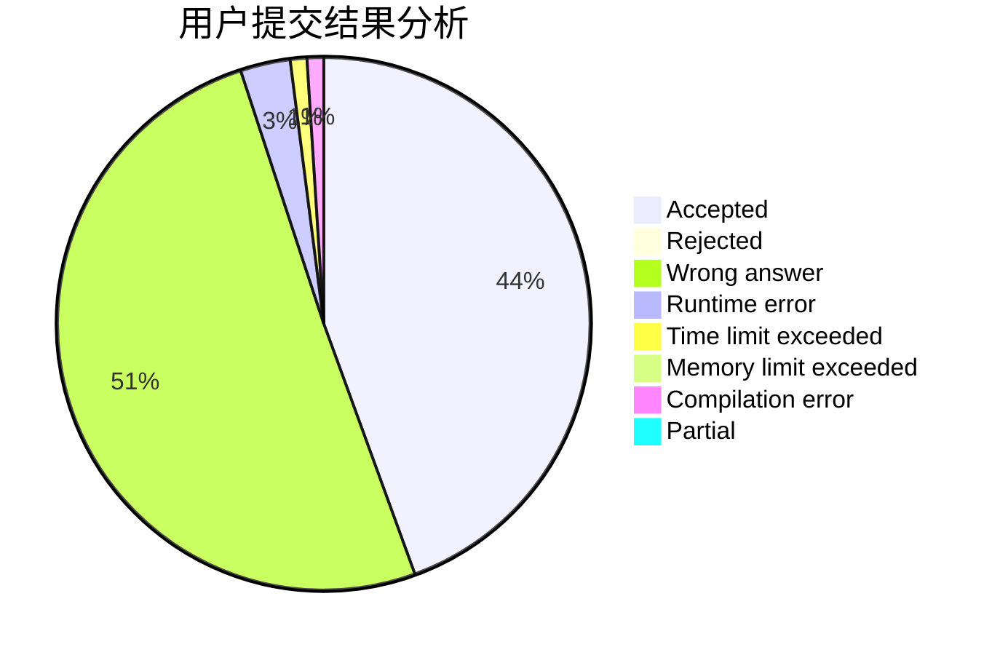
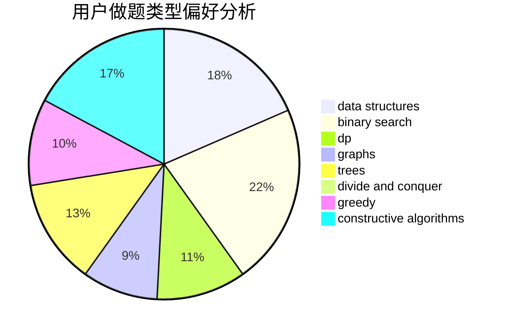
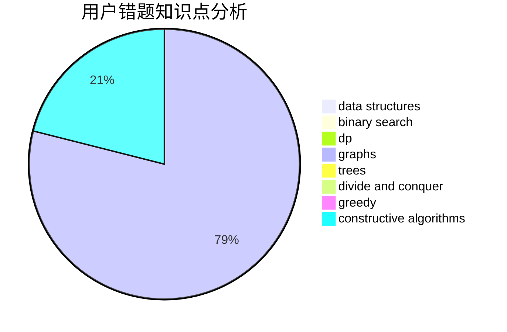

# bomb233

<!-- tabs:start -->

#### **用户提交结果分析**

#### **用户做题类型偏好分析**

#### **用户错题知识点分析**

<!-- tabs:end -->
# 推荐题目
[1439D](https://codeforces.com/contest/1439/problem/D)		combinatorics,
                        dp,
                        fft		  
[911D](https://codeforces.com/contest/911/problem/D)		brute force,
                        math		  
[612A](https://codeforces.com/contest/612/problem/A)		brute force,
                        implementation,
                        strings		  
[1054C](https://codeforces.com/contest/1054/problem/C)		constructive algorithms,
                        implementation		  
[1031A](https://codeforces.com/contest/1031/problem/A)		implementation,
                        math		  
[1129C](https://codeforces.com/contest/1129/problem/C)		binary search,
                        data structures,
                        dp,
                        hashing,
                        sortings,
                        string suffix structures,
                        strings		  
[967B](https://codeforces.com/contest/967/problem/B)		math,
                        sortings		  
[542F](https://codeforces.com/contest/542/problem/F)		dp,
                        greedy		  
[1040B](https://codeforces.com/contest/1040/problem/B)		dp,
                        greedy,
                        math		  
[30B](https://codeforces.com/contest/30/problem/B)		implementation		  
