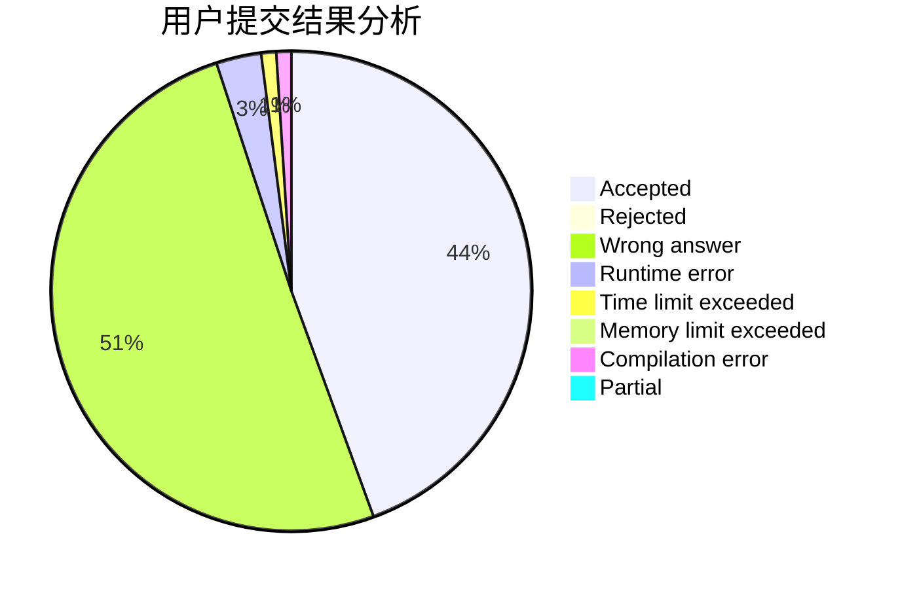
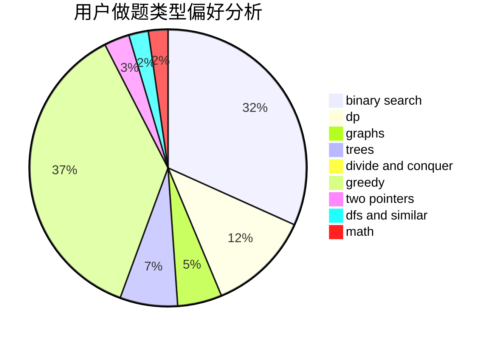

# bomb233

<!-- tabs:start -->

#### **用户提交结果分析**

#### **用户做题类型偏好分析**

<!-- tabs:end -->
# 推荐题目
[1439D](https://codeforces.com/contest/1439/problem/D)
[911D](https://codeforces.com/contest/911/problem/D)
[612A](https://codeforces.com/contest/612/problem/A)
[1054C](https://codeforces.com/contest/1054/problem/C)
[1031A](https://codeforces.com/contest/1031/problem/A)
[1129C](https://codeforces.com/contest/1129/problem/C)
[967B](https://codeforces.com/contest/967/problem/B)
[542F](https://codeforces.com/contest/542/problem/F)
[1040B](https://codeforces.com/contest/1040/problem/B)
[30B](https://codeforces.com/contest/30/problem/B)
