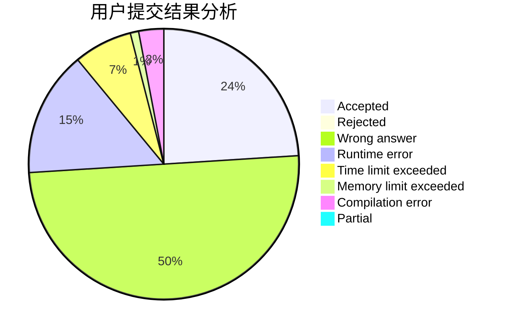
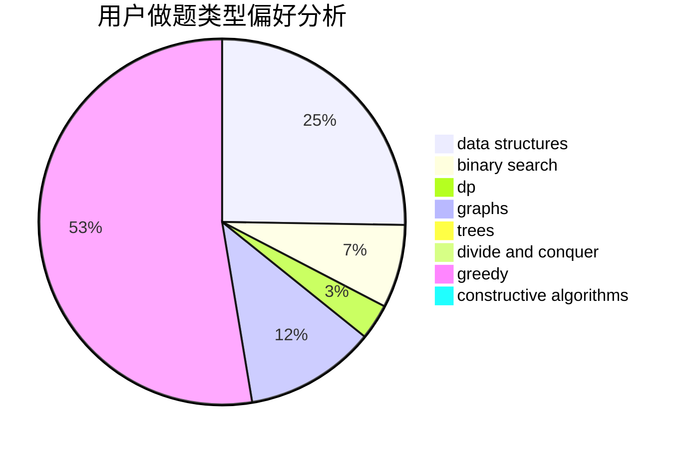
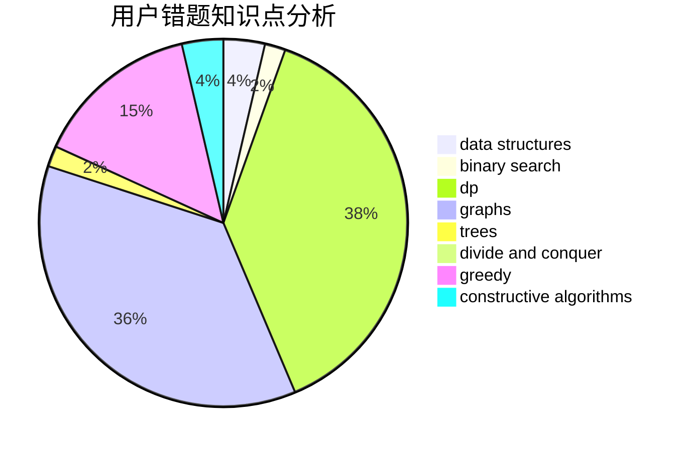

# bottomcoder

<!-- tabs:start -->

#### **用户提交结果分析**

#### **用户做题类型偏好分析**

#### **用户错题知识点分析**

<!-- tabs:end -->
# 推荐题目
[584C](https://codeforces.com/contest/584/problem/C)		constructive algorithms,
                        greedy,
                        strings		  
[478B](https://codeforces.com/contest/478/problem/B)		combinatorics,
                        constructive algorithms,
                        greedy,
                        math		  
[1223F](https://codeforces.com/contest/1223/problem/F)		data structures,
                        divide and conquer,
                        dp,
                        hashing		  
[1345E](https://codeforces.com/contest/1345/problem/E)		dsu,graphs,sortings,trees		  
[1172A](https://codeforces.com/contest/1172/problem/A)		greedy,
                        implementation		  
[871E](https://codeforces.com/contest/871/problem/E)		graphs,
                        greedy,
                        trees		  
[1201D](https://codeforces.com/contest/1201/problem/D)		binary search,
                        dp,
                        greedy,
                        implementation		  
[1181A](https://codeforces.com/contest/1181/problem/A)		greedy,
                        math		  
[946F](https://codeforces.com/contest/946/problem/F)		combinatorics,
                        dp,
                        matrices		  
[25C](https://codeforces.com/contest/25/problem/C)		graphs,
                        shortest paths		  
